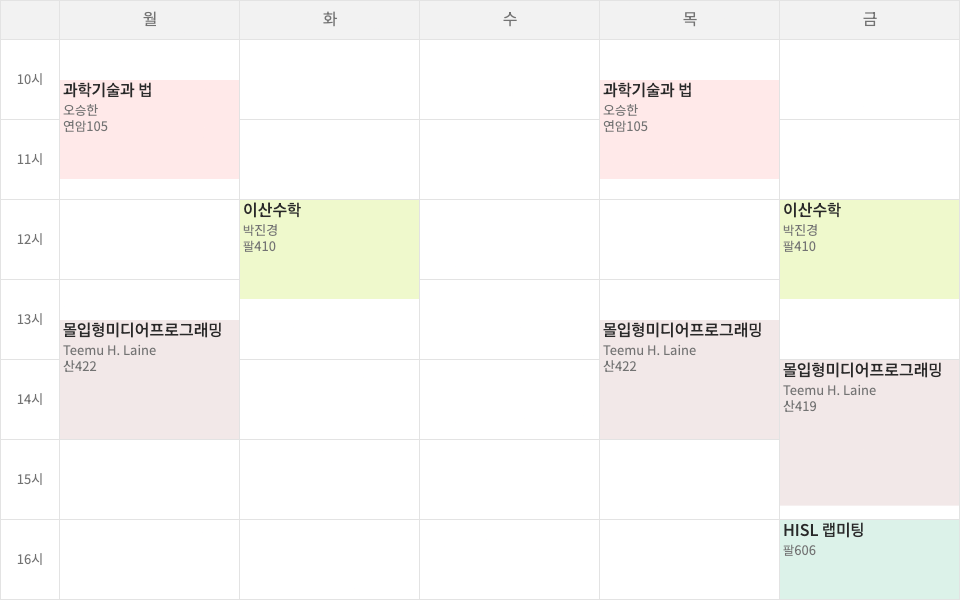
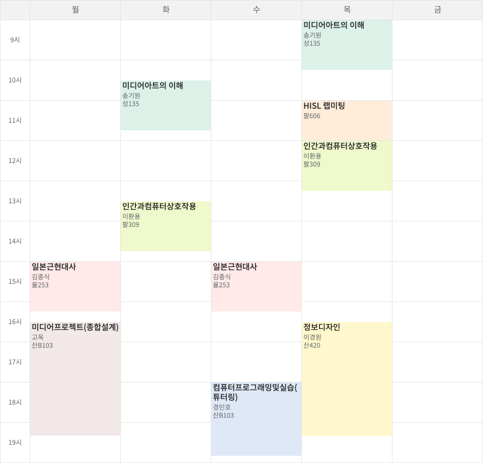
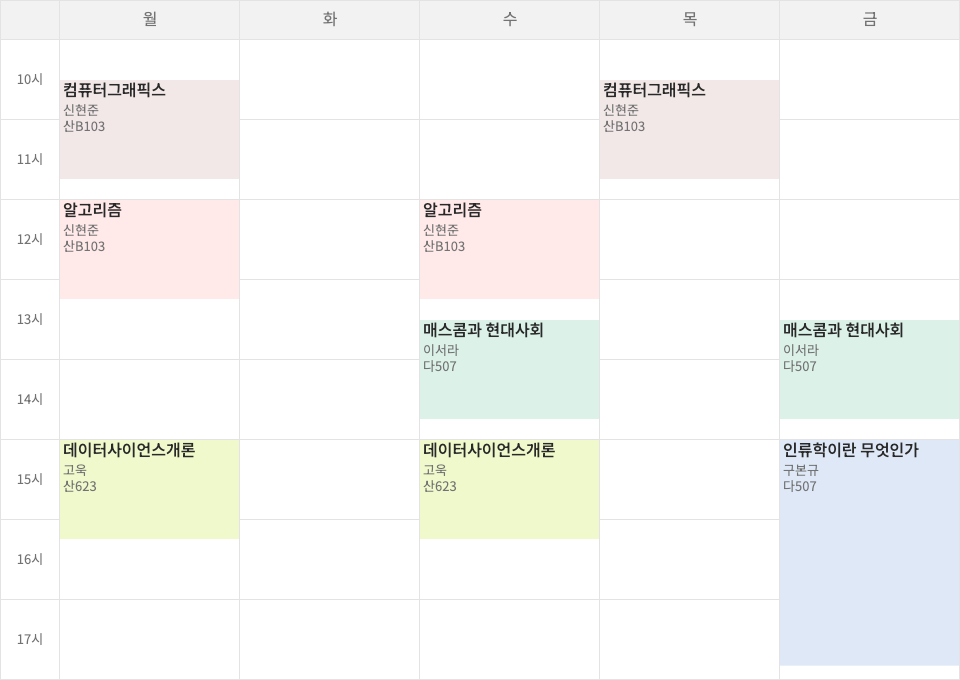
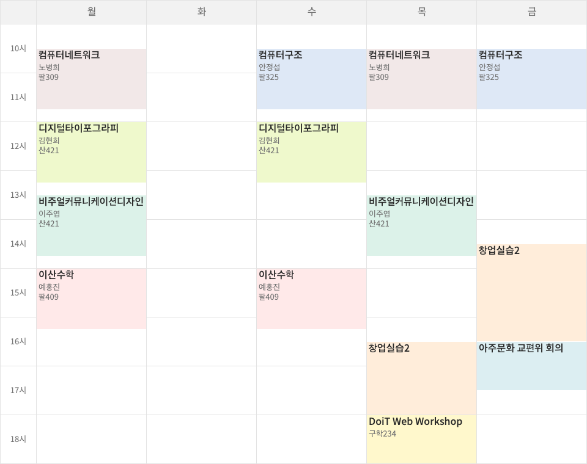
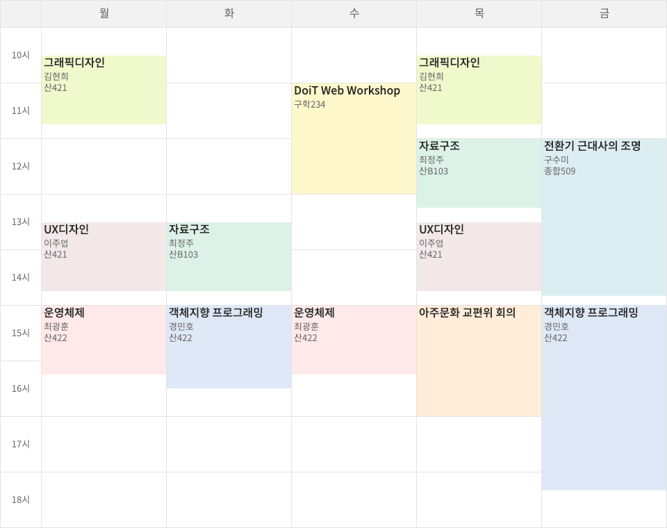
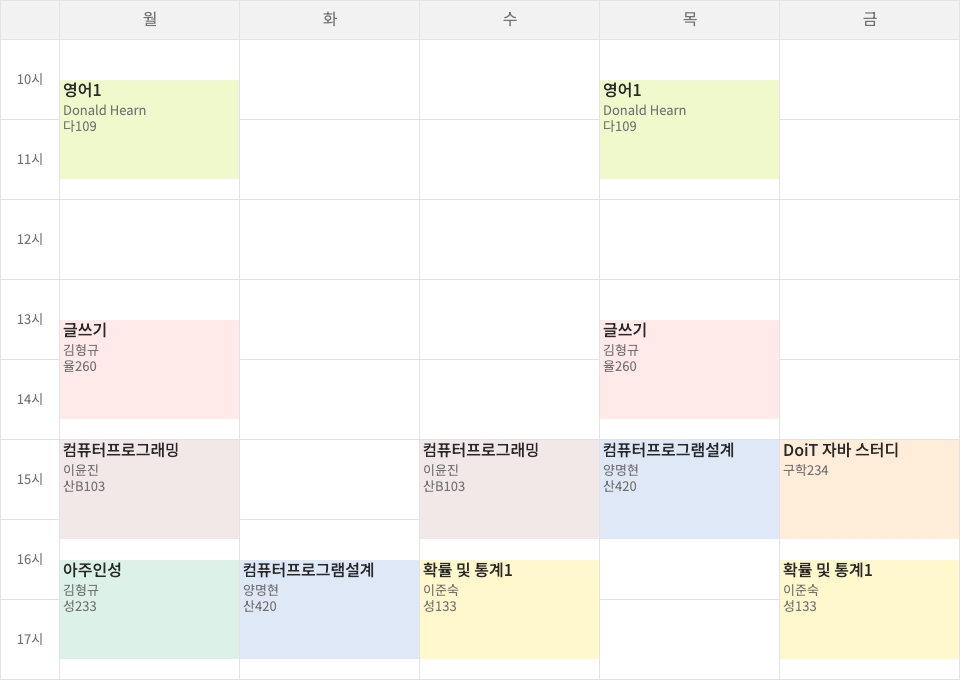
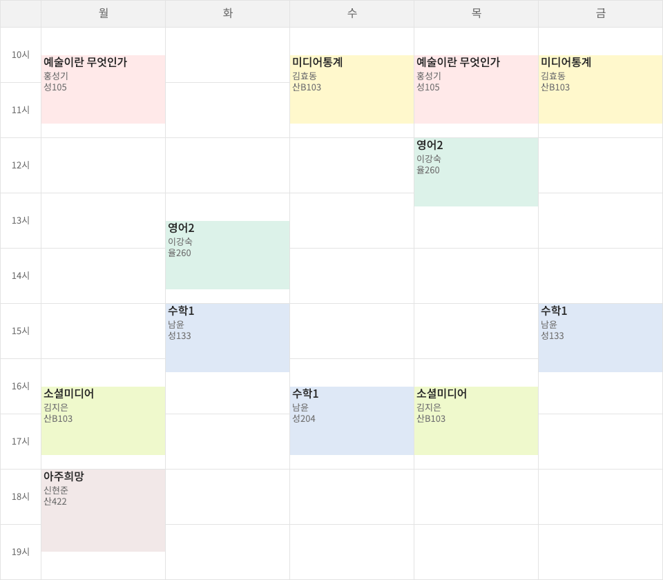

# Campus Life

## 수업

### 2024년 봄 (4학년 2학기)

* [몰입형미디어프로그래밍](dgmd318-immersive-media-programming)
* [과학기술과법](sci116-science-technology-and-law)
* [이산수학](sce141-discrete-mathematics/2024)
* [선형대수1(녹화)](math211-linear-algebra)
* [운영체제(녹화)](sce213-operating-systems)

### 2023년 가을 (4학년 1학기)

* [일본근현대사](are231-japanese-modern-history)
* [미디어아트의이해](cart1016-understanding-media-art)
* [정보디자인](dgmd353-information-design)
* [미디어프로젝트](dgmd466-media-project)
* [인간과컴퓨터상호작용](sce436-human-computer-interaction)
* [컴퓨터프로그래밍및실습(튜터링)](sce103-computer-programming-and-practice)

### 2023년 봄 (3학년 2학기)

* [영상처리](dgmd341-digital-image-processing)
* [데이터베이스](sce333-database)
* [모바일프로그래밍](dgmd217-mobile-programming)
* [오픈소스SW입문](sce331-introduction-to-open-source-sw)
* [한국영화사](cart1013-korean-film-history)
* [서양미술사](cart001-western-art-history)

### 2022년 가을 (3학년 1학기)

* [알고리즘](cse350-algorithms)
* [컴퓨터그래픽스](dgmd241-computer-graphics)
* [데이터사이언스개론](dgmd333-introduction-to-data-science)
* [매스콤과현대사회](soc11-mass-communication-and-modern-society)
* [인류학이란무엇인가](chis104-what-is-anthropology)

### 2018년 가을 (2학년 2학기)

* [이산수학](./sce141-discrete-mathematics/2018)
* [컴퓨터구조](sce212-computer-organization-and-architecture)
* [컴퓨터네트워크](sce221-computer-networks)
* [비주얼커뮤니케이션디자인](dgmd251-visual-communication-design)
* [디지털타이포그래피](dgmd252-digital-typography)
* [창업실습2](dgmd472-business-start-up-practice-2)

### 2018년 봄 (2학년 1학기)

* [그래픽디자인](dgmd151-graphic-design)
* [자료구조](cse200-data-structures)
* [객체지향프로그래밍](cse231-object-oriented-programming)
* [운영체제](cse311-operating-systems)
* [UX디자인](dgmd451-user-experience-design)
* [전환기근대사의조명](hist113-survey-of-modern-history)

### 2017년 가을 (1학년 2학기)

* [글쓰기](kor102-korean-writing)
* [컴퓨터프로그래밍](cse104-computer-programming)
* [컴퓨터프로그램설계](cse134-computer-program-design)
* [확률및통계1](math251-probability-and-statistics-1)
* [영어1](eng111-speaking-and-writing-in-english)
* [아주인성](cajo113-ajou-virtues-ethics-responsibility-and-sustainability)
* [한국정치의쟁점과과제(녹화)](pol113-the-reality-and-issues-in-contemporary-korean-society)

### 2017년 봄 (1학년 1학기)

* [소셜미디어](mibs101-social-media)
* [미디어통계](mibs131-media-statistics)
* [예술이란무엇인가](cart105-what-is-art)
* [영어2](eng112-listening-and-reading-in-english)
* [수학1](math102-calculus-1)
* [아주희망](cajo114-ajou-dream)

## 소프트웨어

### 무료

* [GitHub Student Developer Pack](https://education.github.com/pack)
* [JetBrains Student Pack](https://www.jetbrains.com/student/)
* [MATLAB & Simulink](https://kr.mathworks.com/academia/tah-portal/ajou-university-40676932.html)
* [Microsoft Office 365](http://ajou.o365univ.net/o365/regist/center.do)
* [OnTheHub](http://ajou.onthehub.com/)
* Google Workspace

### 할인

* [Adobe Creative Cloud for Education](https://www.adobe.com/kr/creativecloud/buy/students.html)
* [AWS Education Program & NCP 그린루키 프로그램](https://www.ajou.ac.kr/sw/board/notice.do?mode=view&articleNo=206978)
* ~~Apple on Campus~~

### 대여

* [PC119센터 대여](http://pc119.ajou.ac.kr)

### 자동화

* [Ajou Hack](https://github.com/ajou-hack)
