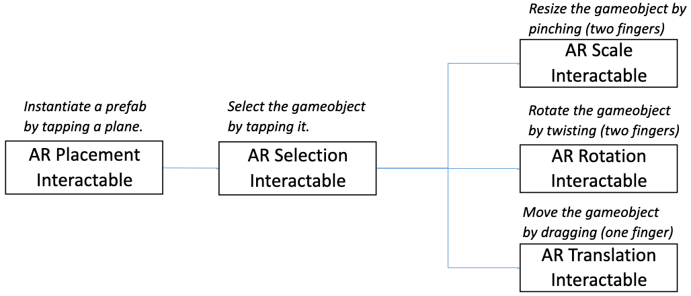

# 몰입형미디어프로그래밍

- 난 핀란드 사람인데 스웨덴에도 살고 한국에도 살았음. VR/AR에 관심있다.
- AR/VR 프로젝트 과제가 2개 있을거고, 유니티 쓸거임.
- 금요일에는 랩 세션을 진행할거임. 개별 실습 과제와 팀플을 하고, 각종 질문받음.
  - 지난주 주제에 대한 실습 과제가 있음. 어렵지 않아요.
  - 팀플은 3-4명, 프로젝트는 결과를 발표하고, 코드나 문서 및 시연영상을 제출.
  - 왠지 모르겠는데 다들 게임을 만들어요. 시연영상은 진짜 게임 예고편처럼 만들어봐.
- 기말고사가 있을거임.
- 교재는 없고, 강의노트와 녹강, 유니티, C#을 쓸거임.
- AR은 안드로이드 디바이스가 있으면 됨. VR은 학교에 오큘러스와 메타퀘스트2가 있음.

## Unity basics

- 유니티는 크로스 플랫폼 게임엔진.
- Game object: scene에 있는 모든 것.
- Mesh: 게임 오브젝트의 모양.
- Colliders: 물체의 물리적 경계. 충돌 판정에 필요.
- Scene: 하나의 게임 화면이며, 여러 게임 오브젝트를 배치할 수 있다.

## Unity scripting

- C# 스크립트를 사용한다. prefab을 만들고, 여기에 스크립트를 추가할 수 있음.
- 스크립트 파일에는 `Start`와 `Update` 함수가 있음:
  - `Start`: 게임이 시작되기 전에 호출됨. 각종 초기화 작업.
  - `Update`: 게임 시작 후 매 프레임마다 호출됨.
- 스크립트에서 게임오브젝트를 참조할 수 있다:
  - `GameObject` 타입 변수를 `public`으로 만들고 유니티에서 연결하면 됨.
  - `private`으로 만들고 스크립트에서 `GameObject.Find("name")`으로 찾을수도.
  - `Instantiate`: 새 게임오브젝트를 생성한다.
  - 언제 스크립트에서 오브젝트를 생성해야 할까?
    - 레벨 시작시 prefab을 여러 다른 장소에 복제해야 할 때.
    - 무기에서 뭔가를 발상할 때, 총알이나 화살 등.
    - 게임오브젝트가 여러 조각으로 분해될 때, 폭발 등.
- 유니티의 벡터:
  - 유니티 좌표계는 왼손법칙을 따름.
  - `Vector3` 타입으로 오브젝트의 위치, 스칼라, 방향, 속도 등을 다룰 수 있음.
  - `MoveTowards`, `Lerp`, `Slerp` 같은 함수들을 유용하게 사용할 수 있음.
  - `Update` 함수 안에 `transform.Translate(transform.forward * Time.deltaTime * 0.5)`을 작성하면 단위 시간마다 0.5씩 앞으로 이동.
- 중요한 클래스들:
  - `GameObject`
  - `Transform`:
    - 게임오브젝트의 위치, 회전, 크기를 표현한다.
    - 유니티는 회전을 나타내는 두 방법이 있음, Euler angles와 quaternions
  - `MonoBehavior`: 스크립트의 베이스 클래스. 게임오브젝트에 대한 각종 정보가 있음.
- 이벤트 함수: 이벤트가 발생하는 특정 시점에 호출되는 함수들. `Update`도 이벤트 함수임.
- 키 입력으로 오브젝트 움직이기:
  - `Input.GetAxis("Horizontal")`, `Input.GetAxis("Vertical")`
  - `transform.Translate(new Vector3(horizontal, 0, vertical) * (5.0f * Time.deltaTime))`
  - 근데 이러면 대각선으로 움직일 때 속도가 빨라짐. 이걸 해결하려면 벡터를 normalize해줘야.
- Coroutines:
  - 스레드 프로그래밍 해봤죠? 유니티에는 코루틴이 있다.
  - 함수 실행을 일시정지하고, 유니티에게 제어권을 넘겨준 다음, 나중에 재개할 수 있음.
  - 가령 함수 안에서 `yield return WaitForSeconds(x)`하면 `x`초 뒤에 함수가 재개됨.
- Rigidbody:
  - 게임오브젝트가 rigidbody 컴포넌트를 갖는다면, 중력에 영향을 받는다. (비활성화하지 않는 이상)
  - 콜라이더를 쓰면 충돌에도 영향을 받음.
- Kinematic:
  - rigidbody 게임 오브젝트가 키네마틱이라면, 물리엔진에 의해 움직이지 않음.
  - 즉, 중력이나 힘, 토크의 영향을 받지 않음.
  - 오직 스크립트나 애니메이션에 의해서만 움직이게 됨.
  - 스크립트로 임의의 force나 torque를 추가해줄 수 있음.
  - 여전히 collisions에 영향을 받기는 한다.
- Collision detection:
  - 다른 게임오브젝트와 콜라이더가 충돌했는지 판단:
    ```cs
    void OnCollisionEnter(Collision collision) {
        if (collision.gameObject.CompareTage("Enemy")) {
            Debug.Log("Collided with an enemy");
        }
    }
    ```
  - `OnCollisionEnter`는 딱 충돌했을 때 한번만 호출됨.
  - `OnCollisionStay`를 쓰면 콜라이더가 맞닿은 내내 반복 호출된다.
- Trigger:
  - 트리거로도 충돌을 판정할 수 있음.
  ```cs
  void OnTriggerEnter(Collider other) {
      if (other.CompareTag("Food")) {
          Debug.Log("Yum");
      }
  }
  ```
  - 트리거를 쓰면 다른 콜라이더를 통과할 수 있다.
- Raycasting:
  - 어떤 점 A부터 B로 향하는 보이지 않는 라인.
  - 레이캐스팅을 하면 ray가 어떤 콜라이더와 충돌하는지 체크할 수 있다.
  - 충돌한 오브젝트가 무엇인지, 그것과의 거리는 얼마인지, 충돌 좌표는 어디인지 알 수 있다.
  - e.g., FPS 게임에서 총쏘면 총알이 어디 착탄했는지 알 수 있음.
  - e.g., 플레이어가 추락하고 있다면 바닥과의 거리를 알 수 있음.
  - e.g., 플레이어와 적 사이에 뭔가가 있는지 체크할 수 있음.

## Introduction to Immersive Media

- 몰입도: 미디어 경험에서 사용자의 감각이 결합되는 정도.
- Embodiment: 몸에 각종 센서를 부착해서 몰입도를 높이는 것.
- Presensce:
  - 좋은 미디어 경험은 사용자가 진짜 가상 세계에 있다고 느끼게 만든다.
  - presence는 그런 느낌의 강도. 한국어로 뭐라고 하지...
  - 제고 요인: 기술적 품질, 몰입도, 현실성, embodiment, 익숙함, 심미성, 디테일 등.
  - 저하 요인: 각종 기술적 문제, 하드웨어의 불편함, 촉감의 부재, 실제 공간의 방해물,
  - 80도 이상의 와이드 뷰, 1080p 이상의 해상도, 60Hz 이상의 주사율 등이 필요함.
- Multisensory: 몰입되는 환경을 위해서는 다양한 기술을 결합해 모든 감각을 동원해야.
  - 시각: 3D 디스플레이, 돔, HMD, 홀로그램
  - 청각: 3D 오디오 효과, 서라운드 사운드
  - 촉감: 햅틱 수트, 장갑
  - 그 외 후각, 미각도 하드웨어 장비로 가능.
- 몰입형 미디어가 뭐냐?
  - 물리 세계의 느낌을 주는 가상 세계를 만들기 위한 시도.
  - 몰입형 미디어의 주요 기능: 시뮬레이션, 인간 관계, 심리적 반응, 신체적 반응 등.
  - XR(eXtended Reality):
    - AR:
      - 증강 현실. 가상 콘텐츠를 현실에 놓는다. e.g., 포켓몬 고, 이케아 플레이스 등.
      - Augmented virtuality: 증강 가상. AV는 현실의 콘텐츠를 가상으로 가져옴.
    - VR: 가상 현실. e.g., 하프라이프 Alyx
    - MR: 혼합현실. e.g., 홀로렌즈 AR이랑 뭐가 다른거지? 뒤에 나옴.

## Introduction to Augmented Reality

- AR의 역사:
  - 1901: 소설 <The Master Key>
  - 1968: Ivan Sutherland가 HMD 디바이스 개발.
  - 1990: 보잉 엔지니어 Thomas Caudell이 AR 용어를 창안.
  - 1992: Louis Rosenberg가 미 공군 연구소에서 첫 AR 시스템을 만들었음.
  - 1998: NFL 게임에서 가상의 노란 선을 보여주며 AR이라는 용어를 사용.
  - 2000: ARToolKit 릴리즈, 첫 AR 게임 <ARQuake> 출시.
  - 2009: ARToolKit이 브라우저를 지원.
  - 2014: 구글 글래스 출시.
  - 2015: AR 기능을 탑재한 모바일 앱이 대거 출시됨.
  - 2016: 포켓몬 고, 마이크로소프트 홀로렌즈.
  - 2017: ARKit, ARCore 발표
  - 2023: 애플 비전 프로.
- AR의 특성:
  - 실제와 가상 세계가 동시에 보여짐.
  - 실시간 인터렉션을 제공. 사용자가 가상 콘텐츠와 상호작용.
  - 가상 또는 현실 세계의 물체를 정확히 등록할 수 있음.
- AR은 현실을 증강, 개선하는 것을 목표로 한다.
- Mixed Reality(MR):
  - MR은 공간 인식을 통해 가상의 콘텐츠를 현실 세계에 올려놓을 수 있다는게 특징.
  - 과거에는 AR이 지금처럼 스마트하지 않았어요. AR에서는 가상 콘텐츠가 현실 위에 보일 뿐이었음.
  - 사실 지금은 AR이 MR임. 지금은 우리가 AR이라고 부르는게 다 MR이죠.
- AR 디바이스:
  - Head-up Display (HUD): 일종의 프로젝터. 시각적으로 보여주는 목적이지, 상호작용은 거의 없음.
  - 헤드셋: 두 가지 종류로 나뉨.
    - Optical see-through: 유리판 같은 광학 요소를 통해 현실을 봄. e.g., 홀로렌즈, 구글 글래스.
    - Video see-through: 카메라를 통해 현실을 봄. e.g., 오큘러스 퀘스트, 애플 비전 프로.
  - 모바일/Handheld AR: 스마트폰 같은 포터블 디바이스에서 구현된 AR.
  - 공공장소 전광판, 키오스크 등.
- Tracking:
  - 현실 세계를 추적하기. AR 시스템이 가상 객체를 현실 세계에 놓아야 하니까.
  - Marker-based:
    - Fiducial markers: 바코드, QR 코드 기반 인식.
    - Image targets: 굵은 윤곽선과 불규칙한 패턴, 고대비 이미지.
    - Multi-targets: 전개도를 인식해서 3D 개체로 보여줌.
  - Markerless-based:
    - 출력된 마커없이 현실 세계를 추적할 수도 있음.
    - 더욱 리얼한 AR 경험을 제공. 지원하지 않는 디바이스도 있음.
    - Object detection: 3D 개체를 인식.
    - SLAM: 현실 환경의 평면을 인식. 가령 테이블 위에 모델을 올리고 싶다면 필요.
    - Face tracking: 스노우의 그것. 높은 정확도를 위해 LIDAR 사용할수도.
    - Location tracking: GPS나 나침반 활용. AR 내비게이션.
- Anchors:
  - 가상 콘텐츠가 어딘가에 고정되어 있지 않다면 카메라를 계속 따라다닐거임.
  - 현실 세계의 특정 위치에 콘텐츠를 고정히키기 위해 앵커를 사용할 수 있다.
  - 두 가지 중요한 용어:
    - World space: 카메라와 가상 개체가 위치한 좌표 공간. 현실 세계에서 위치가 갱신됨.
    - Pose: world space에서의 개체 위치와 방향을 표현.
- AR 플랫폼: 애플은 ARKit, 안드로이드는 ARCore, 오픈소스 Holokit 등.
- 좋은 AR 경험을 위한 요인:
  - 가상 개체를 현실 세계의 특정 위치에 고정시켜야.
  - 사용자의 위치에 따라 가상 개체가 변형될 수 있어야. 가령 가까이 가면 커져야 한다.
  - Occlusion: 개체가 다른 개체와 물리적으로 상호작용해야.
  - Lighting: 조명을 잘 다루면 현실적.

## AR Foundation and AR Project Setup

- 유니티로 XR 개발을 할 수 있음.
- AR Foundation:
  - 유니티에서 멀티플랫폼 AR 애플리케이션을 만들게 해주는 툴.
  - 디바이스 추적, 평면 인식, 앵커, 얼굴 추적 등 온갖게 다 들어있음.
  - iOS에 지원되는 기능이 더 많기는 합니다.
- 유니티에서 AR 프로젝트 만드는 법 설명...
- XROrigin: XR 월드 스페이스의 중심을 표현. 개체의 AR 좌표를 유니티 월드 좌표로 변환.
- XR Simulation: 컴퓨터에서 AR 앱을 테스트해볼 수 있음.

## Trackable and Image Tracking

- AR Foundation의 추적 시스템은 현실 세계의 Trackable을 기반으로 동작함.
- 이미지를 인식하고 그에 따른 동작을 프로그래밍할 수 있음.
- 특정 이미지를 인식하고 3D 개체 띄우는 걸 보여줄게:
  - 교수님이 라이브 코딩하고 시연하는데 잘 안 됨.
  - 30분간 이어지는 눈물의 디버깅쑈... 뭔가 확실히 보여주시려는 듯.
  - 실습 수업에서 해결됨. Universal RP 문제였음.

## Plane Tracking and AR Raycasting

- AR Plane Manager로 plane을 인식할 수 있음.
- 일단 기본적은 AR scene을 설정하고, XR Session Origin > Add Component > AR Plane Manager 선택.
- hierarchy에 기본 palne을 추가하셈(XR > AR Default Plane)
- 이렇게 하면 인식된 planes를 시각화해서 볼 수 있음.
- 터치했을 때 plane 위에 오브젝트 생성하기:
  - 레이를 쏴서 plane 위에 오브젝트를 올릴 수 있다.
  - 강의노트 7-8 페이지에 코드가 있음.
  - 오늘도 라이브 코딩 하시는 중.
- plane 대신 placement indicator를 쓸 수도 있다.

## Building UI with Unity UI (uGUI)

- 유니티로 UI만드는 법을 알려줄거임. 이건 인터넷에 자료가 많으니 짧게 하겠음.
- 모든 UI 요소는 Canvas 컴포넌트를 가진 게임 오브젝트의 자식이어야 한다.

## Face Tracking, Light Estimation, Anchors, Occlusion

- 얼굴 추적:
  - 얼굴 추적은 AR Face Manager를 쓰면 됨.
  - 얼굴에 가상 마스크같은 걸 씌울 수 있다.
  - 이건 AR Foundation Remote가 안 됨. 매번 apk를 빌드해야 한다.
  - 수정과 빌드를 반복하면서 왜 AR Foundation Remote가 좋은지 보여주고 계심.
- Light estimation:
  - ARCameraManager는 카메라로 캡쳐된 프레임을 분석해서 빛을 estimation한다.
    ```cs
    private void Awake() {
      targetLight = GetComponent<Light>;
    }

    private void OnEnable() {
      cameraManager.frameReceived += ProcessFrame;
    }

    private void OnDisable() {
      cameraManager.frameReceived -= ProcessFrame;
    }

    private void ProcessFrame(ARCameraFrameEventArgs args) {
      ARLightEstimationData data = args.lightEstimation;
      if (data.averageBrightness.HasValue) {
        targetLight.intensity = data.averageBrightness.Value; // 공간의 평균 조도로 설정.
      }

      // 조도 외에 averageColorTemperture, colorCorrection, mainLightColor 등 속성이 있음.
      ...
    }
    ```
- Anchors:
  - 앵커는 공간상의 특정한 지점.
  - `gameObject.AddComponent<ARAnchor>()`같은 식으로 오브젝트에 앵커를 추가할 수 있음.
  - 공간에 입체 그림을 그리는 예시를 시연하심. 왕신기.

## AR Interaction with XR Interaction Toolkit

- (잠깐 졸았는데 챕터가 바뀜...)
- XR Interaction Toolkit은 하이레벨 인터랙션 시스템.
- 이 툴킷으로 쉽게 인터랙티브한 AR/VR 경험을 만들 수 있음.
- AR 인터랙션
  - AR 제스처 시스템: 손가락 제스처, 탭, 드레그, 트위스트, 핀치 등.
  - AR 제스처 interactor and interactables
- VR 인터랙션:
  - 크로스플랫폼 XR 컨트롤러 입력.
  - 기본적인 오브젝트 호버, 선택, 활성 액션.
  - 햅틱 피드백: 컨트롤러 진동
  - 비주얼 피드백
  - XR 컨트롤러를 이용한 UI 인터랙션
  - Handling stationary and room-scale VR experiences.
- 메인 컴포넌트:
  - Interactors: gameobjects that can hover, select or activate another gameobject.
  - Interactables: gameobjects that the user cnat interact with by tap, drag, press, etc.
  - Interaction managers: handle interaction between interactors and interactables.
  - Interactor와 Interactable이 Interaction manager를 통해 상호작용한다.
- 스크립트 작성을 안하고 오브젝트와 인터랙션할 수 있음.
- Summary of using AR interactables:
  

## New Input System

- 앞서 `Input.GetKeyDown` 같은 식으로 입력 시스템을 사용했음.
- 그런데 새로운 입력 시스템을 추가하면 어떨까? 조이스틱을 연결하거나 AR 컨트롤러를 연결하면?
- 기존 시스템은 A버튼을 누르면 그에 대한 함수를 실행하도록 모델링함:
  ```
  Jump Button --> Jump Function
  ```
  - `if (Keyboard.current.spaceKey.wasPressedThisFrame) OnJump()`
  - 해당 프레임에서 스페이스 키가 눌렸다면 점프한다.
- 새로운 시스템이 추가되면 A버튼과 B버튼에 대한 구분이 필요해짐:
  - 두 버튼에 대한 액션과 함수를 분리해보자:
  ```
  Jump Button 1
                \
                 +--> Jump Action --> Jump Function
                /
  Jump Button 2
  ```
  - 함수는 키를 직접 바라보는게 아니라 액션을 바라보게 됨.
    - 하나의 액션에 각종 키를 바인딩해두고, 함수에서는 액션만을 참조한다.
    - 이렇게 하며 새로운 입력 시스템이 추가돼도 기존 코드를 변경할 필요가 없음.
  - 액션을 따로 만드려면 Input Actions Asset을 추가:
    - Action maps: 액션의 그룹. key-actions pair (e.g., 메뉴, 게임플레이)
    - Actions:
      - 플레이어에 대한 단일 액션 (e.g., 이동, 발사, 점프)
      - 각 액션에 특정 키 바인딩을 명시할 수 있음.
    - Action/Binding properties: 선택된 액션의 특성.
    - Interactions: 액션을 트리거하기 위한 인터랙션 (e.g., press, hold, single tap, multi tap)
    - Processors: 장치로부터 받은 값을 변경 (e.g., invert, clamp)
  - 코드에서는 키를 명시하지 않는다:
    - `actions.FindActionMap("Gameplay").FindAction("Jump").performed += OnJump`
    - `Gameplay` 그룹의 `Jump` 액션이 일어나면 `OnJump` 함수가 실행.
- 슬라이드에는 없는데 하나 더 보여줄게. XR Interaction Toolkit을 써보자:
  - VR 컨트롤러에 있는 각종 입력 장치를 바인딩해놓음.
  - 스크립트에서 바로 사용할 수 있음.

## Introduction to Virtual Reality

- VR: computer-generated simulation of a 3D environment, which seems real to the user.
- VR의 목표: "generate realistic image, sounds and other sensations that simulate a user's physical presence in a virtual environment.
- 오늘날 VR HMD(head-moounted display)는:
  - 양쪽 눈에 같은 이미지를 보여줌으로써 stereographic 3D scene을 제공함.
  - 사용자의 신체나 시선을 추적할 수 있고, 감정을 읽기도.
- Why VR? 현실감을 위해. 훈련, 교육 등 실현하려면 비용이 많이 드는 일을 가상환경으로 해결 가능.
- Stereoscopic VR:
  - 우리가 하나의 사물을 볼 때 양쪽 눈에는 살짝 다른 상이 맺힘.
  - 살짝 다른 이미지를 양쪽 눈에 보여주면 3D로 보임. 각각의 눈에 렌즈가 하나씩 필요.
  - 오래된 방식.
- Monoscopic VR:
  - 두 눈에 하나의 거대한 이미지를 보여준다.
  - 몰입감은 좀 떨어지지만 저렴함.
  - 유튜브에 있는 VR 기능이 이거임. 그냥 2D 이미지가 파노라마처럼 사용자를 둘러싸는 것.
- VR의 역사:
  - 1956: Sensorama 발명. 3D 영상과 소리, 냄새와 촉감 제공.
  - 1968: 첫 HMD, The Sword of Damocles.
  - 1969: Videoplace 발명. HDM를 필요로하지 않는 첫 인터랙티브 VR 시스템.
  - 1978: Aspen Movie Map, https://rebeccaallen.com/projects/aspen-movie-map
  - 1979: Vital VR 헬멧. 파일럿 시선을 추적하는 군사용 장치.
  - 1991: 첫 VR 아케이드 머신.
  - 1995: 홈 VR 헤드셋 출시, I-Glasses, VFX1 헤드기어. 혁명적.
  - 2010: 오큘러스 리프트의 첫 프로토타입 개발.
  - 이후로 구글 카드보드, 삼성 기어 Vr, GloveOne, HTC Vive, Valve Index 등 출시.
  - 작년에는 메타 퀘스트 3와 애플 비전 프로가 나왔음.
- VR의 중요한 요소들:
  - 3D viewing:
    - pincushion effect
    - 유니티의 VR 카메라는 uses barrel distortion으로 pincushion effect를 방지.
    - Screen resolution: 해상도가 낮으면 screen-door effect가 일어난다.
    - 낮은 해상도의 HMD를 위한 기법이 있음: foveated rendering은 시선을 추적해서 사용자가 보고 있는 곳만 고해상도로 렌더링하고, 주변부는 흐리게 함.
  - Head, hand, and body tracking:
    - VR HMD에는 모션 트래킹을 위한 센서가 있음.
    - Positional tracking: 현실 세계의 헤드셋과 컨트롤러의 위치를 추적.
    - Hand tracking: 컨트롤러나 장갑, 햅틱 피드백.
    - Body tracking: 몸 전체를 추적. 수트같은걸 입음.
    - Inside-out vs outside-in tracking:
      
      - Inside-Out: 카메라가 사용자에게 달려있음. e.g., Oculus, Meta Quest, ...
      - Outside-in: 환경에 고정된 카메라가 있고, 사용자를 추적. e.g., HTC Vive, Oculus Rift, ...
    - 3DoF vs 6DoF:
      - 3DoF:
        
        - Rotational movements of the head are tracked (tilt, turn)
        - 3개의 회전축.
      - 6DoF:
        
        - Rotational movements of the head + position tracking
        - 3개의 회전축과 3개의 위치축.
  - Embodiment:
    - 사용자가 가상의 바디를 자신의 바디라고 느끼는 것.
    - first-person VR 경험에 필수적.
    - Increased immersion, presence, emotional responses.
  - Interactivity:
    - Natural: 인터랙션은 자연스러워야 한다.
    - Multimodal: 인터랙션은 다양한 입출력을 지원해야 한다.
  - High quality content:
    - 높은 품질의 콘텐츠는 높은 몰입을 가능하게 만들죠.
    - 이 수업은 3D 콘텐츠를 만드는 수업은 아니니까 어셋 스토어에서 가져다 쓰도록.
  - Spatial sound

### VR Hardware and Software

- HMDs and Projcted VR:
  - HMD는 님들이 잘 아는 VR 기기.
  - Projected VR은 사방이 스크린인 공간에 사용자가 들어감.
- Types of VR HMD devices:
  - Tethered, desktop VR:
    - 실제로는 컴퓨터에서 도는데 케이블 통해서 HMD로 전송하는 방식.
    - e.g., 플레이스테이션 VR, Steam VR, HTC VIVE, ...
  - Standalone, mobile VR: 오큘러스, 메타 퀘스트, ...
- Hand input devices:
  - 컨트롤러나 장갑같은 걸 쓸 수 있음.
  - Meta Quest 3나 애플 비전 프로는 맨손도 감지한다.
- Non-hand input devices: Head, Eye, Lip/face, Microphones, Full-body tracking

### Types of VR Experience

- Diodrama: 간단한 3D 씬, "Shoebox diodrama"
- First-person experience: e.g., Half-Life Alyx
- Third-person experience
- Stationary vs room-scale VR experiences:
  - 둘 다 방에 카메라 설치해두는 건데 뭐가 다른가?
  - Stationary: 사용자가 한 장소에 고정. 사용자의 물리적 움직임이 영향을 미치지 않음.
  - Room-scale: VR 기기가 사용자의 실제 움직임을 추적해서 가상세계에 반영.
- 3D content creation experiences: VR로 3D 콘텐츠를 만든다. 마인크래프트도 어찌보면...
- Riding/Walking experiences: 롤러코스터 VR은 아주 초기에도 시도한 것. 보통 상호작용이 제한됨.
- 360-Degree media: 비디오인데 360도 촬영해서 몰입감을 선사. 상호작용은 없음.
- Social VR: 아주 유명한 VRChat.

### Design Considerations for VR Experiences

- 몰입도 높은 VR 경험을 위한 요구사항:
  - 낮은 레이턴시(motion-to-photon): 20ms 미만이어야.
  - 높은 프레임 레이트: 90 FPS 이상이어야.
  - High resolution
  - Wide field of view(FOV): 실제 사람은 220도 정도, 오큘러스 리프트는 90도.
  - Precise head/hand/body tracking: 6DoF가 좋겠죠.
  - High quality audiovisual content
  - Natural interaction
  - Blocking of external disturbances
- Simulator sickness:
  - VR을 사용하고 멀미를 하는 경우도 흔합니다.
  - simulator sickness가 일어나는 다양한 원인이 있음.
  - 높은 레이턴시, 낮은 트래킹 정확도: 요즘엔 디바이스가 좋아서 문제가 안 됨.
  - Fast acceleration(eye-inner ear mismatch): 등속운동하거나 천천히 움직이도록 해보세요.
  - 빠르게 움직일 때 FoV가 너무 넓으면 안 됨.
  - 낮은 refresh rate와 flicker, brightness, strong contrast changes.
  - 예상치 못한 움직임: 계단을 오르는데 점프가 된다거나... 적이 사용자를 미는 경우.

## VR Development Tools Setup, Inputs, and Hand Presence

- Oculus/Meta Quest 2 공식문서 읽고 셋업하셈. 당신 폰과 컴에 관련 앱이 필요함.
- 고성능 GPU가 필요함. 지원이 안 되는 GPU가 있으니 그래픽카드 사양을 잘 보셈.
- 그리고 안타깝지만 윈도우즈 시스템에서만 할 수 있음. (oh no)
- 내일 실습에 오기 전에 미리 설정을 해보렴. 그래야 우리가 도와줄 수 있음.
- 유니티에서 셋업하는 방법을 알려줄게:
  - 유니티에서 VR과 Universal 3D 프로젝트는 둘 다 URP를 사용함.
    - 난 Universal 3D를 해보겠음.
    - VR ㅋ프로젝트 템플릿을 쓰면 샘플 파일들이 들어있어서 좀 지저분하다.
  - 패키지 매니저에서 OpenXR Plugin을 설치해라.
  - 추가로 XR Device Siulator를 설치하면 기기가 없어도 시뮬레이트할 수 있음.
  - 프로젝트 세팅 > XR Plug-in Management > OpenXR > 안드로이드 탭 들어가서 프로파일 추가해라.
  - AR 프로젝트에서 메인 카메라 지우고 XR Origin 추가했지? VR 프로젝트도 똑같음.
  - 근데 이제 컨트롤러가 있으니까 카메라 오프셋 아래에 있는 컨트롤러를 없앨 필요는 없음.
  - 컨트롤러에 XR Interactor Line Visual 컴포넌트를 추가하면 컨트롤러 방향을 선으로 표시해줌.
- 간단한 VR 씬만들고 시연하심. 재밌겠다...:star_struck:
- What is URP?
  - 렌더 파이프라인은 씬의 콘텐츠를 스크린에 렌더링함.
  - Build-in RP: 모든 플랫폼에서 동작.
  - URP: 제한된 성능의 기기에서 동작함. (e.g., 스마트폰, VR 기기)
  - HDRP: 고성능 기기에서만 동작함. (e.g., 컴퓨터, 콘솔)
  - 상황에 맞게 잘 선택하면 된다.
- What is OpenXR?
  - 크로스플랫폼 XR 개발을 위한 표준.
  - 유니티 OpenXR 플러그인은 각종 기기에 여러 인터랙션 프로파일을 지원함.

## Memo

- 깜짝 퀴즈 볼거임. 지금 당장.
  - 펜과 종이로 20초 안에 질문에 대답해야 함. 이메일로 당신의 정답을 내셈.
  1. b) FixedUpdate
  2. d) Layer mask
  3. (0, 4, 0)
  4. A frist AR game
  5. c) Richie's (?)
  6. b) Leo (??)
  7. a) ShanDong (???)
  8. She's scream was louder than gunshot. (????)
  9. April fools' day.....
- lab4 과제가 올라왔는데 arcoreimg.exe 파일이 첨부되어 있음:
  - 맥이나 리눅스쓴다면 그냥 [AR Core 저장소](https://github.com/google-ar/arcore-android-sdk/tree/master/tools/arcoreimg)에서 받아도 됨.
  - `arcoreimg evel-img --input_image_path=<path>`하면 이미지 인식률을 체크해볼 수 있음.
  - 점수가 75점 이상 나와야 마커 이미지로 인식이 잘 된다.
- Q: 데스크탑이랑 모바일 네트워크가 서로 달라서 AR Foundation Remote를 못 씀...
  - A: USB 테더링으로 해보셈.
- 중간고사 보고싶은 사람?
  - 우린 중간고사 안 봅니다.
  - 그러니까 수업 나오셈. 4/22에 나와서 팀플하세요.
- VR 기기 빌려줄게요:
  - 팀 1,2,3,4,9는 산621로 오셈. VR 기기랑 USB 케이블을 줄거임.
  - 기기는 조심히 써주세요. 엄청 비싸진 않지만 저렴하지도 않음.
  - 기기는 항상 박스에 넣어둬라. 케이블도 꼭 챙겨서 나중에 반납해야 됨.
  - 케이블이나 충전기가 없는 경우도 있을거임. 그냥 핸드폰 충전기 써보셈.
- 님들 컴퓨터가 안 좋으면 실습실에서 하세요. 실습실 쓸 사람들은 신청서를 제출하렴.
