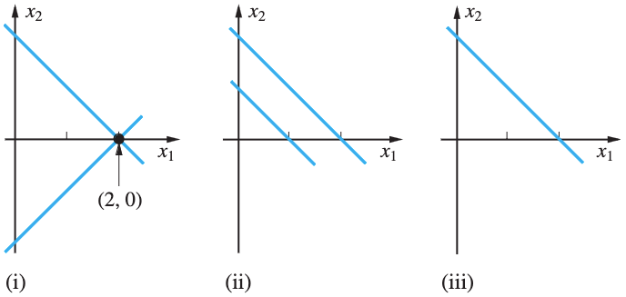

# 선형대수

## Matrices and Systems of Equation

- 선형방정식(linear equation):
  - $a_1x_1 + a_2x_2 + \cdots + a_nx_n = b$처럼 선형적으로 결합된 방정식.
  - 선형함수의 그래프는 직선으로 표현됨.
  - 선형함수 $f$에 대해 $f(ax + by) = af(x) = bf(y)$를 만족.
- 선형시스템(linear system):
  - 동일한 변수를 사용하는 방정식이 여러 개가 있다면, 시스템으로 다룰 수 있음:
    - $a_{11}x_1 + a_{12}x_2 + \cdots + a_{1n}x_n = b_1$
    - $a_{21}x_1 + a_{22}x_2 + \cdots + a_{2n}x_n = b_2$
    - $a_{m1}x_1 + a_{m2}x_2 + \cdots + a_{mn}x_n = b_m$
    - $m \times n$ 선형시스템의 해는 ordered n-tuple $(x_1, x_2, \cdots, x_n)$ 형태.
  - 예시:
    - $x_1 + 2x_2 = 5$, $2x_1 + 3x_2 = 8$:
      - $2 \times 2$ 크기의 선형 시스템.
      - 두 방정식을 연립해서 풀면 답은 $(1, 2)$ 순서쌍.
    - $x_1 - x_2 + x_3 = 2$, $2x_1 + x_2 - x_3 = 4$
      - $2 \times 3$ 크기의 선형시스템.
  - 해를 구할 수 없는 경우, 시스템이 모순(inconsistent)이라고 한다.
- 선형시스템을 기하학적으로 표현할 수 있음. 세 가지 형태의 선형시스템이 있다:
  
  1. 한 점에서 교차하는 경우: $x_1 + x_2 = 2$, $x_1 - x_2 = 2$
  2. 평행하는 경우(모순): $x_1 + x_2 = 2$, $x_1 + x_2 = 1$
  3. 같은 경우(해가 무수히 많음): $x_1 + x_2 = 2$, $-x_1 - x_2 = -2$
- 등가 시스템(equivalent systems):
  - 같은 변수로 구성이 되어 있는 두 선형시스템의 해집합(solution set)이 같은 경우.
  - 방정식의 순서는 해에 영향을 주지 않는다. 즉, 순서만 다른 두 시스템은 등가 시스템을 만족.
  - 양변에 같은 값을 더하거나 빼는 경우, 0이 아닌 같은 값을 곱하거나 나누는 경우에도 해에 영향을 주지 않는다.
  - 주어진 선형시스템이 $n \times n$일 때:
    - 시스템을 strict triangular form으로 변형할 수 있다면 유일한 ordered n-tuple 해를 구할 수 있음.
    - strict triangular form: $k$번째 방정식에서 첫 $k - 1$개의 변수가 모두 0이고, $x_k$는 0이 아닌 형태.
