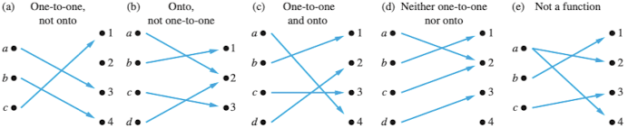
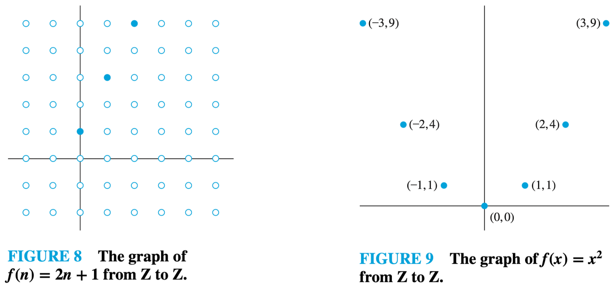
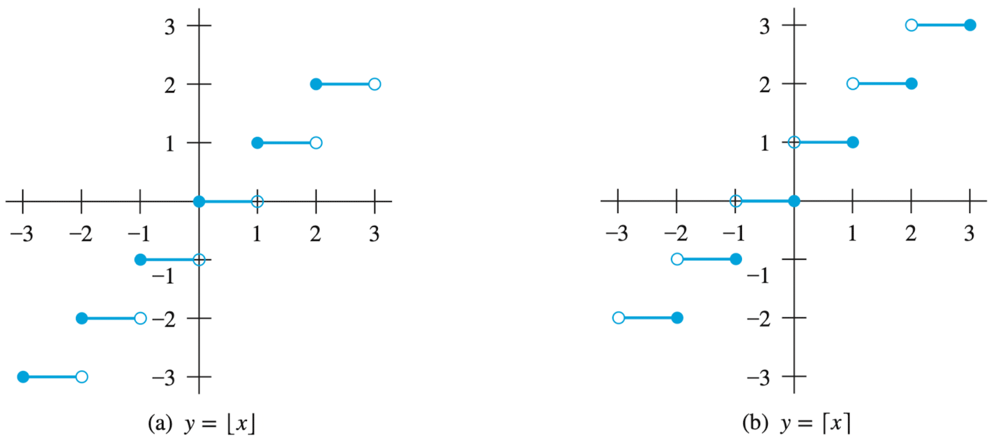
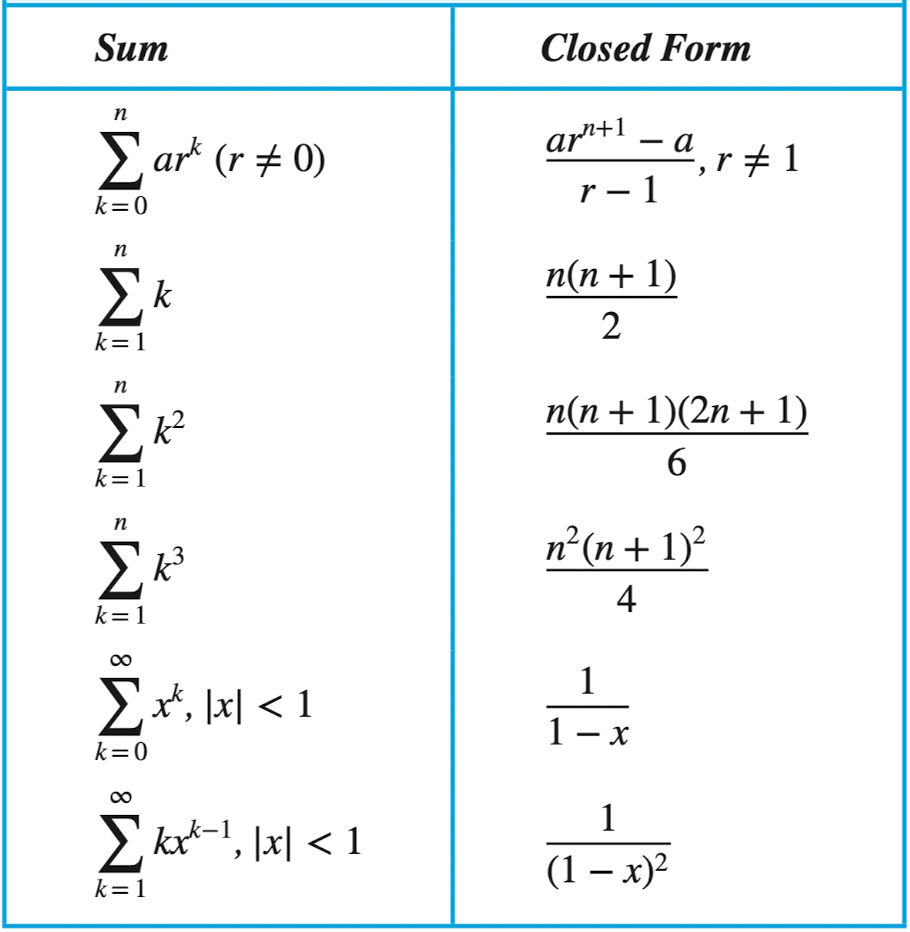

# 이산수학

- 정수, 그래프, 논리 등 연속되지 않은 값을 가지는 대상의 구조와 성질에 관심.
  - 컴퓨터의 데이터는 모두 이산적. 이산적 데이터 구조를 수학적으로 해석할 수 있음.
  - 집합, 함수, 수열, 순열과 조합, 관계, 그래프, 트리, 부울 대수 등의 주제를 다룸.
  - 중간까지는 정수론과 암호, 귀납법, 관계까지. 기말에는 그래프, 트리, 부울 대수 등을 다룸.
- 과제는 중간 전 2번, 기말 전 2번.
  - 교재의 연습 문제를 과제로 내줄거임.
  - 과제는 BB로 제출하게 될거예요.
- 수업이 끝나면 그 수업 내용을 확장하는 동영상을 올려줌:
  - 영상에는 더 많은 예제와 설명이 있을거임.
  - 동영상은 부가적인게 아니라 꼭 봐야함.

## Basic Structures

- 이산적인 자료를 처리하기 위해 필요한 기본적인 구조는 집합, 함수, 수열과 합, 행렬.
- 개념은 고등학교에서 배웠을테니 여기에서는 기호와 표현에 중점을 둘거임.

### Sets

- 집합은 자료를 구분하고 모음을 정의. 집합에는 순서가 없음.
  - 집합의 원소를 element, member라고 지칭.
  - 집합을 표현하는 방법:
    - 원소나열법(Roster method): $S = \{1, 2, 3\} = \{3, 2, 1\}$
    - 조건제시법(Set-builder notation): $S = \{x \in \Bbb{Z}^+ | x \text{ is odd and } x \lt 10\}$
- 공집합: $\varnothing = \{\}$
  - 공집합과 공집합을 가진 집합은 다름: $\varnothing \neq \{\varnothing\}$
- 부분집합:
  - 하나의 집합이 다른 집합에 속했는지, 속하지 않았는지.
  - $A$가 $B$에 속함: $A \sub B$
  - $A \sub B$이고, $B \sub A$인 경우에도 서로가 서로의 부분집합: $A \sube B$
- 카디널리티:
  - 집합의 크기(원소 개수), $|A| = n(A) = n$
  - $|\varnothing| = 0$, $|\{\varnothing\}| = 1$
  - $|A \cup B| = |A| + |B| - |A \cap B|$
  - 유한집합뿐만 아니라 무한집합의 크기도 표현 가능:
    - 정수 집합의 카디널리티: $|\Bbb{Z}|$ (특정 수로 나타낼 수는 없음)
    - 정수는 양의 정수, 음의 정수, 0을 포함하므로, $|\Bbb{Z}| = 2|\Bbb{N}| + 1$
- Tuple:
  - 집합에서 원소가 순서를 갖는 순서쌍.
  - Ordered n-tuple: $(a_1, a_b, \cdot, a_n)$
  - Cartesian product:
    - $A \times B = \{(a, b) | a \in A \land b \in B\}$
    - $A$와 $B$를 결합해 만들 수 있는 모든 순서쌍의 집합.
- Set operations:
  - 합집합(union), 교집합(intersection)
  - 여집합(complementation): $\bar A = A^c = U - A = \{x | x \in U | x \notin A\}$
  - 차집합(difference): $A - B$
- 대칭차집합(symmetric difference):
  - XOR(exclusive OR), `(A && !B) || (!A && B)`
  - $A$와 $B$ 중 한쪽에만 속한 원소들의 집합.
  - $A \oplus B = (A - B) \cup (B - A) = A\bar B + \bar AB$
- 집합의 항등관계:
  - 항등법칙(identity): $A \cup \varnothing = A$, $A \cap U = A$
  - 지배법칙(domination): $A \cup U = U$, $A \cap \varnothing = \varnothing$
  - 멱등법칙(idempotent): $A \cup A = A$, $A \cap A = A$
  - 보원법칙(complementation): $\bar{\bar{A}} = A$
  - 교환법칙(commutative):
    - $A \cup B = B \cup A$, $A \cap B = B \cap A$
    - 교환법칙이 성립하기 때문에 우리는 데이터의 저장 순서를 신경쓰지 않아도 됨.
  - 결합법칙(associative):
    - $A \cup (B \cup C) = (A \cup B) \cup C$
    - $A \cap (B \cap C) = (A \cap B) \cap C$
  - 분배법칙(distributive):
    - $A \cap (B \cup C) = (A \cap B) \cup (A \cap C)$
    - $A \cup (B \cap C) = (A \cup B) \cap (A \cup C)$
    - 우변 대신 좌변의 연산을 수행하면 연산수를 줄일 수 있겠죠.
  - 드 모르간 법칙(De Morgan):
    - $\overline{A \cup B} = \bar A \cap \bar B$
    - $\overline{A \cap B} = \bar A \cup \bar B$
    - `!(A && B)`와 `!A || !B`가 같다는 것. 좌변 연산의 연산수가 적겠지.
  - 흡수법칙(absorption):
    - $A \cup (A \cap B) = A$
    - $A \cap (A \cup B) = A$
  - 보수법칙(complement): $A \cup \bar{A} = U$, $A \cap \bar{A} = \varnothing$

### Functions

- $\varnothing$이 아닌 어떤 두 집합의 원소간 대응관계가 함수.
  - $A$ 원소 각각에 $B$ 원소 하나를 대응시킨 것을 $A$에서 $B$로의 함수라고 함: $f: A \to B$
  - $A$의 원소 $a$, $B$의 유일한 원소 $b$에 대해 $f(a) = b$.
  - $f(x) = y_1$이고, $f(x) = y_2$일 때, $y_1 = y_2$이어야. 즉, 같은 입력에 같은 출력을 보장해야.
  - 함수는 매핑(mapping) 또는 변환(transformation)이라고도 한다.
- 용어 정리를 해보자, $f: A \to B$일 때, f(a) = b:
  - $a$는 원상(preimage), $b$는 상(image)
  - $A$는 함수 $f$의 정의역(domain), $B$는 함수 $f$의 공역(codomain)
  - $f$가 반환하는 $b$의 집합은 치역(range), 즉, 치역 $f(a)$는 항상 $B$의 부분집합.
- 함수로 관계(relation)을 표현할 수 있음.
  - 집합 $A$에서 $B$로의 모든 관계를 카테시안 곱으로 표현할 수 있음.
  - 결국 $f: A \to B$는 $A \times B$의 부분집합.
- 집합과 함수:
  - 집합을 인자로 받으면 집합을 반환한다. e.g., $f(\{a_1, a_2\}) = \{b_1, b_2\}$
  - 원상이 여러 개라면 값을 집합으로 표현할 수 있음. e.g., $b$의 원상이 $\{a_1, a_2\}$
- 다양한 종류의 대응:
  
  - 단사함수(injection, one-to-one):
    - $f(a) = f(b)$이면 반드시 $a = b$일 때.
    - 정의역의 원소들이 모두 서로 다른 원소들에 대응되는 경우. (중복 결과 없음.)
    - 반례: 함수값이 같은데 인자가 다른 경우, $f(a) = f(b)$인데 $a \neq b$인 경우.
  - 전사함수(surjection, onto):
    - $b \in B$인 모든 원소에 대해 $f(a) = b$인 원소 $a \in A$가 존재할 때.
    - 공역의 모든 원소들이 함수 $f$에 의해 매핑되는 경우. (공역과 치역이 같음.)
    - 반례: 공역의 어떤 원소가 어떠한 정의역의 원소에도 대응되지 않는 경우.
  - 전단사함수(일대일대응, bijection, one-to-one correspondence)
    - 단사이면서 전사인 함수. 두 조건을 모두 만족하는 경우.
    - 전단사함수라면 집합 $A$의 원소 개수와 $B$의 원소 개수가 같음.
- 역함수(inverse):
  - 함수 $f: A \to B$에 대해 $f(a) = b$일 때 $f^{-1}(b) = a$인 함수.
  - 전단사함수가 아니라면 역함수는 존재하지 않는다:
    - 단사함수가 아니라면 $f^{-1}(a)$가 하나의 값으로 대응되지 않을 것.
    - 전사함수가 아니라면 $f^{-1}(a)$가 어떤 값에도 대응되지 않을 것.
- 합성함수(composition):
  - $f(g(x)) = f \circ g(x)$
  - 합성은 교환법칙이 성립하지 않음: $f \circ g \neq g \circ f$
- 함수 판별 예제:
  - ${a, b, c, d}$에서 ${1, 2, 3}$인 함수 $f$에 대해, $f(a) = 3, f(b) = 2, f(c) = 1, f(d) = 3$:
    - $f(a) = 3$이고, $f(d) = 3$인데 $a \neq d$이므로 단사함수 아님.
    - 공역과 치역이 같으므로 전사함수임.
  - 정수 집합에 대해 $f: \Bbb Z \to \Bbb Z$이고, $f(x) = x^2$:
    - $f(-1) = 1$이고, $f(1) = 1$인데 $-1 \neq 1$이므로 단사함수 아님.
    - 2를 만들기 위해서는 $\sqrt 2$가 필요하지만, 정수 집합에 포함되지 않으므로 전사함수 아님.
  - $f: \Bbb Z \to \Bbb Z$이고, $f(x) = x + 1$:
    - $y = x$가 성립하므로 전단사함수임. 따라서 역함수가 존재할 것.
- 함수의 그래프:
  
  - 그래프가 직선이나 곡선이려면 실수 집합에 대한 함수여야.
  - 우리는 정수 집합을 다루고 있으므로 선이 아니라 점으로 그래프를 그려야.
- 각종 함수들:
  - 정수 근사 함수:
    
    - 바닥(floor)함수:
      - $f(x) = \lfloor x \rfloor$, e.g., $\lfloor 3.5 \rfloor = 3$
      - $x$보다 작거나 같은 정수 중 가장 큰 정수.
    - 천장(ceiling)함수:
      - $f(x) = \lceil x \rceil$, e.g., $\lceil 3.5 \rceil = 4$
      - $x$보다 크거나 같은 정수 중 가장 작은 정수.
  - 팩토리얼 함수:
    - $f: \Bbb N \to \Bbb Z^+$일 때, $f(n) = n!$.
    - $f(n) = 1 \times 2 \times 3 \times \cdots \times (n - 1) \times n$
    - $f(0) = 0! = 1$
  - 부분 함수:
    - $f: A \to B$ 중에서 $A$의 부분집합에 대해서만 정의된 함수.
    - e.g., $f: \Bbb Z \to \Bbb R$, $f(n) = \sqrt n$일 때:
      - $n$이 $-1$이라면 무리수이므로 $\Bbb R$에 포함되지 않음.
      - 따라서 음수에 대해서는 함수값이 정의되지 않는다.
      - 즉, $f$는 $\Bbb Z$ 중 일부(양의 정수)에 대해서만 정의된 부분함수.

### Sequences and Summations

#### Sequences

- 수열은 요소의 순서있는 목록을 표현하는 이산구조.
  - 수열은 정수의 부분집합에서 집합 $S$로의 함수.
  - 정수 $n$의 상을 표현하기 위해 $a_n$이라는 표기를 사용.
  - 수열의 일반화된 규칙을 바탕으로 임의의 항을 구할 수 있음.
  - 메모리 구조를 수열로 추상화할 수 있음.
- 등비수열(geometric progression):
  - $a, ar, ar^2, ar^3, \cdots , ar^n, \cdots$
  - $a$는 초항(initial), $r$은 공비(common ratio).
  - e.g., $a = 1, r = -1$일 때, $\{b_n\} = \{b_0, b_1, b_2, \cdots\} = \{1, -1, 1, \cdots\}$
- 등차수열(arithmetic progression):
  - $a, a + d, a + 2d, \cdots , a + nd,  \cdots$
  - $a$는 초항, $d$는 공차(common difference).
  - e.g., $a = -1, d = 4$일 때, $\{s_n\} = \{s_0, s_1, s_3, \cdots\} = \{-1, 3, 7, \cdots\}$
- 문자열(string):
  - 문자를 순서대로 나열한 유한수열.
  - 빈 문자열(empty string)은 $\lambda$로 표기. 길이가 0.
  - 문자열 $abcde$는 길이가 5.
- 점화관계(recurrence relations)
  - 관계: 수열에서 어떤 항과 다음 항 사이의 규칙성.
  - 점화관계:
    - 앞서 나온 항들로부터 다음 항을 구하는 규칙.
    - 수열 $\{a_n\}$에 대해 $a_0$부터 $a_{n - 1}$까지의 모든 정수로 $a_n$ 항을 구할 수 있음.
    - 초기조건(initial condition): 점화관계가 효력을 나타내기 전에 적용되는 규칙.
  - e.g., $n = 1, 2, 3, \cdots$에 대한 점화관계 $a_n = a_{n - 1} + 3$. 이때 초기조건 $a_0 = 2$.
  - 피보나치 수열: 초기조건 $f_0 = 0, f_1 = 1$, 점화관계 $f_n = f_{n - 1} + f_{n - 2}$에 의한 수열 $f_0, f_1, f_2, \cdots$.
- 점화관계 풀기:
  - 순차적으로 모든 항을 구하지 않고 바로 n번째 항을 구하는 것.
  - 점화관계를 푼다 = 닫힌 공식(closed formula)를 구한다 = 일반항을 구한다.
    - 등차수열의 닫힌 공식: $a_n = a + (n - 1)d$
    - 등비수열의 닫힌 공식: $a_n = ar^{n - 1}$
  - 첫 번째 방법은 전향대입: 초기조건부터 일반항을 구할 때까지 계산을 반복하는 방법.
  - 두 번째 방법은 후향대입: $a_n$부터 초기조건까지 계산을 반복하는 방법.
  - e.g., 복리 예시: 10,000달러를 30년간 연 11% 복리로 예금하면?
    - 점화관계는 $P_n = P_{n - 1} + 0.11P_{n - 1} = (1.11)P_{n - 1}$.
    - 전향대입을 해보자:
      - 0년째: $P_0 = 10000$
      - 1년째: $P_1 = P_0 + 0.11P0 = (1.11)P_0$
      - 2년째: $P_2 = P_1 + 0.11P1 = (1.11)P_1 = (1.11)^2P_0$
      - 3년째: $P_3 = P_2 + 0.11P2 = (1.11)P_2 = (1.11)^3P_0$
      - n년째: $P_n = (1.11)P_{n - 1} = (1.11)^nP_0 = (1.11)^n10000$
      - 따라서 30년째: $P_{30} =(1,11)^{30}10000$
- special integer sequences:
  - 규칙을 찾기 위해 질문해봐야 할 것들:
    - 같은 값을 가진 항이 반복되고 있는가?
    - 이전 항에 어떤 값을 더하거나 곱해서 다음 항을 구할 수 있는가?
    - 이전 항들을 조합해서 다음 항을 얻을 수 있는가?
    - 항들이 일정 규칙을 갖고 사이클을 이루고 있는가?
    - 기존에 잘 알려진 수열과 일치하는가?
  - 잘 알려진 수열들:
    - $n^2$: $1, 4, 9, 16, 25, 36, \cdots$
    - $n^3$: $1, 8, 27, 64, 125, \cdots$
    - $n^4$: $1, 16, 81, 256, 625, \cdots$
    - $f_n$: $1, 1, 2, 3, 5, 8, \cdots$
    - $2^n$: $2, 4, 8, 16, 32, 64, 128, \cdots$
    - $3^n$: $3, 9, 27, 81, 243, \cdots$
    - $n!$: $1, 2, 6, 24, 120, 720, \cdots$

#### Summations

- $\sum_{j=m}^n a_j = a_m + a_{m+1} + \cdots + a_n$
- $\Pi_{j=m}^n a_j$ = $a_m \times a_{m+1} \times \cdots \times a_n$
- 공식화되어 있음. 위에 4개정도 외워두면 유용하겠죠:
  

### Cardinality of Sets

- 카디널리티:
  - 집합의 크기.
  - $|A| = |B|$: 일대일 대응일 때(전단사 함수가 존재)
  - $|A| \leq |B|$: 단사함수가 존재할 때.
  - $|A| \geq |B|$
- 셀 수 있는(countable) 집합:
  - 집합의 원소가 유한하면 당연히 셀 수 있음.
  - 양의 정수의 집합 $\Bbb Z^+$과 카디널리티가 같은 집합도 셀 수 있음.
  - 즉, 자연수의 집합과 일대일 대응관계를 맺을 수 있어야 셀 수 있음. (0을 자연수로 취급)
  - 무한집합과 양의 정수 집합 간에 전단사 함수가 존재한다면 셀 수 있는 무한집합.
    - 자연수의 집합 $\Bbb N$은 무한집합이지만 셀 수 있음.
    - 양의 짝수 집합 $\Bbb E$은 자연수와 일대일 대응이 됨: $f(x) = 2x$.
    - 셀 수 있는 무한집합의 카티널리티 $|S| = \aleph_0$(aleph zero 또는 aleph null)
  - e.g., 양의 유리수 집합은 셀 수 있는가?
    - 양의 유리수는 대략 ${1 \over 1}, {1 \over 2}, {1 \over 3}, \cdots$이니까 $f(n) = {1 \over n}$?
    - 이렇게 나열하면 안 된다... 이건 모든 양의 유리수를 나열하는 방법이 아님.
    - 일단 양의 유리수를 $r_1, r_2, r_3, \cdots$로 나열하고, 자연수와 일대일대응됨을 보여야.
    - $1, {1 \over 2}, {2 \over 2}, {3 \over 1}$과 같은 순으로 전체 유리수를 나열할 수 있음.
- 셀 수 없는(uncountable) 집합:
  - 셀 수 있는 집합이 아닌 경우.
  - 실수의 집합 $\Bbb R$은 셀 수가 없음.
- 계산가능성(computability): 컴퓨터로 함수의 값을 계산할 수 있다면 계산가능(computable)함.

### Matrices

- 우리 전공에서 행렬은 정말 많이 씁니다. 행렬은 행과 열로 구성된 사각형 숫자 배열.
- 행렬 $A$가 $m$개의 행, $n$개의 열로 구성될 때, $A$는 $m \times n$ 행렬.
  - $m$과 $n$이 같다면 정방행렬(square matrix)라고 부름.
  - 정방행렬에서 대각선 원소들($i = j$)을 주대각 원소라고 부름.
  - 행렬은 수열의 또 다른 표현. 하나의 행렬은 길이가 $n$인 수열 $m$개로 이뤄짐.
- 행렬 $A$는 원소 $a_{ij}$로 구성된다:
  $$
  A = \begin{bmatrix}
  a_{11} & a_{12} & \cdots & a_{1n} \\
  a_{21} & a_{22} & \cdots & a_{2n} \\
  \vdots & \vdots & \ddots & \vdots \\
  a_{m1} & a_{m2} & \cdots & a_{mn}
  \end{bmatrix}
  $$
  - $i$번째 행은 $1 \times n$ 행렬:
    $$[a_{i1}, a_{i2}, \cdots, a_{in}]$$
  - $j$번째 열은 $m \times 1$ 행렬:
    $$
    \begin{bmatrix}
    a_{1j} \\
    a_{2j} \\
    \vdots \\
    a_{mj}
    \end{bmatrix}
    $$
- 행렬의 덧셈:
  $$
  \begin{bmatrix}
  1 & 0 & -1 \\
  2 & 2 & -3 \\
  3 & 4 & 0
  \end{bmatrix} +
  \begin{bmatrix}
  3 & 4 & -1 \\
  1 & -3 & 0 \\
  -1 & 1 & 2
  \end{bmatrix} =
  \begin{bmatrix}
  4 & 4 & -2 \\
  3 & -1 & -3 \\
  2 & 5 & 2
  \end{bmatrix}
  $$
  - 각 요소끼리 더한다: $A + B = [a_{ij} + b_{ij}]$
  - 두 행렬의 크기가 같아야 더할 수 있음.
- 행렬의 곱셈:
  $$
  \begin{bmatrix}
  1 & 0 & 4 \\
  2 & 1 & 1 \\
  3 & 1 & 0 \\
  0 & 2 & 2
  \end{bmatrix} \cdot
  \begin{bmatrix}
  2 & 4 \\
  1 & 1 \\
  3 & 0
  \end{bmatrix} =
  \begin{bmatrix}
  14 & 4 \\
  8 & 9 \\
  7 & 13 \\
  8 & 2
  \end{bmatrix}
  $$
  - $i$ 행 요소들을 $j$ 열 요소들과 곱한 값의 합을 구한다: $AB = [c_{ij}]$, $c_{ij} = a_{i1}b_{1j} + a_{i2}b_{2j} + \cdots + a_{ik}b_{kj}$
  - $m \times k$ 행렬 $A$와 $k \times n$ 행렬 $B$의 곱셈 결과 행렬의 크기는 $m \times n$.
  - 좌측 행렬의 열 개수와 우측 행렬의 행 개수가 같아야 곱할 수 있음.
  - 행렬 곱은 교환 법칙이 성립하지 않는다: $AB \neq BA$
  - 항등행렬(identity matrix) 또는 단위행렬(unit matrix):
    $$
    I_n =
    \begin{bmatrix}
    1 & 0 & \cdots & 0 \\
    0 & 1 & \cdots & 0 \\
    \vdots & \vdots & \ddots & \vdots \\
    0 & 0 & \cdots & 1
    \end{bmatrix}
    $$
    - 정방행렬($n \times n$)이고, 주대각 원소가 모두 1, 나머지는 0인 행렬.
    - 항등원이 뭐예요? $a + x = x + a = a$에서 $a$가 나오게 하는 $x$.
      - $A + x = x + A = A$의 항등원은? 모든 원소가 0인 영행렬(zero matrix).
      - 행렬의 곱셈에서 항등원은 항등행렬, $AI_n = I_mA = A$
  - 행렬의 거듭제곱:
    - $A^r = \underbrace{AAA \cdots A}_{r \text{ times}}$
    - 약속: $A^0$ = I_n$
- 행렬의 전치(transpose):
  - 행을 열로, 열을 행으로 뒤바꾸는 연산.
  - $m \times n$ 행렬 $A$를 전치하는 예시:
    $$
    A =
    \begin{bmatrix}
    1 & 2 & 3 \\
    4 & 5 & 6
    \end{bmatrix}
    \space
    A^T=
    \begin{bmatrix}
    1 & 4 \\
    2 & 5 \\
    3 & 6
    \end{bmatrix}
    $$
  - 전치한 결과가 그 전과 같은($A^T = A$) 행렬을 대칭(symmetric)이라고 한다.
    $$
    \begin{bmatrix}
    1 & 1 & 0 \\
    1 & 0 & 1 \\
    0 & 1 & 0 \\
    \end{bmatrix}
    $$
    - $a_{ij}$와 $a_{ji}$가 같은 대칭행렬. 주대각은 뭐가 되든 상관없음.
- 0-1 행렬과 논리연산:
  - 모든 원소가 0 또는 1만으로 구성된 행렬.
  - 0과 1에 대한 연산을 불리언 연산 혹은 비트 연산이라고 한다.
    - 논리곱($\land$, meet): $b_1 \land b_2 = \begin{cases} 1 &\text{if } b_1 = b_2 = 1 \\ 0 &\text{otherwise}\end{cases}$
    - 논리합($\lor$, join): $b_1 \lor b_2 = \begin{cases} 1 &\text{if } b_1 = 1 \text{ or } b_2 = 1 \\ 0 &\text{otherwise}\end{cases}$
  - 어떤 두 행렬에 대해 논리연산을 하면 덧셈처럼 각 원소끼리 연산하면 됨.
  - 논리연산도 두 행렬의 크기가 같아야 가능함.
  - 불리언 곱(boolean product):
    - 행렬의 곱셈과 비슷한데, 곱셈을 논리곱으로, 덧셈을 논리합으로: $A \odot B$.
    - 즉, $c_{ij} = (a_{i1} \land b_{1j}) \lor (a_{i2} \land b_{2j}) \lor \cdots \lor (a_{ik} \land b_{kj})$.
    - 행렬 곱과 마찬가지로 $A$의 행 개수와 $B$의 열 개수가 같아야하고, 교환법칙이 성립하지 않음.
    - 불리언 거듭제곱: $A^{[r]} = \underbrace{A \odot A \odot \cdots \odot A}_{r \text{ times}}$
      - 약속: $A^{[0]} = I_n$.
      - 행렬이 1로만 채워져 있다면 아무리 불리언 곱을 해도 항상 1로만 채워진 행렬이 나옴.

## Number Theory and Cryptography

- 정수론에 대해서 살펴볼게요. 암호학이나 활용까지는 못 볼듯.
