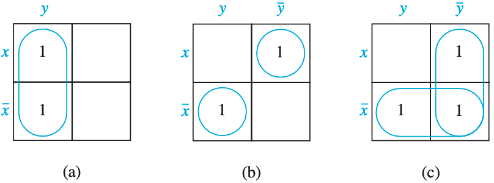
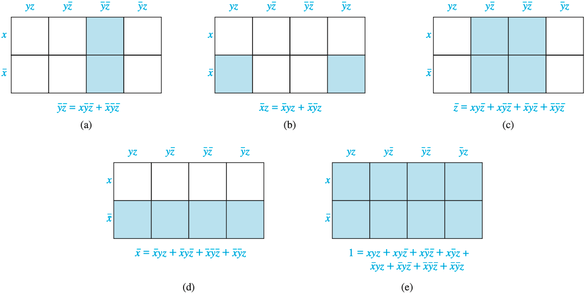

# 이산수학

::: TOGGLE ToC
[[toc]]
:::

$$
\gdef\mod{\textbf{ mod }}
\gdef\bmod{\text{mod }}
\gdef\nequiv{\not\equiv}
\gdef\sbmatrix#1{\begin{bmatrix}#1\end{bmatrix}}
\gdef\relation#1#2#3{{}_#2#1_#3}
\gdef\poleq{\preccurlyeq}
\gdef\pole{\prec}
$$

## Relations

### Equivalence Relations

- 지금까지 관계의 정의와 특성, 표현, 폐쇄까지 공부했음.
- 이제 동치관계에 대해 배워보자. 어떤 관계 내에 유사한 성질을 가진 관계.
- 동치관계(equivalence relations):
  - Reflexive & Symmetric & Transitive 특성을 만족하는 관계.
  - 두 원소 $a, b$가 동치관계에 대한 관계가 있을 때 동치(equivalent)라고 한다: $a \sim b$
  - > $m > 1$인 정수 $m$이 있을 때, $R = \{(a, b) | a \equiv b (\bmod m)\}$. $R$이 동치관계인가?
    > - RST를 모두 만족하는지 하나씩 확인해 보면 된다.
    > - R: 같은 두 수는 당연히 나머지가 같으니 성립, $a \equiv a (\bmod m)$
    > - S: 교환해도 당연히 나머지가 같으니 성립, $b \equiv a (\bmod m)$
    > - T: $a \equiv b (\bmod m)$일 때 $a \equiv c (\bmod m)$이니까 성립.
  - > 문자열 길이 함수 $l$. $l(a) = l(b)$일 때 $\relation{R}{a}{b}$인 관계 $R$이 동치관계인가?
    > - R: 같은 두 문자열의 길이는 당연히 같으니 성립, $l(a) = l(a)$
    > - S: 교환해도 길이가 같으니 성립, $l(b) = l(a)$
    > - T: $l(a) = l(b)$이고, $l(b) = l(c)$이라면 $l(a) = l(c)$이므로 성립.
  - > "나누어 떨어짐" 관계가 동치관계인가?
    > - 관계를 정의해보면: $R = \{(a, b) | (a | b) \land a, b \in \Bbb{Z}^+\}$
    > - R: $a | a$가 성립.
    > - S: $a | b$일 때 $b | a$는 성립하지 않음. antisymmetric임.
    > - T: $a | b$이고 $b | c$일 때 $a | c$이므로 성립.
- 동치류(equivalence classes):
  - 집합 $A$에 대한 관계 $R$이 동치관계일 때, $A$의 어떤 원소 $a$와 관계된 모든 $A$의 원소 집합.
  - 즉, $R = \{(a, ?), (a, ?), (a, ?), ...\}$에서 $a$와 관계있는 모든 $?$의 집합이 동치류.
  - 관계 $R$에 대한 동치류: $[a]_R$, 관계가 하나만 있으면 그냥 $[a]$로 쓰기도.
  - 앞서 $?$를 $s$라고 하면, $[a]_R = \{s | (a, s) \in R\}$
  - > $a \equiv n (\bmod 4)$일 때 동치류 $[a]_m$을 구해보면?
    > - 동치류 중 하나를 아무거나 골라서 $a$ 자리에 써줘도 됨.
    > - $[0]_4 = \{\cdots, -8, -4, 0, 4, 8, \cdots\}$, 4로 나누어 떨어지는 정수의 집합이 됨.
    > - $[1]_4 = \{\cdots, -7, -3, 1, 5, 9, \cdots\}$, 4로 나눴을 때 나머지가 1인 정수 집합.
    > - 한 동치류에 속한 원소는 다른 동치류에 속하지 않는다.
    > - $a$가 해당 동치류 $[a]$의 원소에 포함되어 있음.
- 동치분할(equivalence partitions):
  - 주어진 관계가 동치관계라면 동치류를 구할 수 있음.
  - 동치류는 전체 집합 $A$를 빈 공간없이 정확히 분할한다.
  - 전체 집합 $A$를 관계 $R$로 분할한다: $A / B$
  - 정리 1, 관계 $R$이 $A$에 대한 동치 관계일 때:
    - $\relation{R}{a}{b}$
    - $[a] = [b]$
    - $[a] \cap [b] \neq \varnothing$ (exactly cover)
  - 동치분할:
    - 전체집합 $S$의 서로소이면서 공집합이 아닌 부분집합 $A_1, A_2 \cdots A_n$이 있음.
    - 이때 모든 부분집합의 합집합 $\bigcup_{i \in l} A_i = S$가 된다.
    - 즉, $A$에 대한 관계 $R$의 모든 동치류의 합은 $A$가 됨: $\bigcup_{a \in A} [a]_R = A$
    - $[a]_R \neq [b]_R$일 때 $[a]_R \cap [b]_R = \varnothing$.
    - 이걸 도대체 언제 쓰나요? 관계에 원소가 엄청 많을 때 유사한 특성을 가진 부분집합으로 분류.
    - 정리2: 역으로 동치류가 주어졌을 때 동치관계를 생성할 수 있음.
    - > 동치관계 $R$의 동치류 $A_1 = \{1, 2, 3\}, A_2 = \{4, 5\}, A_3 = \{6\}$이 주어짐.
      > $A_1$의 순서쌍은 $(1, 1), (1, 2), \cdots, (3, 2), (3, 3)$.
      > $A_2$의 순서쌍은 $(4, 4), \cdots, (5, 5)$
      > $A_3$의 순서쌍은 $(6, 6)$
      > 따라서 $R = \{(1, 1), (1, 2), \cdots, (6, 6)\}$
    - > 집합 $A = \{a, b, c\}$에 대한 관계 $R$이 동치관계인지 판별하고, 동치관계가 아니라면 동치관계를 만족하는 최소의 순서쌍을 포함하고, 이에 대한 동치류를 구하라.
      > - $M_R = \sbmatrix{1 & 0 & 1 \\ 0 & 1 & 0 \\ 1 & 1 & 0}$
      > - 일단 딱 봤을  때 reflexive하지 않고, symmetric하지 않으니 동치관계가 아님.
      > - $(c, a), (a, c)$가 있는데 $(c, c)$가 없으니 transitive도 아님.
      > - Reflexive하게 만드려면: $(c, c)$를 추가해준다.
      > - Symmetric하게 만드려면: $(b, c)$를 추가해준다.
      > - Transitive하게 만드려면:
      >   - 워셜 알고리즘으로 풀어본다.
      >   - 주의할 점은 $W_0$가 그냥 $R$이 아닌, 반사폐쇄와 대칭폐쇄까지 추가한 관계여야.
      >   - 결과적으로 $(a, b), (b, a), (b, c), (c, c)$가 추가됨.
      > - 따라서 $R = \{(a, a), (a, b), (a, c), \cdots, (c, c)\}$
      > - 동치류도 구해보면:
      >   - $[a] = \{a, b, c\}$
      >   - $[b] = \{a, b, c\}$
      >   - $[c] = \{a, b, c\}$
      >   - 동치류가 $A$와 같음을 알 수 있음.

### Partial Orderings

- 부분적으로 순서를 결정할 수 있는 관계.
- 어떤 관계 $R$이 부분순서 관계라는 것. 앞서 동치관계는 순서를 결정할 수 없음.
- 사전식 순서:
  - 사전을 생각해보면 알파벳 순서가 있음: $(a, b), (b, c), (c, d), \cdots$
  - $(a, a)$도 포함할 수 있을까? YES. 순서가 같다는 의미. Reflexive.
  - $(a, b)$가 있으면 $(b, a)$도 있을까? NO. 그러면 모순. Antisymmetric.
  - $(a, b)$와 $(b, c)$가 있으면 $(a, c)$도 있을까? YES. Transitive.
- Partially ordered set:
  - 부분순서가 있는 집합. poset이라고 줄여부름.
  - 부분 순서 집합 $(S, R)$에서 $S$는 대상 집합, $R$은 부분순서 관계.
  - 순서쌍 표현이랑 좀 헷갈리는데 책에서는 이렇게 씀...
- 전체 순서가 있을 수도 있고, 일부만 순서가 있을 수도 있음. 그래서 partial ordering임.
- > Greater than or equal 관계가 정수 집합에 대한 부분 순서 관계인가?
  > - R: $a \geq a$ for every integer $a$.
  > - A: if $a \geq b$ and $b \geq a$, then $a = b$.
  > - T: if $a \geq b$ and $b \geq c$, then $a \geq c$.
  > - 따라서 $(\Bbb{Z}, \geq)$는 poset이다.
- > 멱집합(power set)에 부분 순서가 있는가?
  > - R: $A \sube A$.
  > - A: if $A \sube B$ and $B \sube A$, then $A = B$.
  > - T: if $A \sube B$ and $B \sube C$, then $A \sube C$.
  > - 따라서 $(P(S), \sube)$는 poset이다.
- Comparability:
  - poset $(S, \poleq)$의 원소 $a, b$를 생각해보자.
  - $a \poleq b$: $(a, b) \in R$이라는 뜻. 부등호 아님. $a$가 $b$ 앞에 나온다는 것.
  - $a \poleq b$ 또는 $b \poleq a$ 둘 중 하나만 있어도 순서 비교가 가능하다.
  - 만약 둘 다 포함이 되어 있지 않다면 비교가 불가능(incomparable).
  - > poset $(\Bbb{Z}^+, |)$가 3과 9, 5와 7에 대해 comparable한가?
    > - 3과 9를 생각해보자:
    >   - $3 | 9$는 성립. 하지만 $9 | 3$은 성립하지 않음. 따라서 $(3, 9) \not\in |$
    >   - 근데 둘 중 하나($3 | 9$)만 있어도 된다고 했으니 비교 가능하다.
    > - 5와 7을 생각해보자: $5 | 7$도 안 되고, $7 | 5$도 안 되니까 비교 불가능.
  - 부분순서 집합이니까 집합 내에 비교가 불가능한 원소가 있을 수 있음.
  - 전체순서(total order) 또는 선형순서(linear order):
    - 만약 집합 내 모든 순서쌍이 비교 가능하다면 전체순서 집합.
    - totally ordered set은 chain이라고 부른다.
    - > poset $(\Bbb{Z}^+, \leq)$가 전체 순서 집합인가? 모든 원소에 $\leq$ 비교 가능하니 YES.
- 순서화집합(well-ordered set):
  - totally ordered set이 최소원소(least element)를 갖는다면 순서화집합.
  - $(a_1, a_2) \poleq (b_1, b_2)$에 대해 $a_1 < b_1$ 또는 $a_1 = b_1$ 그리고 $a_2 \leq b_2$라면 lexicographic ordering.
- Lexicographic order:
  - 영어사전 순서 생각해보세요. 알파벳 순서로, 길이가 짧은게 먼저 나옴.
  - 임의의 두 poset $(A_1, \poleq_1$)과 $(A_2, \poleq_2)$를 생각해보자.
  - 이때 순서쌍의 첫 번째 원소를 비교하고, 그게 같다면 두 번째 원소를 비교.
  - > discreet $\poleq$ discrete, $e \poleq t$이니까.
  - > discreet $\poleq$ discreetness, 길이가 짧은게 먼저.
- Hasse diagrams:
  - 부분 순서 관계를 다이그래프로 표현하면? RAT 특성을 갖는 모습:
    ```mermaid
    graph TD
      a((a)) --> b((b))
      b --> c((c))
      c --> d((d))
      a --> a
      b --> b
      c --> c
      d --> d
      a --> c
      c --> d
      a --> d
    ```
  - 너무 복잡하다. partial order니까 당연히 RAT라고 생각할 수 있음. 다 생략해보자:
    ```
    graph TD
      d((d)) --- c((c))
      c --- b((b))
      b --- a((a))
    ```
  - 이렇게 생략한게 하세 다이어그램. 유한 poset $(S, \poleq)$의 하세 다이어그램 그리는 절차:
    1. 일단 관계에 대한 다이그래프를 그린다.
    1. 모든 정점의 루프를 모두 지운다.
    1. transitive한 경로가 있다면 직접 가는 경로를 지운다.
    1. 모든 화살표가 위로 향하도록 다시 정렬해 그린다.
    1. 모든 화살표를 지우고 방향 없는 엣지로 만든다.
  - covering relation:
    - $x \pole z \pole y$ 관계가 있음. 이때 $z$가 없으면 $x$와 $y$는 인접 정접이 됨.
    - 이때, $y$가 $x$를 덮는다(cover). 이때 $(x, y)$의 집합이 covering relation.
  - > $S = \{a, b, c\}$에 대한 멱집합 $P(S)$의 부분 순서 $\{(A, B) | A \sube B\}$를 하세 다이어그램으로 그려라.
    > - $P(S) = \{\varnothing, \{a\}, \{b\}, \{c\}, \{a, b\}, \{a, c\}, \{b, c\}, \{a, b, c\}\}$
- Maximal and Minimal elements:
  - 극대원소: 다른 어떤 원소보다도 작지 않은 원소들.
  - 극소원소: 다른 어떤 원소보다도 크지 않은 원소들.
  - 하세 다이어그램을 그리면 쉽게 찾을 수 있음. 무한 집합에서는 존재하지 않을 수도.
- Greatest and Least elements:
  - 최대원소: 다른 모든 원소보다 큰 유일한 원소.
  - 최소원소: 다른 모든 원소보다 작은 유일한 원소.
  - 극대원소가 여러 개면 최대원소가 존재하지 않음.
  - 극소원소가 여러 개면 최소원소가 존재하지 않음.
- Upper and Lower bound:
  - 상한계: 부분집합 A의 모든 원소보다 크거나 같은 원소.
  - 하한계: 부분집합 A의 모든 원소보다 작거나 같은 원소.
  - 최소상한계(Least upper bound, LUB): 상한계에서 가장 작은 유일한 원소.
  - 최대하한계(Greatest lower bound, GLB): 하한계에서 가장 작은 유일한 원소.
  - 상한계와 하한계에 자기 자신이 포함된다는 걸 잊으면 안 됩니당.
  - > e.g., $(\Bbb{Z}^+, |)$에 대해 lub는 최소공배수, glb는 최대공약수.
- Lattices:
  - poset의 모든 원소간 쌍에 lub와 glb가 존재하는 경우.
  - 임의의 두 원소들로 만들어지는 모든 쌍에 대해 lub와 glb가 존재하는지 확인해보면 된다.
- 위상정렬(topological sorting):
  - 주어진 partial order로부터 total order를 구하는 것.
  - $\relation{R}{a}{b}$일 때 $a \poleq b$이면 partial order와 total order가 양립할 수 있음.
  - 보조정리 1: 모든 유한한 nonempty poset $(S, \poleq)$은 최소 하나의 극소원소를 갖는다.
  - 비교가 불가능한 두 원소 중 아무거나 선택해도 되므로, 위상정렬의 결과가 유일하지 않을 수도 있음.

## Graphs

- 앞에서는 그래프가 관계를 표현하는 한 방법이었음.
- 방대한 네트워크를 그래프로 모델링하고 알고리즘을 만들면 컴퓨터가 계산해준다.
- 그래프 이론은 대학원에서 배울 수 있음. 우리는 기본적인 것들만 보자.
- 알고리즘을 다루지는 않을거임. 자구나 알고에서 배우렴.

### Graphs and Graph Models

- 그래프: $G = (V, E)$
  - 공집합이 아닌 정점 집합 $V$와 간선 집합 $E$로 구성.
  - 각 간선은 한 두개의 정점과 연결됨. 이때 간선과 연결된 정점을 끝점(endpoint)라고 한다.
- Infinite graph: $V$가 무한집합인 그래프. 유한집합이면 finite graph.
- Simple graph:
  - 간선이 두 개의 서로 다른 정점을 연결하고 (루프가 없어야)
  - 같은 정점 쌍을 연결하는 두 개 이상의 간선이 없는 그래프 (멀티엣지가 없어야)
- Multigraph: 멀티엣지를 가진 그래프. 멀티엣지는 허용, 루프는 없어야.
- Pseudograph: 루프와 멀티엣지를 가진 그래프.
- Undirected graph:
  - 간선에 방향이 없는 그래프. 양방향 관계라고 볼 수 있음.
  - 순서가 없으니까 간선을 $\{u, v\}$로 표현. 순서가 상관없음.
  - 근데 보통은 다 $(u, v)$로 표현한다. 대신 방향이 없다고 말해줘야.
- Directed graph or digraph:
  - 간선에 방향이 있는 그래프. 방향그래프, 유향그래프 등 다양하게 부름.
  - 간선에 방향이 있으므로 $E$를 표현할 때는 순서가 있는 순서쌍 집합으로 표현해줘야.
  - 간선 $(u, v)$는 정점 $u$에서 $v$로 향하는 간선. 순서가 중요함.
- Mixed graph or hybrid graph: 방향이 있는 간선과 없는 간선이 섞여있는 그래프.
- Simple directed graph:
  ```mermaid
  graph LR
  a((a)) --> b((b))
  b --> c((c))
  a --> c
  c --> b
  ```
  - 루프와 멀티엣지가 없으니 단순그래프임.
  - 방향이 있으니 유향그래프임.
- Directred multigraph:
  ```mermaid
  graph LR
  a((a)) --> b((b))
  b --> c((c))
  b --> c
  b --> b
  a --> c
  a --> c
  c --> c
  ```
  - 루프나 멀티엣지를 가질 수 있음.
  - 멀티그래프에는 루프가 없어야 한다며? 유향그래프에서는 루프가 허용됨.
- 그래프 종류 총정리:
  | Type                  | Edges                 | Multiple Edges Allowed? | Loops Allowed? |
  |-----------------------|-----------------------|-------------------------|----------------|
  | Simple graph          | Undirected            | No                      | No             |
  | Multigraph            | Undirected            | Yes                     | No             |
  | Pseudograph           | Undirected            | Yes                     | Yes            |
  | Simple directed graph | Directed              | No                      | No             |
  | Directed multigraph   | Directed              | Yes                     | Yes            |
  | Mixed graph           | Directed & undirected | Yes                     | Yes            |
- 그래프 모델:
  - 그래프로 모델링할 때 해볼 질문들:
    - 방향이 있어야 하는가?
    - 멀티엣지가 필요한가?
    - 루프가 필요한가?
  - 컴퓨터 네트워크 예시, 소셜 네트워크 예시.

### Graph Terminology and Special Types of Graphs

#### Undirected graph

- undirected graph 관련 기본 용어:
  - 인접(adjacent or neighbors):
    - 어떤 두 정점을 직접 잇는 간선이 존재한다면 둘은 인접정점.
    - 이때 간선 $e$는 두 정점에 부속되며(incident), 두 정점을 연결(connect)한다.
  - Neighborhood of $v$: $N(v)$
    - 정점 $v$와 인접한 정점의 집합.
    - 정점집합 $V$의 어떤 부분집합 $A$에 대해 $N(A) = \bigcup_{v \in A} N(v)$
    - 루프가 있는 경우 자기 자신도 인접정점에 포함된다.
  - 차수(degree): $\text{deg}(v)$
    - 어떤 점점의 차수는 그 정점과 연결된 엣지의 개수.
    - 루프를 가진 정점의 차수는 2. 나가는 거 하나, 들어오는 거 하나.
  - Isolated vertex: 그래프에서 어떠한 정점과도 연결되지 않은 정점.
  - Pendant vertex: 그래프에서 단 하나의 정점과 연결된 정점.
- 정리 1 (handshaking theorem):
  - 어떤 undirected graph $G = (V, E)$가 $m$개의 간선을 가지고 있는경우.
  - 모든 차수를 더하면 간선의 2배가 된다: $2m = \sum_{v \in V} \text{deg}(v)$
  - 즉, 차수의 합이 언제나 짝수임을 보장할 수 있다.
  - > 차수가 6인 정점이 10개 있는 그래프에서 간선의 개수는? 차수의 합이 60, 따라서 간선은 30개.
  - > 정점이 5개 있는 그래프에서 각 정점의 차수가 3이 될 수 있나?
    > - 차수의 합이 15면 간선의 개수 $m$은 7.5가 되어야 함.
    > - 정수로 떨어지지 않으므로 불가능하다.
- 정리 2: 홀수 차수를 가진 정점의 개수는 항상 짝수이다.
- 여기서 차수에 대한 정리는 다 undirected graph 얘기임.

#### Directed graph

- 유향그래프는 순서쌍으로 구성된다. $(u, v)$는 $u$에서 출발해서 $v$에 도착하는 간선.
- 시점(initial vertex): 간선이 출발하는 정점. $(u, v)$에서 $u$.
- 종점(terminal vertex): 간선이 도착하는 정점. $(u, v)$에서 $v$.
- 유향그래프의 차수에 대해 생각해보자:
  - 진입차수(in-degree): 들어오는 간선 개수, $\text{deg}^-(v)$
  - 진출차수(out-degree): 나가는 간선 개수, $\text{deg}^+(v)$
  - isolated 정점의 진입/진출 차수는 둘 다 0.
- 정리 3:
  - 유향그래프 $G = (V, E)$에서 간선의 개수는 진입/진출차수의 합과 같음.
  - $|E| = \sum_{v \in V} \text{deg}^-(v) = \sum_{v \in V} \text{deg}^+(v)$
  - 나가는 간선이 있으면 들어가는 간선도 무조건 있으니까.

#### Simple graph

- 완전그래프(complete graph), $K_n$:
  - 가능한 모든 간선을 갖는 simple graph.
  - $n$개의 정점을 가진 완전그래프를 $K_n$이라고 한다.
  - 여기에 k_1부터 k_6까지 그래프 사진.
  - 완전그래프의 간선 개수: $|V| = n$일 때, $|E| = {}_nC_2 = {2(n - 1) \over 2}$
- 사이클(cycle), $C_n$:
  ```
  graph LR
    a((a)) --- b((b))
    b --- c((c))
    c --- d((d))
    d --- e((e))
    e --- a
  ```
  - $n \geq 3$의 정점을 갖는 그래프에서 모든 정점을 한 번씩 거쳐 시점으로 돌아오는 그래프.
  - $|V| = n, |E| = n$
- Wheel, $W_n$:
  - 사이클에 정점 하나를 추가한 심플 그래프.
  - $|V| = n + 1, |E| = 2n$, 여기서 $n$은 사이클의 $n$.
- Cube, $Q_n$:
  - n-dimensional hypercube 또는 n-cube이라고도 함.
  - $Q_n$의 정점 개수는 $2^n$개. 이때 $n$은 비트스트링의 길이.
  - 각 정점이 유니크한 비트스트링을 의미한다.
  - 자신의 비트스트링에서 딱 한 비트를 변경한 정점과 간선으로 연결된다.
  - 가령 $000$의 인접정점은 $100, 010, 001$이 된다. $011, 111$ 같은 건 안 되겠지.
  - $n$개 비트를 표현하려면 $2^n$개의 정점이 필요할 것임: $|V| = 2^n$
  - 비트스트링이 어떤 집합의 원소의 유무를 표현하는 식으로 사용할 수 있음.
- 이분그래프(bipartite graph):
  - $V$의 두 부분집합 $V_1$과 $V_2$의 정점이 서로 연결된 심플그래프.
  - 단, 같은 집합 내에서는 서로 연결되면 안 된다.
  - 정점 집합을 공통부분이 없는 두 부분 집합으로 나눈다고 생각하면 됨.
  - 사이클 $C_n$에서 $n$이 짝수일 때 이분그래프가 된다.
- 완전 이분그래프(complete bipartite graph), $K_{m,n}$:
  - 정점의 두 부분집합에 대해 $V = V_1 \cup V_2$이고, $V_1 \cap V_2 = \varnothing$.
  - 이때 $V_1$의 모든 정점과 $V_2$의 모든 정점이 서로 연결된 이분그래프.
- Topology:
  - 컴퓨터 네트워크를 생각해보자. 네트워크의 요소들을 연결하는 형태를 토폴로지라고 한다.
  - Star topology: 모든 노드들이 중앙의 한 노드에만 연결된 형태. 완전 이분그래프.
  - Ring topology: 한 노드가 양쪽의 두 노드에 연결된 형태. 사이클.
  - $W_n$ based topology: star와 ring 토폴로지를 결합한 형태. wheel.
  - Mesh topoogy: 병렬처리를 위한 모델. n-dimensional hypercube.

### New graph from old

- 기존 그래프를 수정해서 새로운 그래프를 만드는 방법에 대해 살펴보자.
- 부분그래프(subgraph):
  - 어떤 그래프 $G = (V, E)$에 대해 $W \sub V$, $F \sub E$인 그래프 $H = (W, F)$.
  - 진부분그래프(proper subgraph):
    - $G$와 동일한 경우는 제외한 $H$: $G \not= H$
    - 이때 $W, F$도 각각 $V, E$에 대해 진부분집합임.
    - 우리는 새로운 그래프를 만들고 싶은거니까 진부분그래프에만 관심있음.
  - 당연히 한 그래프에 대해 다양한 진부분그래프가 만들어질 수 있음.
  - $H = (W, F)$에서 $F$에 대응하는 $E$에 연결된 모든 정점이 $W$에 포함되어 있어야.
- 간선을 추가하거나 제거하기:
  - 기존 그래프 $G$에서 간선 $\{a, b\}$를 제거해 부분그래프 $H$를 만들 수 있음.
  - 기존 그래프에 간선을 추가하면 부분그래프가 아닌 새로운 그래프가 만들어짐.
- 간선을 축약하기:
  - 두 정점을 하나로 합치면 각 정점에 연결된 간선도 합쳐진다.
  - 이것도 기존 그래프의 부분그래프가 아닌 새로운 그래프가 됨.
- 정점을 제거하기:
  - 정점을 제거하면 그 정점과 연결된 모든 간선도 제거된다.
  - 연결그래프를 유지하기 위해 간선의 제거로 인해 격리된 정점도 제거해야 할 수 있다.
  - 꼭 연결그래프를 유지하지 않아도 된다면 격리된 정점을 제거하지 않아도 된다.
  - 이렇게 만들어진 그래프는 기존 그래프의 부분그래프.
- 유니온 연산하기:
  - 그래프에 대해 합집합을 취할 수 있다: $G_1 \cup G_2$
  - 중복되는 간선이나 정점은 그냥 병합되고, 중복되지 않는 것은 그냥 추가된다.

### Representations of Graphs and Graph Isomorphism

#### Representations of Graphs

- 그래프 정보를 컴퓨터에게 전달해보자.
- 인접리스트(adjacency lists):
  - 멀티플 엣지가 없는 그래프를 표현한다.
  - 각 정점에 대한 인접 정점을 나열해주면 된다.
  - 유향그래프라면? 동일한데 시점에 대한 종점을 나열해주면 된다. 종점이 없으면 비워둔다.
- 인접행렬(adjacency matrices):
  - 내가 잘 아는 그것. 정점이 $n$개라면 $n \times n$ 0-1 행렬로 표현.
  - 두 정점이 인접하면 1, 인접하지 않으면 0.
  - 심플그래프에서:
    - 인접행렬은 항상 대칭적(symmetric)임.
    - 루프가 없으니까 주대각은 항상 0.
  - 멀티엣지나 루프가 존재한다면?
    - $a$에서 $b$로 가는 간선이 여러 개라면 0-1 행렬로는 표현할 수가 없음.
    - $a$에서 $b$로 가는 간선의 개수를 써주면 된다. 루프는 1.
  - 유향그래프의 인접행렬은 비대칭(asymmetric)일 수 있다.
- 인접리스트 vs 인접행렬:
  - 그래프의 형태에 따라 다르게 선택하면 됨.
  - 주어진 정점을 직접 연결하는 간선이 별로 없다면 인접리스트가 좋다.
    - 간선이 별로 없는데 행렬로 표현하면 대부분 0인 희소행렬(sparse matrix)가 될 것.
    - $n \times n$ 크기의 메모리를 할당해서 낭비하게 된다.
- 결합행렬(incidence matrices):
  - 멀티 엣지가 있을 때, 인접행렬로는 간선 개수는 알아도 구분할 수는 없었음.
  - 이때 사용하는 것이 결합행렬. 각각의 간선을 구분해서 표현할 수 있다.
  - 간선 $e_j$가 정점 $v_i$와 연결되어 있으면 $m_{ij} = 1$.
  - 정점은 행으로, 간선은 열로 표현. 따라서 행은 정점 개수, 열은 간선 개수가 됨.
  - 심플그래프에서:
    - 하나의 간선은 항상 두 개의 정점에 연결됨. 따라서 각 열에 두 개의 1이 있어야 함.
    - 어떠한 열에도 같은 형태의 열은 없음. 간선의 양 끝점이 같으면 멀티엣지니까.
    - 근데 심플그래프는 인접행렬로 표현하는게 더 낫다.
  - 슈도그래프에서:
    - 멀티엣지와 루프가 있는 경우.
    - 루프인 간선에 대응되는 열에는 반드시 하나의 1만 있음.
    - 따라서 각 열에 한 개 또는 두 개의 1이 존재할 수 있음.

#### Isomorphism of Graphs

- 동형: 두 그래프의 인접성이 같은지 판단.
- 두 그래프 $G_1 = (V_1, E_1)$과 $G_2 = (V_2, E_2)$을 생각해보자:
  - $V_1$에서 $V_2$로의 전단사 함수 $f$가 있다고 생각해보자.
  - $G_1$에서 $a$와 $b$가 인접하고, $G_2$에서 $f(a)$와 $f(b)$가 인접하면 $f$는 동형(isomorphism).
  - $G_1$에서 어떤 두 정점이 인접하다면, 그에 매핑되는 $G_2$의 두 정점도 인접해야 한다는 뜻.
  - 눈으로 봤을 때 모양이 같은지 보는게 아니라 인접성을 따져봐야.
- 동형성 검사:
  - $G_1$의 정점 하나를 선택해서 $G_2$의 정점과 매핑시킨다.
  - 앞서 매핑한 정점과 인접한 $G_1$의 정점들이 $G_2$에서도 인접한지 살펴본다.
  - 두 심플그래프가 동형인지 검사하는건 어려운 문제임. 모든 정점을 다 살펴봐야 함.
  - 이렇게 다 검사하는 방법이 브루트포스. $n$개의 정점이 있으면 $n!$번의 비교가 필요.
  - 두 그래프가 동형이 아니라는걸 찾는게 더 쉬운 경우가 있음. 그래프 불변성을 판별해보면 된다.
- 그래프 불변성(invariant):
  - 두 그래프가 동형이면 정점의 개수가 같고, 간선의 개수도 같다.
  - 차수의 시퀀스도 같다. 만약 $G_1$에서 차수가 2인 정점이 차수 3인 정점과 연결되어 있다면, $G_2$에서도 차수가 3인 정점과 연결된 차수 2의 정점과 매핑되어야 한다.

### Connectivity

- 우리는 경로, 그래프의 연결성, 경로 개수 세기만 다룰거임.
- 정점 연결성이랑 간선 연결성 파트는 스킵.

#### Paths

- 경로: 그래프에서 정점들을 연결하는 간선들의 시퀀스.
- 경로의 길이: 거쳐가는 간선의 개수.
- 경로는 정점의 시퀀스로도 표현할 수 있고, 간선의 시퀀스로도 표현할 수 있다.
- $u$에서 출발해서 $v$에 도착하는 길이 $n$인 경로 표현:
  - 정점의 시퀀스: $x_0 = u, x_1, \cdots, x_{n-1}, x_n = v$
  - 간선의 시퀀스: $(x_0, x_1), (x_1, x_2) , \cdots, (x_2, x_n)$
- 멀티그래프나 슈도그래프에서는 경로가 유일하지 않을 수 있음.
- 회로(circuit): 시점과 종점이 같은 경로($u = v$)
- 경로나 회로가 심플하다:
  - 동일한 간선이 두 개 이상 포함되지 않는다는 뜻.
  - 즉, 같은 간선을 중복해서 지나가지 않는다는 것.
- Degrees of separation: 지인 6명만 거치면 전세계 모든 사람들과 연결된다.

#### Connectedness in Undirected Graphs

- 모든 정점쌍 사이에 경로가 존재하면 그래프는 연결되어 있다.
  - 즉, 임의의 한 정점에서 다른 모든 정점으로의 경로가 존재한다면 연결되어 있다.
  - 어떤 한 쌍이라도 그 사이에 경로가 없으면 그래프는 비연결.
  - 정점이나 간선을 지우면 비연결 부분그래프를 생성할 수 있다.
- 연결요소(connected component):
  
  - 최대로 연결된 부분그래프.
  - '최대'이므로 부분그래프에서 연결할 수 있는 정점이 있다면 반드시 연결해야 한다.
- 절단점(articulation point or cut vertices):
  - 삭제했을 때 두 개 이상의 연결요소가 만들어지는 정점.
  - 정점 삭제하면 그 정점에 연결된 간선도 모두 삭제된다는 걸 주의하세요.
- 절단모서리(Cut edge or bridge):
  - 삭제했을 때 두 개 이상의 연결요소가 만들어지는 간선.

#### Connectedness in Directed Graphs

- 유향그래프에서의 연결성은 뭐가 다를까?
- 강한연결(strongly connectivity):
  
  - 유향 그래프 $G$의 모든 정점쌍에 대해 양방향으로 경로가 존재한다면 $G$는 강하게 연결되어 있다.
  - 모든 정점쌍에 대해 $a$에서 $b$로 가는 경로가 있고, $b$에서 $a$로 가는 경로도 있는 경우.
  - 즉, 모든 정점쌍이 양방향으로 연결되어 정점쌍 사이에 사이클이 만들어지는 경우.
  > ```mermaid
  > graph LR
  >   a((a)) --> b((b))
  >   b --> c((c))
  >   c --> d((d))
  >   b --> d
  >   d --> c
  >   c --> a
  > ```
  > - 이 그래프는 강한연결. 모든 정점쌍에 양방향으로 경로가 있음.
- 약한연결(weakly connectivity):
  - 유향그래프의 방향성을 무시하고 그래프를 봤을 때 연결되어 있는 경우.
  - 즉, 방향성을 무시하고 모든 정점쌍의 연결성을 판단하는 것.
- 강한 연결요소(strongly connected component):
  
  - 최대로 강하게 연결된 부분그래프. (A maximal strongly connected subgraph)
  - 어떤 강한 연결을 가진 부분그래프보다 더 큰 강한 연결을 가진 부분그래프가 없는 경우.
  - 강한연결을 가진 부분그래프가 있을 때 그보다 더 큰 강한연결을 가진 부분그래프가 없는 경우.
  - 정점 하나가 강한 연결요소가 될 수도 있음.

#### Counting Paths

- 두 정점 사이에 서로 다른 경로의 개수는 인접행렬을 이용해 쉽게 구할 수 있음.
- 인접행렬 $A$에서 $a_{ij}$는 $i$에서 $j$로 가는 길이 $r$인 경로의 개수.
  - 이건 심플그래프에서의 얘기임. 멀티엣지가 있다면 $a_{ij}$는 $i$에서 $j$로 가는 경로의 개수.
  - 여기서 $A^r$은 $i$에서 $j$로 가는 길이 $r$인 경로들을 표현한다.
> - 아래 그래프에서 길이 4인 $a$에서 $d$로 가는 경로 개수를 구해보자:
>   ```mermaid
>   graph LR
>     a((a)) --- b((b))
>     b --- d((d))
>     a --- c((c))
>     d --- c
>   ```
>   - 일단 그래프를 인접행렬 $A$로 표현한다: $A = \sbmatrix{0 & 1 & 1 & 0 \\ 1 & 0 & 0 & 1 \\ 1 & 0 & 0 & 1 \\ 0 & 1 & 1 & 0}$
>   - 4승한다: $A^4 = \sbmatrix{8 & 0 & 0 & 8 \\ 0 & 8 & 8 & 0 \\ 0 & 8 & 8 & 0 \\ 8 & 0 & 0 & 8}$
>   - 따라서 $a$에서 $d$로 가는 길이 4인 경로의 개수는 8개이다.
>   - 부울곱 아니고 행렬곱임.
- $G$가 꼭 심플그래프일 필요는 없음.

### Euler and Hamiltonian Graphs

#### Euler Paths and Circuits

- 한붓그리기를 해봤다면 오일러 경로와 서킷을 이미 알고 있을거임.
- 오일러 경로:
  - 모든 엣지를 한번씩만 거치는 경로.
  - 그래프 $G$의 오일러 경로는 $G$의 모든 엣지를 포함하는 심플 패스.
- 오일러 서킷:
  - 모든 엣지를 한번씩만 거쳐서 다시 시작점으로 돌아오는 서킷.
  - 그래프 $G$의 오일러 서킷은 $G$의 모든 엣지를 포함하는 심플 서킷.
- 서킷의 조건이 더 엄격하죠. 먼저 오일러 서킷을 찾아보고, 없으면 오일러 경로를 찾아보세용.
- 그래프가 작고 단순하면 그냥 눈으로 보고 찾을 수 있음.
- 오일러 경로/서킷 찾기:
  - 최소 2개 이상의 정점을 갖는 연결 멀티 그래프에서...
  - 정확히 2개의 정점의 차수가 홀수이면 오일러 경로가 존재한다. (필요충분)
  - 모든 정점의 차수가 짝수이면 오일러 서킷이 존재한다. (필요충분)
  - 오일러 경로/서킷을 찾고 싶으면 일단 모든 정점의 차수를 구하는게 우선.

#### Hamilton Paths and Circuits

- 오일러가 간선에 초점을 뒀다면 해밀턴은 정점에 초점을 둔다.
- 해밀턴 경로:
  - 모든 정점을 한 번씩만 거치는 심플 경로.
  - 모든 간선을 거칠 필요는 없지만, 같은 간선을 중복하면 안 됨.
- 해밀턴 서킷:
  - 모든 정점을 한 번씩만 거쳐서 다시 시작점으로 돌아오는 서킷.
  - 모든 간선을 거칠 필요는 없지만, 같은 간선을 중복하면 안 됨.
- 해밀턴 경로/서킷 찾기:
  - 오일러 경로/서킷과 달리 필요충분조건이 없음.
  - 대신 어떤 조건을 만족하면 해밀턴 서킷이 존재한다는 필요조건이 있음.
  - Dirac's Theorem:
    - 정점 개수 $n$이 3 이상인 심플 그래프에서, 모든 정점의 차수가 $n/2$보다 크거나 같다면 해밀턴 서킷이 존재한다.
    - 이 조건을 만족하지 않는다고 해밀턴 서킷이 존재하지 않는다는 건 아님!
  - Ore''s Theorem:
    - 정점 개수 $n$이 3 이상인 심플 그래프에서, 모든 인접하지 않는 정점쌍 $u, v$에 대해 $\text{deg}(u) + \text{deg}(v) \geq n$이면 해밀턴 서킷이 존재한다.
    - 이것도 필요조건임.

### Shortest-Path Problems

- 최단경로 찾는 알고리즘. 그래프를 응용하는거임.
- TSP, 다익스트라, ..., 나중에 알고리즘 수업에서 배우렴.

## Trees

- 난 자구랑 알고 배웠으니까 대충 들어야징.
- 트리: 심플 서킷이 없는 연결그래프. (connected undirected graph with no simple circuits)
- Forest: 심플 서킷이 없지만, 연결되어 있지 않은 그래프. 각각의 연결 요소가 모두 트리인 경우.
- 루트트리(Rooted tree):
  - 한 정점이 루트로 지정된 트리. 모든 엣지가 루트로부터 멀어지는 방향성을 갖게 됨.
  - 따라서 심플 서킷이 없는 유향 연결그래프.
  - 트리에는 방향이 있어도 화살표를 그리지 마세요. 마음 속의 화살표~
  - 용어 정리:
    - 부모(parent): 유향간선 $(u, v)$가 있을 때 $u$는 $v$의 부모.
    - 자식(child): 유향간선 $(u, v)$가 있을 때 $v$는 $u$의 자식.
    - 형제(sibling): 부모가 같은 정점들.
    - 조상(ancestor): 루트부터 해당 정점까지의 경로상에 있는 모든 정점들.
    - 자손(descendant): 해당 정점을 조상으로 하는 모든 정점들.
    - 리프정점(leaf): 자식이 없는 정점.
    - 내부정점(internal vertex): 자식이 있는 정점.
    - 서브트리(subtree): 특정 정점을 루트로 하는 부분 트리.
- $m$-ary 루트트리:
  - 모든 내부정점이 $m$개 이하의 자식을 가지는 루트트리.
  - 모든 내부정점이 정확히 $m$개의 자식을 가지는 루트트리는 full $m$-ary 트리.
  - $m = 2$인 경우 이진트리(binary tree).
  - $m = 3$인 경우 삼항트리(ternary tree).
- 순서(ordreed) 루트트리:
  - 내부정점의 자식들에 순서가 있는 루트트리.
  - ordered binary tree: 왼쪽 자식과 오른쪽 자식을 구분. 순서대로 읽고 쓴다.
- 트리의 성질:
  - 트리의 간선 개수는 정점의 개수보다 하나 적다. ($|E| = |V| - 1$)
  - full $m$-ary 트리에서:
    - 모든 정점 개수 $n$, 내부정점 개수 $i$, 리프 개수 $l$ 중 하나만 알아도 다른 것들을 구할 수 있음.
    - $n$개의 정점이 있다면, $i = (n - 1) / m$개의 내부정점이 있다.
    - $n$개의 정점이 있다면, $l = ((m - 1)n + 1) / m$개의 리프가 있다.
    - $i$개의 내부정점이 있다면, $n = mi + 1$개의 정점이 있다.
    - $i$개의 내부정점이 있다면, $l = (m - 1)i + 1$개의 리프가 있다.
    - $l$개의 리프가 있다면, $n = (ml - 1) / (m - 1)$개의 정점이 있다.
    - $l$개의 리프가 있다면, $i = (l - 1) / (m - 1)$개의 내부정점이 있다.
  - 정점의 레벨과 트리의 높이:
    - 레벨: 루트부터 해당 정점까지의 유일한 경로상에 있는 간선의 개수(길이). 루트의 레벨은 0.
    - 높이($h$): 트리 내의 정점 중 가장 높은 레벨.
    - 이미 트리를 아는 학생들은 루트의 레벨이 1이라고 생각할 수도 있음. 그건 자료구조에서 트리를 구현할 때의 이야기임. 우리는 수학을 하고 있으니까 루트의 레벨은 0이다.
- 균형(balanced) $m$-ary 트리: 모든 리프의 레벨이 $h$ 또는 $h - 1$인 $m$-ary 루트트리.
- $m$-ary 트리의 최대 리프 개수: $m^h$

### Spanning Trees

- 스패닝 트리:
  - 심플 그래프 $G$의 스패닝 트리는 $G$의 모든 정점을 포함하는 부분 그래프.
  - 그래프가 트리가 되도록 일부 간선을 지워주면 된다. $|E| = |V| - 1$인지 확인해보세요.
  - 같은 그래프에 대해 다양한 스패닝 트리가 만들어질 수 있음.
- 심플그래프이고 연결되어 있으면 스패닝 트리가 존재한다.
- 스패닝 트리를 어떻게 찾을 수 있을까? DFS나 BFS를 활용하면 된다.
- Depth-First Search(DFS):
  ```python
  def dfs(G):
      T = [(None, root)]
      TV = [root]
      visit(G, root)
      def visit(v):
          for w in G[v]:
              if w not in TV:
                  T.append((v, w))
                  TV.append(w)
                  visit(w)
      return T
  ```
  - 그래프의 노드 하나를 루트로 선택하고 스택을 사용해 방문. 방문 경로가 스패닝 트리가 됨.
  - Tree edges: DFS로 선택된 엣지들.
  - Back edges: 선택된 엣지는 아니지만, 트리의 조상과 자손을 연결하는 엣지.
- Breadth-First Search(BFS):
  ```python
  def bfs(G):
      Q = [root]
      T = [(None, root)]
      TV = [root]
      while Q:
          v = Q.pop(0)
          for w in G[v]:
              if w not in TV:
                  Q.append(w)
                  T.append((v, w))
                  TV.append(w)
      return T
  ```
  - 그래프의 노드 하나를 루트로 선택하고 큐를 사용해 방문. 방문 경로가 스패닝 트리가 됨.
  - DFS보다 깊이가 얕음.
- Backtracking applications:
  - DFS에서 막다른 길에 도달하면 앞선 갈림길로 돌아갔음. 그게 백트래킹.
  - Graph Colorings: 정점에 색칠하는 문제. 인접한 정점은 서로 다른 색을 가져야 함.
  - The n-Queens Problem: n개의 퀸을 체스판에 놓는 문제. 서로 공격하지 않아야 함.
  - Sums of Subsets: 주어진 집합에서 합이 특정 값이 되는 부분집합을 찾는 문제.
- DFS in Directed graphs:
  - 이제 유향그래프에서 스패닝 트리를 만들어보자. 똑같이 DFS하면 됨.
  - 유향그래프는 연결관계에 따라 스패닝 포레스트가 나올 수도 있음.

### Minimum Spanning Trees

- 가중치가 있는 연결그래프에서 엣지의 가중치 합이 최소가 되는 스패닝 트리를 만들어보자.
- Prim's algorithm:
  ```python
  def prim(G: list[tuple[int, int]]): # G = [(v, cost), ...]
      T = []
      TV = [random(N)]
      while len(T) < N - 1:
          min_cost = sys.maxsize
          min edge = (u, None)
          for u in TV:
              for v, cost in G[u]:
                  if v not in TV and cost < min_cost:
                      min_cost = cost
                      min_edge[1] = v
          T.append(min_edge[1])
          TV.append(min_edge)
      return T
  ```
  1. 최소 스패닝 트리의 간선 집합 $T = \varnothing$와 정점 집합 $TV = \varnothing$을 초기화한다.
  1. 임의의 시작 정점을 선택하고 $TV$에 추가한다: $TV = \{ a \}$
  1. $TV$의 모든 정점의 인접정점에 대해, $TV$에 있지 않은 정점 중 가중치가 가장 작은 간선을 $T$에 추가한다.
  1. $T$의 크기가 $n - 1$이 될 때까지 반복한다.
- Kruskal's algorithm:
  ```python
  def kruskal(G: list[tuple[int, int, int]]): # G = [(u, v, cost), ...]
      T = []
      E = sorted(G, key=lambda x: x[2])
      while len(T) < N - 1:
          e = E.pop()
          if not has_simple_circuit(T + [e]):
              T.append(e)
      return T
  ```
  1. 최소 스패닝 트리의 간선 집합 $T = \varnothing$와 정점 집합 $E$을 초기화한다.
     - 여기서 $E$는 $G$의 간선을 가중치에 따라 오름차순으로 정렬한 리스트.
  1. $E$의 간선을 순서대로 보면서 $T$에 추가해도 심플 서킷을 형성하지 않는 엣지를 $T$에 추가한다.
     - 심플 서킷이 있는지 어떻게 검사하나? 유니온 파인드를 사용하면 된다. 나중에 배우셈.
  1. $T$의 크기가 $n - 1$이 될 때까지 반복한다.
- 가중치에 중복이 없으면 최소 스패닝 트리가 유일하다.
- 모양이 달라도  결과물의 가중치 합은 동일하다.
- 둘의 시간복잡도가 다름. 엣지가 많으면 프림이 낫고, 엣지가 적으면 크루스칼이 낫다.

## Boolean Algebra

- 불리언 뻥션과 그 수학적 표현을 배울거임.
- 논리 게이트 살펴볼거고, 회로 설계도 해볼거임.
- propagation delay를 줄이기 위한 회로 최소화도 배워봅시다.
- 부울대수(boolean algebra):
  - 집합 $\{0, 1\}$의 두 요소를 사용해 $+$, $\cdot$, $-$ 연산을 정의하는 대수학.
  - 디지털 장치는 전압에 따라 0 또는 1 값을 출력한다. 그래서 부울대수를 배우는거임.
    - 높은 전압은 HIGH, 낮은 전압은 LOW. 높고 낮음의 기준은 시스템마다 다름.
    - 이때 HIGH를 1, LOW를 0으로 표현한다.
  - 연산:
    - boolean sum: $1 + 1 = 1$, $1 + 0 = 1$, $0 + 1 = 1$, $0 + 0 = 0$
    - boolean product: $1 \cdot 1 = 1$, $1 \cdot 0 = 0$, $0 \cdot 1 = 0$, $0 \cdot 0 = 0$
    - complement: $\bar 0 = 1$, $\bar 1 = 0$
    - 우선순위는 사칙연산 우선순위와 비슷함. complement, product, sum 순서.

### Boolean Functions

- 함수는 입력에 대해 출력을 내놓음. 입력에 출력이 있는 것을 시스템이라고 한다.
- 부울집합의 거듭제곱:
  - $B = \{0, 1\}$에 대해, $B^n$은 0과 1로 구성할 수 있는 모든 $n$-튜플의 집합.
  - > e.g., $B^2 = \{(0, 0), (0, 1), (1, 0), (1, 1)\}$
  - > e.g., $B^3 = \{(0, 0, 0), (0, 0, 1), \cdots, (1, 1, 1)\}$
- 부울변수(boolean variable):
  - 부울변수 $x$는 0 또는 1 값을 가질 수 있음.
  - 따라서 $B^n$에서 $B$로의 함수를 만들 수 있다.
    - 즉, $n$개의 부울변수를 받아서 0 또는 1을 출력하는 함수.
    - 이를 n차 부울함수(boolean funciton of degree n)라고 한다.
  - > e.g., 함수 $F(x, y) = x\bar y$일 때, 2차 부울함수의 모든 출력을 나열하라.
    > - 2차 부울함수이므로 모든 경우의 수는 $2^2 = 4$가지.
    > - $F(1, 1) = 0$, $F(1, 0) = 1$, $F(0, 1) = 0$, $F(0, 0) = 0$
  - > e.g., 함수 $F(x, y, z) = xy + \bar z$일 때, 모든 출력을 나열하라.
    > - 3차 부울함수이므로 모든 경우의 수는 $2^3 = 8$가지.
  - 함수의 모든 입출력을 표현한 테이블이 진리표(truth table).
  - 어떤 부울식이 성립함으로 보여줄 때 진리표를 그리면 된다.
  - 변수가 $n$개라면 $2^{2^n}$개의 부울함수를 만들 수 있다.
- 2진 계수(binary counting):
  - 이진수를 0부터 1씩 증가하면서 나열하는 방법. 이건 그냥 알고 있으면 좋은 팁.
  - $2^0$ 자리: 숫자가 오를 때마다 계속 토글됨.
  - $2^1$ 자리: $2^0$ 자리가 1에서 0으로 바뀔 때 토글됨.
  - $2^2$ 자리: $2^1$ 자리가 1에서 0으로 바뀔 때 토글됨.
  - $2^3$ 자리: $2^1$ 자리가 0에서 1로 바뀔 때 토글됨.
  - 이걸 참고해서 진리표 그릴 때 인자 오름차순으로 써주면 좋음.
- 부울함수의 동치:
  - 모든 입력에 같은 출력을 내는 두 함수는 동치.
  - > e.g., $F(x, y) = xy$이고, $G(x, y) = xy + 0$이라면 $F(x, y) = G(x, y)$
  - $\bar F(x_1, x_2, \cdots, x_n) = \overline{F(x_1, x_2, \cdots, x_n)}$
  - $(F + G)(x_1, x_2, \cdots, x_n) = F(x_1, x_2, \cdots, x_n) + G(x_1, x_2, \cdots, x_n)$
  - $(FG)(x_1, x_2, \cdots, x_n) = F(x_1, x_2, \cdots, x_n)G(x_1, x_2, \cdots, x_n)$
- 부울대수의 성질:
  - Law of the double complement: $\bar{\bar x} = x$
  - Idempotent laws: $x + x = x$, $x \cdot x = x$
  - Identity laws: $x + 0 = x$, $x \cdot 1 = x$
  - Domination laws: $x + 1 = 1$, $x \cdot 0 = 0$
  - Commutative laws: $x + y = y + x$, $xy = yx$
  - Associative laws: $x + (y + z) = (x + y) + z$, $x(yz) = (xy)z$
  - Distributive laws: $x(y + z) = xy + xz$, $x + yz = (x + y)(x + z)$
  - **De Morgan's laws:** $\overline{x + y} = \bar x \bar y$, $\overline{xy} = \bar x + \bar y$
  - **Absorption laws:** $x + xy = x$, $x(x + y) = x$
    - $x + xy = x(1 + y) = x \cdot 1 = x$
    - $x(x + y) = x \cdot 1 = x$
  - Unit property: $x + \bar x = 1$
  - Zero property: $x \bar x = 0$
- 쌍대성(duality):
  - 부울곱과 부울합을 바꾸고, 0과 1을 바꿔도 성질이 유지된다.
  - 쌍대(dual)이라고 하는데, 그냥 듀얼이라고 하자.
  - > e.g., $x(y + 0)$의 듀얼을 구하라: $x + (y \cdot 1)$
  - > e.g., $\bar x \cdot 1 + (\bar y + z + 0)$의 듀얼을 구하라: $(\bar x + 0)(\bar y \cdot z \cdot 1)$
  - > e.g., $x(x + y)$에 듀얼을 취해 흡수법칙을 보여라: $x + xy = x$
- 부울대수와 논리연산:
  - 부울연산이 논리연산하고 비슷해보이죠.
  - 부울곱은 논리곱(meet), 부울합은 논리합(join), 컴플리먼트는 논리부정(not)에 대응.
  - 집합연산에도 대응할 수 있음. 부울곱은 교집합, 부울합은 합집합, 컴플리먼트는 여집합.
  - 즉, 논리나 집합에 대해 증명할 때 부울대수를 사용할 수 있다는 것.

### Representing Boolean Functions

- 지금까지는 부울표현식이 주어지면 그걸 진리표로 표현했음.
- 반대로 부울함수 값이 주어졌을 때, 그 함수를 부울표현식으로 표현해보자.
- 그리고 부울표현식을 최대한 간략화하는 방법도 배워보자.

#### Sum-of-Products Expansions

- > e.g., $x, y, z$에 대해 $101$일 때 1을 출력하는 함수 $F$: $F(x, y, z) = x\bar yz$
- > e.g., $x, y, z$에 대해 $110$, $010$일 때 1을 출력하는 함수 $G$: $G(x, y, z) = xy\bar z + \bar x y \bar z$
- 일단 함수값이 1인 경우를 찾아서 부울곱의 합(SoP, Sum of Products) 형태로 나타내주면 된다.
- 반대로 값이 0인 경우에 대해 부울합의 곱(PoS, Product of Sums) 형태로 나타낸 것과 같음.
- 뭘 써도 되는데, 보통은 SoP로 표현한다. 0이 너무 많다면 SoP가 편하겠지.
- 최소항(minterm):
  - SoP 표현식에서 부울곱으로 연결된 개별 항.
  - 최소항에는 함수의 모든 부울변수가 부울곱으로 이어져있어야. 즉, $x, y, z$가 모두 있어야.
  - 최소항의 합으로 함수를 표현하는 방식이 SoP expansion.
- 최대항(maxterm): PoS 표현식에서 부울합으로 연결된 개별 항.
- > e.g., $F(x, y, z) = (x + y)\bar z$를 SoP 형식으로 표현하라.
  > - 일단 진리표를 그려서 $F(x, y, z) = 1$이 되는 경우를 찾아봐야.
  > - 이어서 각각의 경우에 대한 최소항을 만든다:
  >   - $F(1, 1, 0)$: $xy\bar z$
  >   - $F(1, 0, 0)$: $x\bar y\bar z$
  >   - $F(0, 1, 0)$: $\bar xy \bar z$
  > - 따라서 $F(x, y, z) = xy\bar z + x\bar y\bar z + \bar xy \bar z$
- > e.g., 위 예제를 항등관계로 풀어봐라.
  > $$
  > \begin{aligned}
  > F(x, y, z) &= (x + y)\bar z \\
  >            &= x\bar z + y\bar z \\
  >            &= x1\bar z + 1y\bar z \\
  >            &= x(y + \bar y)\bar z + (x + \bar x)y\bar z \\
  >            &= xy\bar z + x\bar y\bar z + \bar xy \bar z + \bar xy \bar z \\
  >            &= xy\bar z + x\bar y\bar z + \bar xy \bar z
  > \end{aligned}
  > $$
  > - 님들이 부울대수의 성질에 대해 빠삭하다면 이게 편할 것. 그게 아니면 진리표 그려라.

#### Functional Completeness

- 불리언 뻥션의 완전성에 대한 얘기를 해보자. 깊이 들어가면 어려운 주제임.
- 완전성(completeness): 머신이 모든 경우에 대해 완벽히 대응할 수 있다.
- 모든 부울함수는 3가지 연산자(부울곱, 부울합, 컴플리먼트)로 표현할 수 있다.
- 따라서 집합 $\{\cdot, +, \bar \;\}$은 함수적으로 완전(functionally complete)하다.
  - 그렇다면, 세 연산자를 모두 사용하지 않고, 부분집합만으로도 표현할 수 있을까?
  - 두 연산자로 나머지 하나의 연산자를 구현할 수 있다면 가능할 것.
- $\{\cdot, \bar \;\}$는 함수적으로 완전하다:
  - $x + y = \overline{\bar x \cdot \bar y}$
  - 드 모르간의 법칙을 응용한 것.
- $\{+, \bar \;\}$는 함수적으로 완전하다:
  - $x \cdot y = \overline{\bar x + \bar y}$
  - 이것도 드 모르간의 법칙을 응용한 것.
- $\{\cdot, +\}$는 함수적으로 완전하지 않다. 컴플리먼트를 표현할 방법이 없음.
- NAND 연산 $|$는 함수적으로 완전하다:
  - NAND 연산은 AND에 NOT을 적용한 연산: $1|1 = 0$, $1|0 = 0|1 = 0|0 = 1$
    - 부울곱과 컴플리먼트 집합을 하나의 연산자로 정의한 것.
    - NAND 연산만 포함된 집합 $\{|\}$으로 모든 연산자를 표현할 수 있다.
  - 컴플리먼트도 표현할 수 있음: $\bar x = x | x$
  - 프로덕트도 표현할 수 있다: $x \cdot y = (x | y) | (x | y)$
- NOR 연산 $\darr$은 함수적으로 완전하다:
  - NOR 연산은 OR에 NOT을 적용한 연산: $1\darr1 = 0$, $1\darr0 = 0\darr1 = 0\darr0 = 1$
    - 부울합과 컴플리먼트 집합을 하나의 연산자로 정의한 것.
    - NOR 연산만 포함된 집합 $\{\darr\}$으로 모든 연산자를 표현할 수 있다.

### Logic Gates

- 우리가 이산수학을 배운 이유는 컴퓨터 시스템을 이해하기 위한 것.
  - 그래도 이건 수학 과목임. 논리 게이트를 다루긴해도 깊게는 안 다룰거임.
  - 논리회로는 나중에 디회, 컴구에서 더 자세히 배울 수 있음.
- Inverter: 컴플리먼트, $F(x) = \bar x$
- OR gate: 부울합, $F(x_1, x_2, \cdots, x_n) = x_1 + x_2 + \cdots + x_n$
- AND gate: 부울곱, $F(x_1, x_2, \cdots, x_n) = x_1 \cdot x_2 \cdot \cdots \cdot x_n$
- NAND gate: $F(x_1, x_2, \cdots, x_n) = \overline{x_1 \cdot x_2 \cdot \cdots x_n}$
- NOR gate: $F(x_1, x_2, \cdots, x_n) = \overline{x_1 + x_2 + \cdots + x_n}$
- 다이어그램도 읽을줄 알아야하니 익혀두셈.
- 논리회로에는 크게 두 종류가 있음:
  - 조합논리회로(combinational logic circuit): 현재 입력에만 의존하는 회로.
  - 순차논리회로(sequential logic circuit): 이전 상태에 의존하는 회로.
  - 조합논리회로에는 메모리 특성이 없고, 순차논리회로는 메모리 특성이 있음.
  - 이산수학에서는 조합논리회로만 본다. 디회에서는 중간고사 이후에 순차논리회로를 봄.
- 부울표현식을 조합논리게이트로 구현할 수 있음:
  - 조건이 주어지면 진리표를 그려서 SoP 표현식을 구하고, 그걸 논리게이트로 구현하면 됨.
  - e.g., 3명이 투표하는데 2명 이상이 찬성하면 통과하는 회로를 구현하라.
    - $F(0, 1, 1) = 1, F(1, 0, 1) = 1, F(1, 1, 0) = 1, F(1, 1, 1) = 1$
    - SoP 형식으로 표현하면: $F(x, y, z) = \bar xyz + x\bar yz + xy\bar z + xyz$
    - 따라서 인버터 3개, AND 4개, OR 1개로 구현할 수 있음.
    - 부품을 줄여야 좋겠죠? 이 부울표현식을 간략화할 수 있음.

### Minimization of Circuits

- 진리표에 1이 많으면 minterm도 많아짐. 표현식이 복잡해지면 회로도 복잡해짐.
- 부울표현식에서 minterm의 개수와 연산수를 줄여서 부울표현식을 간략화해보자.
  - 부울대수의 성질을 이용하는 방법과 카르노 맵(Karnaugh map)을 이용하는 방법이 있음.
  - 부울대수에 빠삭하면 상관없지만, 카르노 맵을 사용하는게 정신건강에 좋을 것임.
  - 변수가 6개 이상일 때는 퀸-맥클러스키(Quine-McCluskey) 방법이 유용함.
  - 우리는 손으로 풀거니까 카르노 맵을 배워보자.
- e.g., $xyz + x\bar yz$는 $xz$로 간략화할 수 있음:
  - 두 회로는 등가회로: $xyz + x\bar yz \equiv xz$
  - 부울대수로 풀면: $xyz + x\bar yz = xz(y + \bar y) = xz1 = xz$
- 60년대까지만 해도 게이트 하나에 하나의 칩을 썼기 때문에 간략화가 정말 중요했음.
- 집적회로(integrated circuit, IC)가 만들어진 뒤로는 게이트 수를 줄이는게 그렇게 중요하진 않음.
- 하지만 회로의 복잡도를 줄이는 측면에서 간략화는 여전히 중요함.

#### Karnaugh Maps

- 카르노 맵은 테이블임. 각 셀이 각각의 minterm을 나타냄. 변수가 $n$개면 셀은 $2^n$개.
- 카르노 맵은 Inverter, OR, AND 게이트에 대해서만 간략화가 가능함.
- 진리표에 맞아야 실수 안 함. 진리표 컬럼이 xyz 순서면 카르노 맵도 행은 x, 열은 yz 순서로 써야.
- 인접한 셀들은 딱 한 비트만 다름. 카르노 맵의 좌우 양끝, 상하 양끝은 인접하다고 취급하세요.
- 카르노맵을 그렸으면 1로 채워진 인접한 셀끼리 최대로 묶는다. 단, 셀의 묶음은 2의 거듭제곱이어야 함.
- 셀의 묶음을 공통 변수로 축약할 수 있음. 이렇게 축약한 각 묶음을 부울 합으로 연결하면 됨.
- 2변수 카르노 맵:
  
  - 2변수 카르노 맵은 $2 \times 2$ 표를 그리면 됨.
  - e.g., $xy + \bar xy$
    - $xy$, $\bar xy$가 표현식에 있으니까 1로 채움. 나머지는 표현식에 없으니까 모두 0.
    - $y$열을 묶을 수 있음. 공통된 부분은 $y$. 따라서 $xy + \bar xy = y$로 간략화할 수 있음.
  - e.g., $x\bar y + \bar xy$
    - $x\bar y$, $\bar xy$가 표현식에 있으니까 1로 채움. 나머지는 0.
    - 대각선으로는 묶을 수 없음. 따라서 각각 하나씩 묶임. $\bar xy$와 $x\bar y$를 불리언 합으로 표현하면 $\bar xy + x\bar y$. 이미 최소화된 상태임.
  - e.g., $x\bar y + \bar xy + \bar x\bar y$
    - $x\bar y$, $\bar xy$, $\bar x\bar y$가 표현식에 있으니까 1로 채움. 나머지는 0.
    - 묶어보면 $\bar x$을 묶을 수 있음. 공통되는 부분이 $\bar x$. 그리고 $\bar y$ 열도 묶을 수 있음. 공통되는 부분은 $\bar y$. 따라서 $\bar x + \bar y$로 간략화할 수 있음.
- 3변수 카르노 맵:
  
  - 3변수 카르노 맵은 $2 \times 4$ 표를 그린다.
  - 좌우 양끝이 인접하다는 점을 생각할 것. 최대로 묶을 때 놓치지 않게 주의해야.
  - 위 그림에서 b는 각각 한 셀씩 묶는게 아니라 두 셀을 하나로 묶을 수 있음.
  - e처럼 모두 1로 채워져 있다면 입력과 상관없이 결과가 그냥 1임.
  - implicant, prime implicant, essential prime implicant: 이런 용어가 있다는 것만 알아두셈.
  - e.g., $xy\bar z + x\bar y \bar z + \bar x \bar y \bar z$
  - e.g., $xy\bar z + x\bar y \bar z + \bar x \bar y z + \bar x \bar y \bar z$
    - 그림처럼 3묶음으로 만들 수도 있지만, 2묶음으로 만들 수도 있음.
    - 굳이 3묶음으로 만들 필요가 없음. 이미 1이 다 묶인 상태니까.
- 4변수 카르노 맵:
  
  - 4변수 카르노 맵은 $4 \times 4$ 표를 그린다.
  - 이제는 좌우는 물론 상하가 인접하다는 점에 주의해야 한다.
  - 위 그림 c에 오타가 있어요. $x\bar z$가 아니라 $xz$입니다.
- 변수가 5개가 되면 카르노 맵을 만들기 힘들어짐. 4변수까지만 보자.
- 무정의조건(don't care condition):
  - 값이 1이든 0이든 상관없는 최소항이 있음. 굳이 필요없는 부분.
  - 그럼 이 부분을 카르노 맵에는 뭐라고 쓸까? 1로 써도 되고 0으로 써도 됨.
  - e.g., BCD 코드화된 10진수가 입력됐을 때 5이상이면 1, 5미만이면 0을 출력하는 회로.
    - BCD: 4비트 2진수로 10진수를 표현한 인코딩.
    - 4비트로는 최대 15까지 표현가능. 근데 10진수가 입력되니까 10~15는 고려하지 않아도 됨.
    - 4비트의 각 자리를 $w, x, y, z$라고 하면, 4변수 카르노 맵을 그릴 수 있음.
    - 0~4까지는 출력이 0, 5~9는 출력이 1. 10~15는 돈케어 컨디션. 보통 'd'로 표시함.
    - 묶을 때 'd'로 표시된 곳은 필요하다면 1로 간주해서 묶을 수 있다.
  - 돈케어 부분은 시험에는 안 낼게요. 카르노 맵만 잘 보세요.
- 간략화 절차 총정리: 회로도/부울표현식 > 진리표 > SoP expansion > 카르노 맵 > 간략화된 회로도/부울표현식

## Notices

- 중간고사 문제 풀 때 이상한 거 없었어요? 문제 6번 교집합이 15라고 되어 있는데 오타예요. 교집합이 될 수가 없지. 6번은 무조건 1점 부여할게요.
- 중간고사 질문 있으면 메일보내셈. 평균이랑 중간값도 공개해줄거임.
- 보강은 동영상 올려줄거니까 보세용. 출석체크는 안 할거임.
- 5/17 오후에 3차 과제 나갈거임.
- 번역서 보시는 분들 목차 마지막에 안내가 있을거임. 12, 13장 PDF로 파일받으셈.
- 우리는 12장 boolean algebra까지만 다룰거임. 디회에서 중요함.
- 6/7 4차 과제 나갈거임.
- 6/18 20시부터 22시까지 기말고사. BB에 공지올렸으니 확인해보렴.
- 기말고사 장소는 팔409. 신분증이랑 필기구, 사진찍을 도구 가져오셈.
