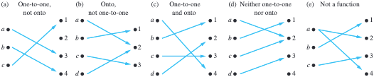
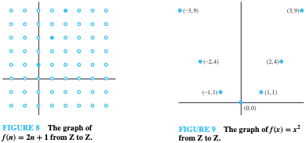
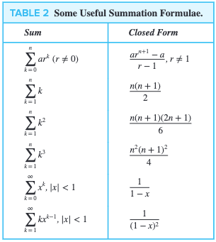
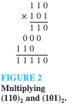

# 이산수학

::: TOGGLE ToC
[[toc]]
:::

$$
\gdef\mod{\textbf{ mod }}
\gdef\bmod{\text{mod }}
\gdef\nequiv{\not\equiv}
\gdef\sbmatrix#1{\begin{bmatrix}#1\end{bmatrix}}
\gdef\relation#1#2#3{{}_#2#1_#3}
$$

- 정수, 그래프, 논리 등 연속되지 않은 값을 가지는 대상의 구조와 성질에 관심.
  - 컴퓨터의 데이터는 모두 이산적. 이산적 데이터 구조를 수학적으로 해석할 수 있음.
  - 집합, 함수, 수열, 순열과 조합, 관계, 그래프, 트리, 부울 대수 등의 주제를 다룸.
  - 중간까지는 정수론과 암호, 귀납법, 관계까지. 기말에는 그래프, 트리, 부울 대수 등을 다룸.
- 과제는 중간 전 2번, 기말 전 2번.
  - 교재의 연습 문제를 과제로 내줄거임.
  - 과제는 BB로 제출하게 될거예요.
- 수업이 끝나면 그 수업 내용을 확장하는 동영상을 올려줌:
  - 영상에는 더 많은 예제와 설명이 있을거임.
  - 동영상은 부가적인게 아니라 꼭 봐야함.

## Basic Structures

- 이산적인 자료를 처리하기 위해 필요한 기본적인 구조는 집합, 함수, 수열과 합, 행렬.
- 개념은 고등학교에서 배웠을테니 여기에서는 기호와 표현에 중점을 둘거임.

### Sets

- 집합은 자료를 구분하고 모음을 정의. 집합에는 순서가 없음.
  - 집합의 원소를 element, member라고 지칭.
  - 집합을 표현하는 방법:
    - 원소나열법(Roster method): $S = \{1, 2, 3\} = \{3, 2, 1\}$
    - 조건제시법(Set-builder notation): $S = \{x \in \Bbb{Z}^+ | x \text{ is odd and } x \lt 10\}$
- 공집합: $\varnothing = \{\}$
  - 공집합과 공집합을 가진 집합은 다름: $\varnothing \neq \{\varnothing\}$
- 부분집합:
  - 하나의 집합이 다른 집합에 속했는지, 속하지 않았는지.
  - $A$가 $B$에 속함: $A \sub B$
  - $A \sub B$이고, $B \sub A$인 경우에도 서로가 서로의 부분집합: $A \sube B$
- 카디널리티:
  - 집합의 크기(원소 개수), $|A| = n(A) = n$
  - $|\varnothing| = 0$, $|\{\varnothing\}| = 1$
  - $|A \cup B| = |A| + |B| - |A \cap B|$
  - 유한집합뿐만 아니라 무한집합의 크기도 표현 가능:
    - 정수 집합의 카디널리티: $|\Bbb{Z}|$ (특정 수로 나타낼 수는 없음)
    - 정수는 양의 정수, 음의 정수, 0을 포함하므로, $|\Bbb{Z}| = 2|\Bbb{N}| + 1$
- Tuple:
  - 집합에서 원소가 순서를 갖는 순서쌍.
  - Ordered n-tuple: $(a_1, a_b, \cdot, a_n)$
  - Cartesian product:
    - $A \times B = \{(a, b) | a \in A \land b \in B\}$
    - $A$와 $B$를 결합해 만들 수 있는 모든 순서쌍의 집합.
- Set operations:
  - 합집합(union), 교집합(intersection)
  - 여집합(complementation): $\bar A = A^c = U - A = \{x | x \in U | x \notin A\}$
  - 차집합(difference): $A - B$
- 대칭차집합(symmetric difference):
  - XOR(exclusive OR), `(A && !B) || (!A && B)`
  - $A$와 $B$ 중 한쪽에만 속한 원소들의 집합.
  - $A \oplus B = (A - B) \cup (B - A) = A\bar B + \bar AB$
- 집합의 항등관계:
  - 항등법칙(identity): $A \cup \varnothing = A$, $A \cap U = A$
  - 지배법칙(domination): $A \cup U = U$, $A \cap \varnothing = \varnothing$
  - 멱등법칙(idempotent): $A \cup A = A$, $A \cap A = A$
  - 보원법칙(complementation): $\bar{\bar{A}} = A$
  - 교환법칙(commutative):
    - $A \cup B = B \cup A$, $A \cap B = B \cap A$
    - 교환법칙이 성립하기 때문에 우리는 데이터의 저장 순서를 신경쓰지 않아도 됨.
  - 결합법칙(associative):
    - $A \cup (B \cup C) = (A \cup B) \cup C$
    - $A \cap (B \cap C) = (A \cap B) \cap C$
  - 분배법칙(distributive):
    - $A \cap (B \cup C) = (A \cap B) \cup (A \cap C)$
    - $A \cup (B \cap C) = (A \cup B) \cap (A \cup C)$
    - 우변 대신 좌변의 연산을 수행하면 연산수를 줄일 수 있겠죠.
  - 드 모르간 법칙(De Morgan):
    - $\overline{A \cup B} = \bar A \cap \bar B$
    - $\overline{A \cap B} = \bar A \cup \bar B$
    - `!(A && B)`와 `!A || !B`가 같다는 것. 좌변 연산의 연산수가 적겠지.
  - 흡수법칙(absorption):
    - $A \cup (A \cap B) = A$
    - $A \cap (A \cup B) = A$
  - 보수법칙(complement): $A \cup \bar{A} = U$, $A \cap \bar{A} = \varnothing$

### Functions

- $\varnothing$이 아닌 어떤 두 집합의 원소간 대응관계가 함수.
  - $A$ 원소 각각에 $B$ 원소 하나를 대응시킨 것을 $A$에서 $B$로의 함수라고 함: $f: A \to B$
  - $A$의 원소 $a$, $B$의 유일한 원소 $b$에 대해 $f(a) = b$.
  - $f(x) = y_1$이고, $f(x) = y_2$일 때, $y_1 = y_2$이어야. 즉, 같은 입력에 같은 출력을 보장해야.
  - 함수는 매핑(mapping) 또는 변환(transformation)이라고도 한다.
- 용어 정리를 해보자, $f: A \to B$일 때, f(a) = b:
  - $a$는 원상(preimage), $b$는 상(image)
  - $A$는 함수 $f$의 정의역(domain), $B$는 함수 $f$의 공역(codomain)
  - $f$가 반환하는 $b$의 집합은 치역(range), 즉, 치역 $f(a)$는 항상 $B$의 부분집합.
- 함수로 관계(relation)을 표현할 수 있음.
  - 집합 $A$에서 $B$로의 모든 관계를 카테시안 곱으로 표현할 수 있음.
  - 결국 $f: A \to B$는 $A \times B$의 부분집합.
- 집합과 함수:
  - 집합을 인자로 받으면 집합을 반환한다. e.g., $f(\{a_1, a_2\}) = \{b_1, b_2\}$
  - 원상이 여러 개라면 값을 집합으로 표현할 수 있음. e.g., $b$의 원상이 $\{a_1, a_2\}$
- 다양한 종류의 대응:
  
  - 단사함수(injection, one-to-one):
    - $f(a) = f(b)$이면 반드시 $a = b$일 때.
    - 정의역의 원소들이 모두 서로 다른 원소들에 대응되는 경우. (중복 결과 없음.)
    - 반례: 함수값이 같은데 인자가 다른 경우, $f(a) = f(b)$인데 $a \neq b$인 경우.
  - 전사함수(surjection, onto):
    - $b \in B$인 모든 원소에 대해 $f(a) = b$인 원소 $a \in A$가 존재할 때.
    - 공역의 모든 원소들이 함수 $f$에 의해 매핑되는 경우. (공역과 치역이 같음.)
    - 반례: 공역의 어떤 원소가 어떠한 정의역의 원소에도 대응되지 않는 경우.
  - 전단사함수(일대일대응, bijection, one-to-one correspondence)
    - 단사이면서 전사인 함수. 두 조건을 모두 만족하는 경우.
    - 전단사함수라면 집합 $A$의 원소 개수와 $B$의 원소 개수가 같음.
- 역함수(inverse):
  - 함수 $f: A \to B$에 대해 $f(a) = b$일 때 $f^{-1}(b) = a$인 함수.
  - 전단사함수가 아니라면 역함수는 존재하지 않는다:
    - 단사함수가 아니라면 $f^{-1}(a)$가 하나의 값으로 대응되지 않을 것.
    - 전사함수가 아니라면 $f^{-1}(a)$가 어떤 값에도 대응되지 않을 것.
- 합성함수(composition):
  - $f(g(x)) = f \circ g(x)$
  - 합성은 교환법칙이 성립하지 않음: $f \circ g \neq g \circ f$
- 함수 판별 예제:
  - ${a, b, c, d}$에서 ${1, 2, 3}$인 함수 $f$에 대해, $f(a) = 3, f(b) = 2, f(c) = 1, f(d) = 3$:
    - $f(a) = 3$이고, $f(d) = 3$인데 $a \neq d$이므로 단사함수 아님.
    - 공역과 치역이 같으므로 전사함수임.
  - 정수 집합에 대해 $f: \Bbb Z \to \Bbb Z$이고, $f(x) = x^2$:
    - $f(-1) = 1$이고, $f(1) = 1$인데 $-1 \neq 1$이므로 단사함수 아님.
    - 2를 만들기 위해서는 $\sqrt 2$가 필요하지만, 정수 집합에 포함되지 않으므로 전사함수 아님.
  - $f: \Bbb Z \to \Bbb Z$이고, $f(x) = x + 1$:
    - $y = x$가 성립하므로 전단사함수임. 따라서 역함수가 존재할 것.
- 함수의 그래프:
  
  - 그래프가 직선이나 곡선이려면 실수 집합에 대한 함수여야.
  - 우리는 정수 집합을 다루고 있으므로 선이 아니라 점으로 그래프를 그려야.
- 각종 함수들:
  - 정수 근사 함수:
    
    - 바닥(floor)함수:
      - $f(x) = \lfloor x \rfloor$, e.g., $\lfloor 3.5 \rfloor = 3$
      - $x$보다 작거나 같은 정수 중 가장 큰 정수.
    - 천장(ceiling)함수:
      - $f(x) = \lceil x \rceil$, e.g., $\lceil 3.5 \rceil = 4$
      - $x$보다 크거나 같은 정수 중 가장 작은 정수.
  - 팩토리얼 함수:
    - $f: \Bbb N \to \Bbb Z^+$일 때, $f(n) = n!$.
    - $f(n) = 1 \times 2 \times 3 \times \cdots \times (n - 1) \times n$
    - $f(0) = 0! = 1$
  - 부분 함수:
    - $f: A \to B$ 중에서 $A$의 부분집합에 대해서만 정의된 함수.
    - e.g., $f: \Bbb Z \to \Bbb R$, $f(n) = \sqrt n$일 때:
      - $n$이 $-1$이라면 무리수이므로 $\Bbb R$에 포함되지 않음.
      - 따라서 음수에 대해서는 함수값이 정의되지 않는다.
      - 즉, $f$는 $\Bbb Z$ 중 일부(양의 정수)에 대해서만 정의된 부분함수.

### Sequences and Summations

#### Sequences

- 수열은 요소의 순서있는 목록을 표현하는 이산구조.
  - 수열은 정수의 부분집합에서 집합 $S$로의 함수.
  - 정수 $n$의 상을 표현하기 위해 $a_n$이라는 표기를 사용.
  - 수열의 일반화된 규칙을 바탕으로 임의의 항을 구할 수 있음.
  - 메모리 구조를 수열로 추상화할 수 있음.
- 등비수열(geometric progression):
  - $a, ar, ar^2, ar^3, \cdots , ar^n, \cdots$
  - $a$는 초항(initial), $r$은 공비(common ratio).
  - e.g., $a = 1, r = -1$일 때, $\{b_n\} = \{b_0, b_1, b_2, \cdots\} = \{1, -1, 1, \cdots\}$
- 등차수열(arithmetic progression):
  - $a, a + d, a + 2d, \cdots , a + nd,  \cdots$
  - $a$는 초항, $d$는 공차(common difference).
  - e.g., $a = -1, d = 4$일 때, $\{s_n\} = \{s_0, s_1, s_3, \cdots\} = \{-1, 3, 7, \cdots\}$
- 문자열(string):
  - 문자를 순서대로 나열한 유한수열.
  - 빈 문자열(empty string)은 $\lambda$로 표기. 길이가 0.
  - 문자열 $abcde$는 길이가 5.
- 점화관계(recurrence relations)
  - 관계: 수열에서 어떤 항과 다음 항 사이의 규칙성.
  - 점화관계:
    - 앞서 나온 항들로부터 다음 항을 구하는 규칙.
    - 수열 $\{a_n\}$에 대해 $a_0$부터 $a_{n - 1}$까지의 모든 정수로 $a_n$ 항을 구할 수 있음.
    - 초기조건(initial condition): 점화관계가 효력을 나타내기 전에 적용되는 규칙.
  - e.g., $n = 1, 2, 3, \cdots$에 대한 점화관계 $a_n = a_{n - 1} + 3$. 이때 초기조건 $a_0 = 2$.
  - 피보나치 수열: 초기조건 $f_0 = 0, f_1 = 1$, 점화관계 $f_n = f_{n - 1} + f_{n - 2}$에 의한 수열 $f_0, f_1, f_2, \cdots$.
- 점화관계 풀기:
  - 순차적으로 모든 항을 구하지 않고 바로 n번째 항을 구하는 것.
  - 점화관계를 푼다 = 닫힌 공식(closed formula)를 구한다 = 일반항을 구한다.
    - 등차수열의 닫힌 공식: $a_n = a + (n - 1)d$
    - 등비수열의 닫힌 공식: $a_n = ar^{n - 1}$
  - 첫 번째 방법은 전향대입: 초기조건부터 일반항을 구할 때까지 계산을 반복하는 방법.
  - 두 번째 방법은 후향대입: $a_n$부터 초기조건까지 계산을 반복하는 방법.
  - e.g., 복리 예시: 10,000달러를 30년간 연 11% 복리로 예금하면?
    - 점화관계는 $P_n = P_{n - 1} + 0.11P_{n - 1} = (1.11)P_{n - 1}$.
    - 전향대입을 해보자:
      - 0년째: $P_0 = 10000$
      - 1년째: $P_1 = P_0 + 0.11P0 = (1.11)P_0$
      - 2년째: $P_2 = P_1 + 0.11P1 = (1.11)P_1 = (1.11)^2P_0$
      - 3년째: $P_3 = P_2 + 0.11P2 = (1.11)P_2 = (1.11)^3P_0$
      - n년째: $P_n = (1.11)P_{n - 1} = (1.11)^nP_0 = (1.11)^n10000$
      - 따라서 30년째: $P_{30} =(1,11)^{30}10000$
- special integer sequences:
  - 규칙을 찾기 위해 질문해봐야 할 것들:
    - 같은 값을 가진 항이 반복되고 있는가?
    - 이전 항에 어떤 값을 더하거나 곱해서 다음 항을 구할 수 있는가?
    - 이전 항들을 조합해서 다음 항을 얻을 수 있는가?
    - 항들이 일정 규칙을 갖고 사이클을 이루고 있는가?
    - 기존에 잘 알려진 수열과 일치하는가?
  - 잘 알려진 수열들:
    - $n^2$: $1, 4, 9, 16, 25, 36, \cdots$
    - $n^3$: $1, 8, 27, 64, 125, \cdots$
    - $n^4$: $1, 16, 81, 256, 625, \cdots$
    - $f_n$: $1, 1, 2, 3, 5, 8, \cdots$
    - $2^n$: $2, 4, 8, 16, 32, 64, 128, \cdots$
    - $3^n$: $3, 9, 27, 81, 243, \cdots$
    - $n!$: $1, 2, 6, 24, 120, 720, \cdots$

#### Summations

- $\sum_{j=m}^n a_j = a_m + a_{m+1} + \cdots + a_n$
- $\Pi_{j=m}^n a_j$ = $a_m \times a_{m+1} \times \cdots \times a_n$
- 공식화되어 있음. 위에 4개정도 외워두면 유용하겠죠:
  

### Cardinality of Sets

- 카디널리티:
  - 집합의 크기.
  - $|A| = |B|$: 일대일 대응일 때(전단사 함수가 존재)
  - $|A| \leq |B|$: 단사함수가 존재할 때.
  - $|A| \geq |B|$
- 셀 수 있는(countable) 집합:
  - 집합의 원소가 유한하면 당연히 셀 수 있음.
  - 양의 정수의 집합 $\Bbb Z^+$과 카디널리티가 같은 집합도 셀 수 있음.
  - 즉, 자연수의 집합과 일대일 대응관계를 맺을 수 있어야 셀 수 있음. (0을 자연수로 취급)
  - 무한집합과 양의 정수 집합 간에 전단사 함수가 존재한다면 셀 수 있는 무한집합.
    - 자연수의 집합 $\Bbb N$은 무한집합이지만 셀 수 있음.
    - 양의 짝수 집합 $\Bbb E$은 자연수와 일대일 대응이 됨: $f(x) = 2x$.
    - 셀 수 있는 무한집합의 카티널리티 $|S| = \aleph_0$(aleph zero 또는 aleph null)
  - e.g., 양의 유리수 집합은 셀 수 있는가?
    - 양의 유리수는 대략 ${1 \over 1}, {1 \over 2}, {1 \over 3}, \cdots$이니까 $f(n) = {1 \over n}$?
    - 이렇게 나열하면 안 된다... 이건 모든 양의 유리수를 나열하는 방법이 아님.
    - 일단 양의 유리수를 $r_1, r_2, r_3, \cdots$로 나열하고, 자연수와 일대일대응됨을 보여야.
    - $1, {1 \over 2}, {2 \over 2}, {3 \over 1}$과 같은 순으로 전체 유리수를 나열할 수 있음.
- 셀 수 없는(uncountable) 집합:
  - 셀 수 있는 집합이 아닌 경우.
  - 실수의 집합 $\Bbb R$은 셀 수가 없음.
- 계산가능성(computability): 컴퓨터로 함수의 값을 계산할 수 있다면 계산가능(computable)함.

### Matrices

- 우리 전공에서 행렬은 정말 많이 씁니다. 행렬은 행과 열로 구성된 사각형 숫자 배열.
- 행렬 $A$가 $m$개의 행, $n$개의 열로 구성될 때, $A$는 $m \times n$ 행렬.
  - $m$과 $n$이 같다면 정방행렬(square matrix)라고 부름.
  - 정방행렬에서 대각선 원소들($i = j$)을 주대각 원소라고 부름.
  - 행렬은 수열의 또 다른 표현. 하나의 행렬은 길이가 $n$인 수열 $m$개로 이뤄짐.
- 행렬 $A$는 원소 $a_{ij}$로 구성된다:
  $$
  A = \begin{bmatrix}
  a_{11} & a_{12} & \cdots & a_{1n} \\
  a_{21} & a_{22} & \cdots & a_{2n} \\
  \vdots & \vdots & \ddots & \vdots \\
  a_{m1} & a_{m2} & \cdots & a_{mn}
  \end{bmatrix}
  $$
  - $i$번째 행은 $1 \times n$ 행렬: $[a_{i1}, a_{i2}, \cdots, a_{in}]$
  - $j$번째 열은 $m \times 1$ 행렬:
    $\begin{bmatrix} a_{1j} \\ a_{2j} \\ \vdots \\ a_{mj} \end{bmatrix}$
- 행렬의 덧셈:
  $$
  \begin{bmatrix}
  1 & 0 & -1 \\
  2 & 2 & -3 \\
  3 & 4 & 0
  \end{bmatrix} +
  \begin{bmatrix}
  3 & 4 & -1 \\
  1 & -3 & 0 \\
  -1 & 1 & 2
  \end{bmatrix} =
  \begin{bmatrix}
  4 & 4 & -2 \\
  3 & -1 & -3 \\
  2 & 5 & 2
  \end{bmatrix}
  $$
  - 각 요소끼리 더한다: $A + B = [a_{ij} + b_{ij}]$
  - 두 행렬의 크기가 같아야 더할 수 있음.
- 행렬의 곱셈:
  $$
  \begin{bmatrix}
  1 & 0 & 4 \\
  2 & 1 & 1 \\
  3 & 1 & 0 \\
  0 & 2 & 2
  \end{bmatrix} \cdot
  \begin{bmatrix}
  2 & 4 \\
  1 & 1 \\
  3 & 0
  \end{bmatrix} =
  \begin{bmatrix}
  14 & 4 \\
  8 & 9 \\
  7 & 13 \\
  8 & 2
  \end{bmatrix}
  $$
  - $i$ 행 요소들을 $j$ 열 요소들과 곱한 값의 합을 구한다: $AB = [c_{ij}]$, $c_{ij} = a_{i1}b_{1j} + a_{i2}b_{2j} + \cdots + a_{ik}b_{kj}$
  - $m \times k$ 행렬 $A$와 $k \times n$ 행렬 $B$의 곱셈 결과 행렬의 크기는 $m \times n$.
  - 좌측 행렬의 열 개수와 우측 행렬의 행 개수가 같아야 곱할 수 있음.
  - 행렬 곱은 교환 법칙이 성립하지 않는다: $AB \neq BA$
  - 항등행렬(identity matrix) 또는 단위행렬(unit matrix):
    $$
    I_n =
    \begin{bmatrix}
    1 & 0 & \cdots & 0 \\
    0 & 1 & \cdots & 0 \\
    \vdots & \vdots & \ddots & \vdots \\
    0 & 0 & \cdots & 1
    \end{bmatrix}
    $$
    - 정방행렬($n \times n$)이고, 주대각 원소가 모두 1, 나머지는 0인 행렬.
    - 항등원이 뭐예요? $a + x = x + a = a$에서 $a$가 나오게 하는 $x$.
      - $A + x = x + A = A$의 항등원은? 모든 원소가 0인 영행렬(zero matrix).
      - 행렬의 곱셈에서 항등원은 항등행렬, $AI_n = I_mA = A$
  - 행렬의 거듭제곱:
    - $A^r = \underbrace{AAA \cdots A}_{r \text{ times}}$
    - 약속: $A^0 = I_n$
- 행렬의 전치(transpose):
  - 행을 열로, 열을 행으로 뒤바꾸는 연산.
  - $m \times n$ 행렬 $A$를 전치하는 예시:
    $$
    A =
    \begin{bmatrix}
    1 & 2 & 3 \\
    4 & 5 & 6
    \end{bmatrix}
    \space
    A^T=
    \begin{bmatrix}
    1 & 4 \\
    2 & 5 \\
    3 & 6
    \end{bmatrix}
    $$
  - 전치한 결과가 그 전과 같은($A^T = A$) 행렬을 대칭(symmetric)이라고 한다:
    - $a_{ij}$와 $a_{ji}$가 같은 대칭행렬. 주대각은 뭐가 되든 상관없음.
    - 예시: $\begin{bmatrix} 1 & 1 & 0 \\ 1 & 0 & 1 \\ 0 & 1 & 0 \end{bmatrix}$
    - 개똥아 똥쌌니 아니요가 대칭행렬이었네...
- 0-1 행렬과 논리연산:
  - 모든 원소가 0 또는 1만으로 구성된 행렬.
  - 0과 1에 대한 연산을 불리언 연산 혹은 비트 연산이라고 한다.
    - 논리곱($\land$, meet): $b_1 \land b_2 = \begin{cases} 1 &\text{if } b_1 = b_2 = 1 \\ 0 &\text{otherwise}\end{cases}$
    - 논리합($\lor$, join): $b_1 \lor b_2 = \begin{cases} 1 &\text{if } b_1 = 1 \text{ or } b_2 = 1 \\ 0 &\text{otherwise}\end{cases}$
  - 어떤 두 행렬에 대해 논리연산을 하면 덧셈처럼 각 원소끼리 연산하면 됨.
  - 논리연산도 두 행렬의 크기가 같아야 가능함.
  - 불리언 곱(boolean product):
    - 행렬의 곱셈과 비슷한데, 곱셈을 논리곱으로, 덧셈을 논리합으로: $A \odot B$.
    - 즉, $c_{ij} = (a_{i1} \land b_{1j}) \lor (a_{i2} \land b_{2j}) \lor \cdots \lor (a_{ik} \land b_{kj})$.
    - 행렬 곱과 마찬가지로 $A$의 행 개수와 $B$의 열 개수가 같아야하고, 교환법칙이 성립하지 않음.
    - 불리언 거듭제곱: $A^{[r]} = \underbrace{A \odot A \odot \cdots \odot A}_{r \text{ times}}$
      - 약속: $A^{[0]} = I_n$.
      - 어느순간 행렬이 1로만 채워지면 아무리 불리언 거듭제곱을 해도 항상 1로만 채워진 행렬이 나옴.

## Number Theory and Cryptography

- 정수론에 대해서 살펴볼게요. 암호학이나 활용까지는 못 볼듯.
- 정수론: 정수와 그 특성에 대해 연구하는 수학의 한 분야.
- 수학적으로 정수를 어떻게 정의하나?
  - 일단 자연수의 정의를 증명해보자:
    - 1은 자연수. 1+1은 자연수끼리 더한거니까 2도 자연수.
    - $1 \in \Bbb N, 1 + 1 = 2 \in \Bbb N, 1 + 2 = 3 \in \Bbb N, \cdots$
  - 정수 덧셈, 뺄셈, 곱셈의 결과는 항상 정수. 하지만 정수의 나눗셈은 닫혀있지 않다.
  - 가분성(divisibility): 정수를 정수로 나눠서 정수가 나오는 경우. 나누어 떨어지는가?
  - 소수(primality): 1과 자기 자신말고는 나누어 떨어지는 수가 없는 수.
- 우리는 가분성이랑 모듈러 연산, 정수 표현과 알고리즘을 살펴볼겁니다.

### Divisibility and Modular Arithmetic

- 모듈러가 뭔지는 다들 알거임. 모듈러 연산이 왜 필요하나?
  - 우리가 아는 정수 집합은 무한집합. 엄청 큰 수를 연산한다고 생각해볼 수 있죠.
  - 사람은 시간이 걸리겠지만 연산할 수 있음. 그런데 컴퓨터는 하드웨어에 따라 못할수도 있음.
  - 전체 수를 분할해서 컴퓨터에게 먹여주면 어떨까? 바로 이 분할연산에 필요한게 모듈러 연산.
- 나눗셈:
  - 모듈러 연산을 알려면 나눗셈부터 알아야.
  - $a$와 $b$가 정수이고, $b = ac$일 때, $c$가 정수라면 $a$가 $b$를 나눈다고 한다.
  - $a | b$: $b$가 $a$로 나누어 떨어진다. 분수로는 $b \over a$. e.g., $3 | 12$
  - $a \not | b$: $b$가 $a$로 나누어 떨어지지 않는다. e.g., $3 \not | 7$
  - 정리 1:
    - i) $a | b$이고, $a | c$라면, $a | (b + c)$가 성립한다.
      - $b = as$를 만족하는 정수 $s$가 존재한다.
      - $c = at$를 만족하는 정수 $t$가 존재한다.
      - $b + c = as + at = a(s + t)$, 따라서 $a | (b + c)$.
    - ii) $a | b$이라면, 모든 정수 $c$에 대해 $a | bc$가 성립한다.
      - $b = as$를 만족하는 정수 $s$가 존재한다.
      - $bc = asc$, 이때 $sc$가 정수이므로, $a | bc$.
    - iii) $a | b$이고, $b | c$이면 $a | c$가 성립한다.
      - $b = as$를 만족하는 정수 $s$가 존재.
      - $c = bk$를 만족하는 정수 $k$가 존재.
      - $c = bk = ask$, 이때 $sk$가 정수이므로, $a | c$.
    - 따름정리(corollary): 정리로부터 유도되는 명제.
      - $a | b$이고, $a | c$라면 $a | mb + nc$가 성립한다.
      - $b = as$를 만족하는 $s$가 존재.
      - $c = at$를 만족하는 $t$가 존재.
      - $mb + nc = mas + nat = a(ms + nt)$
- 나눗셈 알고리즘:
  - 용어 정리를 해보자:
    - 나누는 수 $d$: divisor.
    - 나누어지는 수 $a$: dividend
    - 몫 $q$: quotient
    - 나머지 $r$: remainder
  - div 연산: $q = a \textbf{ div } d$
  - mod 연산: $r = a \mod d$
- 합동(congruence) 관계:
  - $a / m$과 $b / m$에서 $a - b$가 $m$으로 나누어 떨어진다면 $a$와 $b$는 모듈러 $m$ 합동.
  - 즉, 같은 수로 나누었을 때 나머지가 같으면 합동이라는 것.
  - $a \equiv b (\bmod m)$: $a$가 모듈러 $m$에 대해 $b$와 합동.
    - $a = mk + r$, $b = ms + r$.
    - 이때 $a - b = (mk + r) - (ms + r) = m(k - s)$, 따라서 $m | (a - b)$.
  - e.g., 어떤 수를 5로 나눴을 대 나머지가 2인 아이들은?
    - $a \mod b$라고 했을 때, $2 \mod 5$, $7 \mod 5$, $12 \mod 5$ 같은 것들이 있을거임.
    - 여기서 $a - b$가 항상 5로 나누어 떨어진다는 거.
  - e.g., 17과 5가 모듈러 6에 대해 합동인가?
    - $17 = 6 \times 2 + 5$
    - $5 = 6 \times 0 + 5$
    - 따라서 $17 \equiv 5 (\bmod 6)$
  - 정리 4:
    - $a = b + km$일 때 $a$와 $b$는 $\bmod m$ 합동. 그 역도 성립.
    - $a = b + km$은 $km = a - b$으로 나타낼수도.
    - 이때 $km$이 $a - b$의 약수이므로 $m | (a - b)$, $a \equiv b (\bmod m)$
    - e.g., $a \equiv 43 (\bmod 23)$이고, $-22 \leq a \leq 0$일 때 $a$를 찾아라:
      - $a = b + km = 43 + 23k$를 풀면된다.
      - $a$의 범위가 정해져있으므로, $k = 2$일 때 $a = -3$.
  - mod의 의미가 좀 다르다:
    - $a \equiv b (\bmod m)$에서 mod는 관계를 나타내는 것.
    - $a \mod m$은 나머지를 구하는 일종의 함수.
    - 정리 3: $a \mod b = b \mod m$일 때 $a \equiv b (\bmod m)$.
- 덧셈과 곱셈에서의 합동:
  - 정리 5:
    - $a \equiv b (\bmod m)$이고, $c \equiv d (\bmod m)$이면, $a + c \equiv b + d (\bmod m)$이고, $ac \equiv bd (\bmod m)$이 성립한다.
    - e.g., $7 \equiv 2 (\bmod 5)$이고, $11 \equiv 1 (\bmod 5)$일 때,
      - $18 = 7 + 11 \equiv 2 + 1 = 3 (\bmod 5)$, $18 \equiv 3 (\bmod 5)$
      - $77 = 7 \times 11 \equiv 2 \times 1 = 2 (\bmod 5)$, $77 \equiv 2 (\bmod 5)$
- 합동식의 대수적 변형:
  - 합동식에 같은 수를 곱하거나 더해도 괜찮음.
  - 하지만 약분을 해서는 안 된다! e.g., $14 \equiv 8 (\bmod 6)$이지만, $7 \nequiv 4 (\bmod 6)$
  - 따름정리:
    - $(a + b)(\bmod m) = ((a \mod m) + (b \mod m)) \mod m$
    - $ab \mod m = ((a \mod m) (b \mod m)) \mod m$
    - 컴퓨터는 우변처럼 연산을 하겠지만, 인간은 좌변처럼 간략하게 정리해서 계산할 수 있음.
    - 컴퓨터가 좌변처럼 계산한다면 $a + b$나 $ab$가 용량 범위를 넘어설 수 있기 때문.
- 모듈러 $m$ 연산:
  - $\Bbb Z_m$: $m$보다 작고, 0과 같거나 큰 nonnegative 정수 집합. ($\{ 0, 1, \cdots, m - 1\}$)
  - $+_m$: $a +_m b = (a + b) \mod m$
  - $\cdot_m$: $a \cdot_m b = (a \cdot b) \mod m$
  - 연산 결과가 $\Bbb Z_m$에 속하기 때문에 무조건 $m$을 넘지 않는다.
  - e.g., $7 +_{11} 9 = (7 + 9) \mod 11 = 16 \mod 11 = 5$. 즉, $7 + 9 \equiv 5 (\bmod 11)$.
  - e.g., $7 \cdot_{11} 9 = (7 \cdot 9) \mod 11 = 63 \mod 11 = 8$. 즉, $7 \cdot 9 \equiv 8 (\bmod 11)$.
  - 특성:
    - 닫힘(Closure): $a, b, c$가 $\Bbb Z_m$에 속해있다면, 연산 결과도 $\Bbb Z_m$에 속한다.
    - 결합법칙, 교환법칙, 분배법칙 성립.
    - 항등원: 덧셈의 항등원은 0, 곱셈의 항등원은 1.
    - 역원:
      - 덧셈의 역원은 $m - a$. $a +_m (m - a) = 0$이고, $0 +_m 0 = 0$.
      - 곱셈의 역원은 존재하지 않을 수 있음.
  - 교환군(commutative group), 교환환(commutative ring), 교환체(commutative field)

### Integer Representations and Algorithms

- 정수의 표현은 진법 얘기. 2진수 연산 알고리즘. 알고리즘은 외우지말고 그냥 알아만 두세요.
- 정수 표현할 때는:
  - Base $b$: $b$진법으로 표현.
  - $b$가 커질수록 큰 수를 짧게 표현할 수 있음.
- 각 자리를 $b$의 거듭제곱으로:
  - 정리1: $n = a_kb^k + a_{k-1}b^{k-1} + \cdots + a_1b + a_0$
  - $n$의 $b$진 전개($n$을 $b$진수로): $(a_k a_{k-1} \cdots a_1 a_0)_b$
  - e.g., $965_{(10)} = 9 \cdot 10^2 + 6 \cdot 10^1 + 5 \cdot 10^0$.
  - 이때 $a_k$를 MSD(Most significant digit), $a_0$을 LSD(Least significant digit)라고 한다.
  - 이 표기를 위치 기수법이라고 부른다.
- Binary expansions: 이진수를 십진수로 변환하는건 잘 알죠.
- Octal expansions: 이진수를 십진수로 변환하는거랑 똑같음.
- Hexadecimal expansions: 0~9는 그대로 사용, 10부터 15까지는 A~F로 표현.
- 십진수의 변환:
  - $b$진수를 거듭제곱으로 표현했으니 몫과 나머지로 표현 가능.
  - $n = bq_0 + a_0$, 몫 $q$와 나머지 $a$.
  - 이어서 $q_0 = bq_1 + a_1$를 얻는다.
  - 이 과정을 $q$가 0이 될때까지 반복.
  - 첫 번째 나머지가 LSD, 마지막 나머지가 MSD.
- 이진수의 변환:
  - 8진수는 2진수 3비트를 묶어서 표현, 16진수는 2진수 4비트를 묶어서 표현한 것.
  - 즉, 8진수와 16진수를 바이너리의 확장으로 볼수도.
  - 이진수를 8진수로 바꿀 때: 하위부터 3비트씩 끊고 각 블록을 8진수로 바꿔서 이어붙임.
  - 이진수를 16진수로 바꿀 때: 하위부터 4비트씩 끊고 각 블록을 16진수로 바꿔서 이어붙임.
  - 반대로 이진수로 바꿀 때도 마찬가지임. 비트수를 맞추려면 상위를 0으로 채우면 됨.
- 이진수 연산:
  - 덧셈: 올림수와 피연산 수의 합을 2로 나눠서 몫은 캐리로 올리고, 나머지는 결과가 됨. $O(n)$.
  - 곱셈: 곱한 값을 왼쪽으로 쉬프트하면서 모두 더함. $O(n^2)$.
    
  - 모듈러: $b^n \mod m$을 계산하자.
    - $b^n$이 엄청나게 커져서 오버플로우가 터질 수 있음.
    - 지수를 이진수로 표현하면 작은 수의 조합으로 풀 수 있다.
    - e.g, $3^{11}$
      1. 일단 11을 이진수로 바꾼다: $(1011)_2$
      1. 분해한다: $3^{11} = 3^8 \cdot 3^2 \cdot 3^1 = ((3^2)^2)^2 \cdot 3^2 \cdot 3^1$
      1. 조립한다

## Induction and Recursion

- 수학적 귀납법과 점화, 재귀를 배울거임.
- 귀납법은 증명할 때, 재귀는 정의할 때 유용합니다.
- 우리는 수학적 귀납법이랑 재귀적 정의만 볼거임.

### Mathematical Induction

- 수학적 귀납법:
  - 무한한 사다리를 오른다고 생각해봅시다:
    - 증명하고 싶은 명제: 우리는 사다리의 모든 계단을 오를 수 있다.
    - 알고 있는 전제:
      - 우리는 사다리의 첫 번째 계단을 오를 수 있다.
      - 만약 사다리의 한 계단을 오를 수 있다면, 다음 계단도 오를 수 있다.
    - 순서대로 계단을 오른다고 생각해보자. 첫 번째 계단을 오르면 두 번째도 오를 수 있을 것.
    - 이를 일반화하면: $k$번째 계단에 올라갈 수 있다면 $k + 1$번째 계단에도 오를 수 있을 것.
  - 증명 과정:
    - 모든 양의 정수 $n$에 대한 명제 $P(n)$이 참인지 증명하자.
    - 기본 단계: $P(1)$이 참임을 보인다.
    - 귀납 단계: 모든 양의 정수 $k$에 대해 $P(k) \to P(k + 1)$이 참임을 보인다.
    - 이 두 단계를 따라 명제를 증명하는 기법이 귀납법.
    - 즉, $(P(1) \land \forall k(P(k) \to P(k + 1))) \to \forall n P(n)$
- 수학적 귀납법의 동작법:
  - 무한 계단 예시말고 무한 도미노 예시도 많이 쓰임.
  - 첫 도미노를 넘어뜨려서 모든 도미노를 순차적으로 넘어뜨릴 수 있나?
  - $P(n)$: $n$번째 도미노가 쓰러진다.
  - 먼저 $P(1)$이 참인지 본다. 첫 도미노를 내가 쓰러뜨리니까 자명하게 참.
  - 이어서 $P(k)$가 참이라는 가정 아래에 $P(k + 1)$이 참임을 보인다.
- e.g., $1 + 2+ \cdots n = {n(n + 1) \over 2}$를 증명하라:
  - Basis step: $n = 1$일 때 $P(1)$이 참임을 보인다: $1 = 1$이니까 참.
  - Inductive step: $n = k$일 때 $P(k)$가 참임을 가정하고 $P(k + 1)$이 참임을 보인다:
    - $P(k) = 1 + 2 + \cdots + n = {k(k + 1) \over 2}$이 참이라고 가정.
    - $P(k + 1) = 1 + 2 + \cdots + k + (k + 1) = {(k + 1)(k + 2) \over 2}$이 참임을 보이면 됨.
    - 이때 $P(k)$를 이용해서 $P(k + 1) = {k(k + 1) \over 2} + (k + 1)$로 쓸 수 있다.
    - 이를 정리하면, ${k^2 + 3k + 2 \over 2} = {(k + 1)(k + 2) \over 2}$가 성립한다.
- e.g., 첫 $n$개의 양의 홀수 정수의 합에 대한 공식을 유도하고 증명하라:
  - $n$까지의 합은 $1 + 3 + \cdots + (2n-1)$.
  - 따라서 공식은: $\sum_{k=1}^n (2k-1) = 2\sum_{k=1}^n (k-n) = n(n+1)-n = n^2$
  - Basis step: $P(1)$일 때는 $1^2 = 1$.
  - Inductive step:
    - $n = k$일 때 $P(k)$가 참임을 가정.
    - $n = k + 1$일 때 $P(k + 1)$이 참임을 보이면 된다.
    - $P(k + 1)$일 때, $1 + 3 + \cdots + (2k - 1) + (2k + 1)$
    - 이때, $k^2 + 2k + 1 = (k + 1)^2$이므로 참.
- e.g., 모든 양의 정수 $n$에 대해 $n < 2^n$임을 증명하라:
  - Basis step: $P(1)$일 때 $1 \lt 2^1$이므로 참.
  - Inductive step:
    - $P(k)$일 때 $k \lt 2^k$임을 가정.
    - $P(k+1)$일 때 $k+1 \lt 2^{k+1}$.
    - $k+1 \lt 2^k+1 \lt 2^k+2 \lt 2^k + 2^k = 2^{k+1}$.
- e.g., $n \geq 4$에 대해 $2^n \lt n!$임을 증명하라:
  - Basis step: $P(4)$일 때 $2^4 = 16 \lt 4! = 24$이므로 참.
  - Inductive step:
    - $P(k)$일 때 $2^k \lt k!$임을 가정.
    - $P(k + 1)$일 때 $2^{k+1} \lt (k+1)!$.
    - $2^{k+1} = 2 \cdot 2^k \lt 2k! \lt (k+1)k! = (k+1)!$.
- e.g., $3 | n^3 - n$임을 증명하라.
  - Basis step: $P(1)$일 때 $3 | 1^3 - 1$이므로 참.
  - Inductive step:
    - $P(k)$일 때 $3 | k^3 - k$임을 가정.
    - $P(k + 1)$일 때 $3 | (k + 1)^3 - (k + 1)$.
    - $k^3 + 3k^2 + 3k + 1 - k - 1$
    - $(k^3-k) + 3(k^2+k)$.
- e.g., Tiling checkerboards: 동영상 풀이보세용.
- 수학적 귀납법에 의한 잘못된 증명:
  - 기계적으로 귀납법을 적용하면 참이 아닌데 참이라고 잘못 증명해버릴 수 있음.
  - 명제의 조건과 전제를 잘 살펴봐야.

### Recursive Definitions and Structural Induction

- 함수나 집합을 재귀적으로 정의하고, 이를 구조적 귀납법으로 증명할 수 있음.
- 우리는 재귀적 정의를 중점적으로 살펴볼거임.
- 재귀적으로 정의된 함수:
  - 두 스텝, basis, recursive step으로 정의한다:
    - Basis step: 초기 함수값을 정의.
    - Recursive step: 이전의 함수값을 이용해 다음 함수값을 구하는 규칙을 정의.
  - e.g., Basis step: $f(0) = 3$, Recursive step: $f(n + 1) = 2f(n) + 3$.
  - e.g., 팩토리얼 함수:
    - $f(0) = 1$, $f(n + 1) = (n + 1) \cdot f(n)$
    - $f(n) = f(n - 1)n$이라고 하면 안 되나? 이러면 $n \geq 1$에 대해서만 성립. 초기값에 대한 형태로 정의하려면 $f(n + 1)$로 정의해야.
  - e.g., $\sum_{k=0}^n a_k$를 재귀적으로 정의하라:
    - Basis step: $f(0) = a_0$
    - Recursive step: $f(n+1) = f(n) + a_{n+1}$
  - e.g., 피보나치 수열 함수:
    - Basis step: $f_0 = 0$, $f_1 = 1$.
    - Recursive step: $f_n = f_{n-1} + f_{n-2}$
  - e.g., $n \geq 3$에 대해 $\alpha = (1 + \sqrt{5}) / 2$일 때, $f_n \gt \alpha^{n-2}$를 증명:
    - Basis step:
      - $P(3)$일 때 ${4 \over 2} = {{1 + 3} \over 2} \gt {{1 + \sqrt{5}} \over 2}$.
      - $P(4)$일 때 $3 \gt {{3 + \sqrt 5} \over 2}$.
    - Inductive step:
      - $\alpha^{k-1} = \alpha^2 \cdot \alpha^{k-3} = (\alpha + 1) \cdot \alpha^{k-3} = \alpha^{k-2} + \alpha^{k-3}$.
      - $f_{k+1} = f_k + f_{k-1} \gt \alpha^{k-2} + \alpha^{k-3} = \alpha^{k-1}$
    - 여기 basis step에서 $P(3)$만 본게 아니라 $P(4)$도 봤죠? strong induction입니다.
    - 피보나치 수열이 재귀적으로 정의되어 있으므로, basis step에서도 여러 경우를 살펴본 것.
- 재귀적으로 정의된 집합과 구조:
  - 자료구조를 재귀적으로 정의할 수 있음.
  - 함수와 마찬가지로 basis step과 recursive step으로 정의한다.
  - e.g., 정수 집합의 부분 집합 $S$를 정의하라:
    - 이미 알려진 집합의 원소를 기반으로 확장하면 됨.
    - Basis step: $3 \in S$
    - Recursive step:
      - IF $x \in S$ AND $y \in S$, THEN $x + y \in S$
      - $S = \{ 3, 3+3=6, 3+6=9, \cdots \}$
  - e.g., 자연수 집합 $\Bbb N$을 정의하라:
    - Basis step: $0 \in \Bbb N$
    - Recursive step:
      - IF $n \in \Bbb N$, THEN $n + 1 \in \Bbb N$
      - $\Bbb N = \{ 0, 0+1=1, 1+1=2, \cdots \}$
    - 여기서는 0을 자연수로 정의했네요. 음이 아닌 정수 집합을 정의했다고 볼 수도.
- Strings:
  - 숫자가 아니라 문자도 재귀적으로 정의할 수 있을 것.
  - 문자열의 정의는 문자열을 구성하는 알파벳의 집합: $\Sigma$
  - 알파벳 집합 $\Sigma$의 원소로부터 생성한 문자열의 집합: $\Sigma \ast$
  - Basis step: $\lambda \in \Sigma \ast$
  - Recursive step: IF $w \in \Sigma \ast$ AND $x \in \Sigma$, THEN $wx \in \Sigma \ast$
  - e.g., $\Sigma = \{0, 1\}$일 때, $\Sigma \ast$에 속한 모든 문자열은?
    - 일단 빈 문자열이 있을 것임: $\lambda \in \Sigma \ast$
    - 빈 문자열에 0을 붙이면: $0 \in \Sigma \ast$
    - 계속 확장하면 $\Sigma \ast = \{ \lambda, 0, 1, 00, 01, 10, 11, \cdots \}$
  - e.g., $\Sigma = \{a, b\}$일 때, $aab \in \Sigma \ast$를 증명하라.
    - $\lambda \in \Sigma \ast$ AND $a \in \Sigma$이므로, $a \in \Sigma \ast$
    - $a \in \Sigma \ast$ AND $a \in \Sigma$이므로, $aa \in \Sigma \ast$
    - $aa \in \Sigma \ast$ AND $b \in \Sigma$이므로, $aab \in \Sigma \ast$
  - String concatenation:
    - 두 문자열의 연결은 $a \cdot b$ 또는 단순히 $ab$로 표기.
    - 두 문자열의 연결을 재귀적으로 정의할 수 있음.
    - Basis step: IF $w \in \Sigma \ast$, THEN $w \cdot \lambda = w$
    - Recursive step:
      - IF $w_1 \in \Sigma \ast$ AND $w_2 \in \Sigma \ast$ AND $x \in \Sigma$,
      - THEN $w_1 \cdot (w_2 x) = (w_1 w_2)x$
    - e.g., 문자열 $w$의 길이 $l(w)$를 재귀적으로 정의하라:
      - $l(\lambda) = 0$
      - $l(wx) = l(w) + 1$ IF $w \in \Sigma \ast$ AND $x \in \Sigma$

## Counting

- 계수는 숫자를 센다는 것. 계수의 기초와 비둘기집 원리, 순열과 조합 얘기를 해보자.
- 핵심은 경우의 수. 서로 다른 데이터가 몇 가지인지, 확률이 얼마인지 구해보자.
- 다 아는거지? 뒤에서 배울 내용에서 계산 빨리하려고 짚는거니까 공식 위주로 보셈.

### The Basics of Counting

- 곱셈법칙:
  - e.g., 7개 비트로 만들 수 있는 비트열의 수는? $2^7 = 128$개.
  - e.g., 집합 $A(|A| = m)$에서 $B(|B| = n)$로의 함수 개수는? $n^m$개.
  - e.g., 위 집합에서 함수가 one-to-one이라면? $n(n-1)(n-2) \cdot (n-m+1)$개.
  - e.g., 유한 집합의 부분집합 개수:
    - 이건 기억해두자. $S$의 개수가 $n$개일 때, $S$는 $2^n$개의 부분집합을 갖는다.
    - 각 원소가 집합에 포함되거나/되지 않거나로 생각하면 쉽게 구할 수 있음.
  - 집합의 곱셈 법칙:
    - 집합을 카테시안 곱으로 곱한다고 생각해보자: $A_1 \times A_2 \times \cdots \times A_m$
    - $|A_1 \times A_2 \times \cdots \times A_m| = |A_1| \cdot |A_2| \cdot \cdots \cdot |A_m|$
    - 카테시안 곱으로 만들어진 순서쌍의 개수를 각 집합의 카디널리티를 모두 곱해서 구할 수 있다.
- 덧셈법칙:
  - e.g., 교수 37명과 학생 87명 중 대표를 뽑을 때 경우의 수는? $37 + 83 = 120$
  - 집합의 덧셈 법칙:
    - $|A_1 \cup A_2 \cup \cdots \cup A_m| = |A_1| + |A_2| + \cdots + |A_m|$
    - 합집합의 카티널리티를 각 집합의 카티널리티를 모두 더해서 구할 수 있다.
  - e.g., 대문자나 숫자로 6~8자리의 패스워드를 만든다. 최소 하나의 숫자를 포함해야.
    - 패스워드가 6자리인 경우, 7자리인 경우, 8자리인 경우를 구해서 더하면 될 것.
    - $P_6$ = $(26 + 10)^6 - 26^6$ (6자리를 모두 알파벳으로만 채우는 경우를 빼줌)
    - $P_7$ = $(26 + 10)^7 - 26^7$
    - $P_8$ = $(26 + 10)^8 - 26^8$
    - $P = P_6 + P_7 + P_8$
- 뺄셈법칙:
  - $|A_1 \cup A_2| = |A_1| + |A_2| - |A_1 \cap A_2|$
  - e.g., 1로 시작하거나 00으로 끝나는 8자리 비트열 개수:
    - 시작은 1이니까 그 아래 7비트의 경우의 수는 $2^7$개.
    - 마지막은 00이니까 그 앞 6비트의 경우의 수는 $2^6$개.
    - 시작인 1이고, 마지막이 00이니까 그 사이 5비트의 경우의 수는 $2^5$개.
    - 따라서 $2^7 + 2^6 - 2^5 = 160$
- 나눗셈법칙:
  - e.g., 4명이 원탁에 둘러앉는 경우의 수?
    - 원탁의 의자 하나를 임의로 선택해서 시작점으로 잡고 시계방향으로 순서를 붙임.
    - 첫 의자에서의 경우의 수는 4, 다음 의자는 3, ... 세 번째 의자는 1개.
    - 그럼 총 $4! = 24$가지 경우. 근데 중복되는 경우 4개가 있으니 $24 / 4 = 6$.
- Tree diagrams:
  - 5개 사이즈(S, M, L, XL, XXL), 각 4개 색상(W, R, G, B)이 있음. 근데 XL은 RGB, XXL은 GB만 있음.
  - 너무 복잡하죠. 이걸 트리 다이어그램 그려서 풀면 쉬워짐.

### The Pigeonhole Principle

- 내용 자체는 상식적인데 증명할 때 유용.
- $k$개의 비둘기집과 비둘기 $k + 1$마리가 있다면, 적어도 한 집에는 비둘기가 2마리가 들어가게 됨.
- 따름정리 1:
  - $k+1$개의 원소를 갖는 집합에서 $k$개의 원소를 갖는 집합으로의 함수는 단사함수가 아니다.
  - 비둘기집 원리로 증명할 수 있음. 무조건 하나는 중복됨.
- e.g., 367명의 사람이 있다. 이 중 적어도 두 사람은 생일이 같음을 증명.
- 일반화된 비둘기집 원리:
  - 비둘기집 개수와 비둘기 수의 차이가 2 이상나는 경우에는?
  - 비둘기집이 10개고, 비둘기가 12마리 이상인 경우를 일반화해보자.
  - $N$개 물건을 $k$개 상자에 넣으면, 적어도 한 상자에는 $\lceil N/k \rceil$개 물건이 들어있다.
  - e.g., 100명의 사람이 있다. 적어도 9명의 사람이 같은 달에 태어났음을 증명:
    - $N=100$, $k=12$라고 했을 때 $\lceil 100/12 \rceil = 9$.

### Permutations and Combinations

- 님들이 이미 잘 아는 순열과 조합.
- 뒤에서 경우의 수 구해야 할 때 필요하니까 간단히 살펴보겠음.

#### Permuatations

- 서로 다른 원소를 가진 집합 안에서의 순열(순서를 가진 배열.)
- 순열은 원소들의 순서있는 배열 자체를 말하는거고, 나열하는 경우의 수를 구하는건 다른거임.
- $r$개 원소를 가진 순열을 r-permutation이라고 한다.
- e.g., $S = \{ 1, 2, 3 \}$ 집합이 있다고 하자:
  - 원소를 나열하는 경우의 수는 $3 \times 2 \times 1 = 6$.
  - 3개 중 2개를 꺼내서 순서대로 나열하는 것. 즉, $P(n, r)$일 때 $P(3, 2) = 6$.
- $P(n, r) = n(n-1)(n-2) \cdots (n - r + 1) = {n! \over (n - r)!}$
- e.g., 100명 중 3명을 고르는 경우의 수: $P(100, 3) = 100 \cdot 99 \cdot 98$
- e.g., 외판원이 8개의 도시를 방문. 방문 순서에 대한 경우의 수:
  - 출발 도시는 정해져있으므로 7개 도시에 대한 순열을 구하면 된다.
  - 따라서 $7 \cdot 6 \cdot 5 \cdot 4 \cdot 3 \cdot 2 \cdot 1 = 7!$.

#### Combinations

- 순서없이 고르는 경우의 수.
- $C(n, r) = {n! \over (n - r)!r!}$
  - 사실 $C(n, r) = {P(n, r) \over P(r, r)}$.
  - 순서를 고려한 경우의 수를 중복되는 경우의 수로 나눠주는 것.
- 따름정리 2: $C(n, r) = C(n, n - r)$

## Relations

- 지금까지는 이산수학에서 사용하는 수학적 이론만 살펴봄.
- 이제 이산수학에서 중점적으로 다루는 내용을 보자.
- 내용이 좀 많습니다.

### Relations and Their Properties

- 이진관계:
  - $R \subseteq A \times B$
  - 두 집합간 원소와 원소의 관계.
  - 원소간 관계는 순서쌍으로 표현할 수 있음.
  - 이진관계 $R$은 $A$와 $B$의 모든 순서쌍 집합의 부분집합.
  - $(a, b) \in R$인 경우: $\relation{R}{a}{b}$
  - $(a, b) \not \in R$인 경우: $\relation{\cancel R}{a}{b}$
  - 그냥 관계라고 해도 이진관계를 생각하면 됨.
- 관계는 그래프나 테이블로 표현할 수 있음.
- 함수랑 비슷하게 느껴지나요?
  - 관계는 하나의 원소가 여러 원소에 대응될 수 있기 때문에 함수와 관계는 다름.
  - 관계가 함수를 포함하는 개념임.
  - 만약 두 집합간 관계에 함수가 있다면 $(a, f(a))$로 표현할 수 있을 것.
- e.g., $A = \{1, 2, 3, 4\}$이고, $R = \{(a, b) | a \text{ divides } b\}$:
  - $A$에서 $A$로의 관계. 자기 자신으로의 관계.
  - $A$의 원소 중 하나가 다른 하나를 나눌 수 있는지 본다.
  - $R = \{(1, 1), (1, 2), (1, 3), (1, 4), (2, 2), (2, 4), (3, 3), (4, 4)\}$
- e.g., 어떤 집합 $A$에 대한 관계는 총 몇 개인가?
  - 만들 수 있는 모든 순서쌍 개수는 $|A \times A|$개.
  - 관계는 전체 순서쌍의 부분집합이므로, $2^{|A \times A|}$개.

#### Properties of Relations

- 자기만의 방식으로 잘 익혀두셈.
- Reflexive relations (반사적 관계):
  - 집합 $A$에 속한 모든 원소 $a$에 대해 $(a, a) \in R$라면 $R$은 반사적이다.
  - $R$ is reflexive iff $\forall a((a, a) \in R)$.
  - 자기 자신으로 향하는 순서쌍을 모두 갖고 있어야 반사적.
  - 행렬로 그려보면: $\sbmatrix{1 & & & & \\ & 1 & & & \\ & & \ddots & & \\ & & & 1 & \\ & & & & 1}$
    - 주대각 원소가 모두 1.
- Irreflexive relations (비반사적 관계):
  - 자기 자신으로 향하는 관계가 아예 없으면 비반사적.
  - $R$ is irreflexive iff $\forall((a, a) \not \in R)$.
  - reflexive도 아니고 irreflexive도 아닐 수 있고, 둘을 동시에 만족할 수도 있음.
  - 공집합에 대한 관계는 reflexive한 동시에, irreflexive함.
  - 루프가 없어야.
  - 행렬로 그려보면: $\sbmatrix{0 & & & & \\ & 0 & & & \\ & & \ddots & & \\ & & & 0 & \\ & & & & 0}$
    - 주대각 원소가 모두 0.
- Symmetric relations (대칭적 관계):
  - $(a, b)$가 있을 때, $(b, a)$가 항상 있다면 반사적.
  - $R$ is symmetric iff $\forall a \forall b ((a, b) \in R \to (b, a) \in R)$.
  - 행렬로 그려보면:
    - 주대각을 기준으로 접었을 때 똑같아야: $m_{ij} = a_{ji}$
    - 주대각 원소는 뭐가되든 상관없음.
- Asymmetric relations (비대칭적 관계):
  - $(a, b)$가 있을 때, $(b, a)$가 아예 없으면 비대칭적.
  - $R$ is asymmetric iff $\forall a \forall b ((a, b) \in R \to (b, a) \not \in R)$.
  - 서로를 향해서도 안되고, 루프가 있어서도 안 됨.
  - 비대칭이면 비반사적이다.
- Antisymmetric relations (반대칭적 관계):
  - $(a, b)$가 있고 $(b, a)$가 있을 때, 항상 $a = b$이면 반대칭적.
  - $R$ is antisymmetric iff $\forall a \forall b (((a, b) \in R \land (b, a) \in R) \to (a = b))$.
  - asymmetric이랑 비슷해 보이는데, 자기 자신으로 향하는 루프는 허용하는 것.
  - 대칭의 반대 의미가 아님. 모든 관계가 자기 자신으로만 향한다면 대칭이면서 반대칭이다.
  - 반대칭이고, 비반사적이면 비대칭이다.
  - 대칭의 반대가 아닌데 왜 반대칭인가..?
- Transitive relations (전이적 관계):
  - $(a, b)$가 있고, $(b, c)$가 있을 때 항상 $(a, c)$가 있으면 전이적.
  - $R$ is transitive iff $\forall a \forall b \forall c (((a, b) \in R \land (b, c) \in R) \to (a, c) \in R)$.
  - 전이적인지 판단할 수 없는 관계도 전이적이라고 본다. 공집합도 전이적임.
  - e.g., transitive:
    - $R = \{(a, b) | a \leq b\}$: $a \leq a+1$이고, $a+1 \leq a+2$일 때 $a \leq a+2$.
    - $R = \{(a, b) | a = b\}$: 모두 자기 자신으로 향함.
  - e.g., not transitive:
    - $R = \{(a, b)|a = b + 1\}$

#### Combining Relations

- 여러 관계를 결합해서 새로운 관계를 만들 수 있음.
- 집합 연산: $R_1 \cup R_2$, $R_1 \cap R_2$, $R_1 - R_2$, $R_2 - R_1$.
- 관계가 순서쌍의 집합이라는걸 잊지 마세용.
- 관계의 합성(composition):
  - 함수 합성이랑 비슷: $f(x) = y$, $g(y) = z$일 때, $(g \circ f)(x) = g(f(x)) = g(y) = z$.
  - $R$의 원소가 $(x, y)$이고 $S$의 원소가 $(y, z)$라면, $S \circ R$의 원소는 $(x, z)$.
  - $R$에서 순서쌍을 먼저 보고, 그 다음에 $y$가 같은 순서쌍을 $S$에서 찾아야 한다는 점에 주의.
- 관계의 거듭제곱(powers):
  - 거듭제곱 연산을 재귀적으로 정의하면:
    - Basis step: $R^1 = R$
    - Inductive step: $R^{n + 1} = R^n \circ R$
  - 관계를 $n$번 반복했을 때의 순서쌍 집합을 의미.
  - $n$이 어느 이상을 넘어가면 결과가 고정됨. 나중에 closure 배울 때 이 개념을 쓸 거임.
  - 정리: $R$ on a set $A$ is transitive iff $R^n \sube R$ for $n = 1, 2, 3, \cdots$.

### Representing Relations

- 관계를 행렬로 표현:
  - 행렬을 보고 관계를 원소나열법으로 표현할 수 있음.
  - $M_R = [m_{ij}]$일 때, $m_{ij} = \begin{cases} 1 \text{ if } (a_i , b_j) \in R \\ 0 \text{ if } (a_i, b_j) \not \in R \end{cases}$
  - $A$에서 $B$로의 관계를 행렬로 표현하면 $|A|$개의 행과 $|B|$개의 열이 있어야.
  - 관계가 공집합이면 행렬로 어떻게 표현하나? $M_R = []$? 행렬로 표현하지 않음.
- 관계를 다이그래프로 표현:
  - directed graph, digraph, 유향그래프, 방향그래프.
  - V: vertices, nodes, 정점.
  - E: edges, arcs, links, 간선.
  - 간선 $(a, b)$에서 정점 $a$는 initial vertex, $b$는 terminal vertex.
  - 간선의 개수를 세보면 관계의 카디널리티(순서쌍의 개수)를 알 수 있음. 루프도 잊지말고 세라.
  - Reflexive: 모든 정점에 루프가 있음.
    ```mermaid
    graph LR
      a((a)) --> b((b))
      b --> c((c))
      b --> a
      a --> a
      b --> b
      c --> c
    ```
  - Symmetry: 모든 간선이 양방향임.
     ```mermaid
    graph LR
      a((a)) --> b((b))
      b --> a
      b --> c((c))
      c --> b
      c --> d((d))
      d --> c
    ```
  - Asymmetry: 모든 간선이 단방향이고, 루프도 없음.
    ```mermaid
    graph LR
      a((a)) --> b((b))
      b --> c((c))
      c --> d((d))
    ```
  - Antisymmetry: 모든 간선이 단방향임. 루프는 있어도 노상관.
    ```mermaid
    graph LR
      a((a)) --> b((b))
      b --> c((c))
      c --> d((d))
      a --> a
      b --> b
      d --> d
    ```
  - Transitive: A에서 B, B에서 C로 향하는 간선이 있으면 A에서 C로 향하는 간선도 있음.
    ```mermaid
    graph LR
      a((a)) --> b((b))
      b --> c((c))
      a --> c
    ```
    - 심지어 이것도 transitive하다:
      ```mermaid
      graph LR
        a((a)) --> d((d))
        b((b)) --> c((c))
      ```
      - x에서 y로, y에서 z로 가는 경로 자체가 없으므로 조건을 위배하지 않음.
  - 합성도 다이그래프로 나타낼 수 있음.
    - $R$:
      ```mermaid
      graph LR
        a((a)) --> b((b))
        b --> c((c))
        c --> d((d))
        d --> b
      ```
    - $R^2$:
      ```mermaid
      graph LR
        a((a)) --> c((c))
        b --> d((d))
        c --> b((b))
        d --> c
      ```
    - $R^3$:
      ```mermaid
      graph LR
        a((a)) --> d((d))
        d --> d
        b((b)) --> b
        c((c)) --> c
      ```

### Closures of Relations

- 관계의 폐쇄. 다른 번역을 쓰기도 함.
- 앞서 살펴본 관계가 어떤 특성을 만족할수도 아닐수도.
  - 관계가 어떤 특성을 가지고 있지 않을 때, 순서쌍을 추가해서 특성을 만족하게 수정할 수 있음.
  - 어떤 특성을 만족하게 만드는 최소한의 순서쌍 집합을 찾고싶다.
- 폐쇄(Closures):
  - 관계 $R$을 포함하면서 임의의 특성 $P$를 만족하도록 하는 관계 $S$.
  - $S$는 $R$의 모든 순서쌍을 가지고 있어야 한다.
  - $P$ 특성을 갖기 위해 필요한 최소한의 순서쌍만을 포함해야 한다.
- Reflexive closure:
  - $R \cup \Delta$
  - 대각관계: $\Delta = \{ (a, a) | a \in A \}$, 주대각만 모두 1인 관계.
  - e.g., $R = \{ (1, 1), (1, 2), (2, 1), (3, 2)\}$, $A = \{ 1, 2, 3 \}$일 때:
    - $R$에 $(2, 2), (3, 3)$을 추가하면 반사 특성을 갖게 만들 수 있음.
  - e.g., $R = \{ (a, b) | a < b \}$의 reflexive closure를 구하라:
    - $R$는 reflexive하지 않음.
    - $R \cup \Delta = \{ (a, b) | a \leq b \}$
- Symmetric closure:
  - $R \cup R^{-1}$
  - 역관계: $R^{-1} = \{ (b, a) | (a, b) \in R \}$
    - 행렬 관점에서는 전치행렬. 행과 열을 바꾼 것과 같음.
    - 다이그래프로는 가는 길이 있으면 오는 길이 있는 모습.
  - 행렬로는 $M_R \lor M_R^T$.
  - e.g., $R = \{ (1, 1), (1, 2), (2, 2), (2, 3), (3, 1), (3, 2) \}$, $A = \{ 1, 2, 3 \}$일 때:
    - $(2, 1), (1, 3)$을 추가하면 대칭 특성을 갖게 만들 수 있음.
  - e.g., $R = \{ (a, b) | a \gt b \}$:
    - $a \gt b$인데 $b \gt a$일 수는 없으므로 symmetric하지 않음.
    - $R \cup R^{-1} = \{ (a, b) | a \neq b \}$
- Transitive closure:
  - 전이적으로 만들기 위해 순서쌍을 추가.
  - 순서쌍을 추가함으로 인해 또 새로운 관계를 만들어야 할수도.
    ```mermaid
    graph LR
      a((a)) --> b((b))
      b --> c((c))
      c --> d((d))
    ```
    - 이 관계를 transitive하게 만드려면 $(a, c), (b, d)$를 추가해야:
      ```mermaid
      graph LR
        a((a)) --> b((b))
        b --> c((c))
        c --> d((d))
        a --> c
        b --> d
      ```
    - 이로인해 $(a, d)$도 추가해야 최종적으로 transitive하게 됨:
      ```mermaid
      graph LR
        a((a)) --> b((b))
        b --> c((c))
        c --> d((d))
        a --> c
        b --> d
        a --> d
      ```
  - 이렇게 연쇄적인 순서쌍의 추가가 필요하기 때문에 전이폐쇄를 구하는게 어려움.
  - 그래프의 경로(path)에 대한 이해가 필요:
    - A sequence of edges: $(x_0, x_1), (x_1, x_2), (x_2, x_3), \cdots, (x_{n-1}, x_n)$
    - 경로: $x_0, x_1, x_2, \cdots, x_{n-1}, x_n$
    - 경로의 길이: $n$, 거쳐간 엣지의 개수.
    - 시작점과 도착점이 같은 경로: 회로(circuit), 사이클(cycle)
    - 인접정점(Adjacent vertex):
      - 3개의 정점이 $x_0, x_1, x_2$로 연결되어 있을 때.
      - 이때 직접 연결된 $x_0, x_1$이 인접정점.
    - $a, x_1, x_2, \cdots, x_{n-1}, b$ 시퀀스가 있음:
      - 시퀀스의 모든 순서쌍이 $R$에 있다면 $a$에서 $b$로의 경로가 있다는 것.
      - 이때 경로의 길이는 $n$. 관계를 $n$번 합성했을 때도 $(a, b)$가 포함됨.
      - 정리1: 길이가 $n$인 $a$에서 $b$로의 경로가 있다는 것과 $(a, b) \in R^n$은 같은 뜻.
  - 우리가 하려는건 주어진 관계에 대한 전이폐쇄를 구하는 것:
    - 다이그래프로 보고 구할 수도 있을 것. 하지만 원소가 너무 많으면 다 그려볼 수 없음.
    - 연결관계(connectivity relation):
      - 길이가 1이상인 a to b 경로의 모든 순서쌍 집합.
      - $R^* = R \cup R^2 \cup R^3 \cup \cdots \cup R^n = \bigcup_{n_1}^\infty R^n$
      - 정리 2: 연결관계 $R^*$가 곧 $R$의 전이폐쇄임.
    - 연결관계를 zero-one 행렬로 구해서 전이폐쇄를 얻을 수 있음:
      - $M_{R^*} = M_R \lor M_R^{[2]} \lor M_R^{[3]} \lor \cdots \lor M_R^{[n]}$
      - 연결관계와 정점이 많다면 계산량도 너무 많다.
    - Warshall's algorithm:
      - 전이폐쇄를 효과적으로 계산하기 위한 알고리즘.
      - 먼저 워셜 행렬 $W$를 0부터 $n$개까지 만든다(이때 $n$은 정점의 개수)
        - 0번 행렬 $W_0$: 주어진 관계 $R$의 행렬 표현, $W_0 = M_R$
        - k번 행렬 $W_k$:
          - 바로 직전 행렬 $W_{k-1}$의 1을 모두 $W_k$로 복사. 나머지는 비워둠.
          - $W_{k-1}$의 k번째 열에서 1인 행 번호를 추출.
          - $W_{k-1}$의 k번째 행에서 1인 열 번호를 추출.
          - 추출한 행과 열로 가능한 모든 순서쌍을 만든다.
          - 해당 순서쌍 관계를 가진 자리를 1로 채우고, 나머지는 0으로 채움.
          - 즉, $W_k = [w_{ij}^k]$
        - 마지막 행렬 $W_n$이 전이폐쇄.
      - e.g., 다음과 같은 관계가 그래프로 주어짐:
        ```mermaid
        graph LR
          b((b)) --> a((a))
          b --> c((c))
          c --> a
          d((d)) --> c
          c --> d
          a --> d
        ```
        - 이를 이용해 $W_0$을 만든다:
          $$W_0 = \sbmatrix{0 & 0 & 0 & 1 \\ 1 & 0 & 1 & 0 \\ 1 & 0 & 0 & 1 \\ 0 & 0 & 1 & 0}$$
        - 이어서 $W_1$을 만든다:
          - 일단 1로 채움:
            $$W_1 = \sbmatrix{  &   &   & 1 \\ 1 &   & 1 &   \\ 1 &   &   & 1 \\   &   & 1 &  }$$
          - 직전 행렬 $W_0$에서 1열 중 값이 1인 요소들의 행 번호를 추출한다: $b, c$
            $$W_0 = \sbmatrix{\color{blue}0 & 0 & 0 & 1 \\ \color{purple}1 & 0 & 1 & 0 \\ \color{purple}1 & 0 & 0 & 1 \\ \color{blue}0 & 0 & 1 & 0}$$
          - 직전 행렬 $W_0$에서 1행 중 값이 1인 요소들의 열 번호를 추출한다: $d$
            $$W_0 = \sbmatrix{\color{blue}0 & \color{blue}0 & \color{blue}0 & \color{purple}1 \\ 1 & 0 & 1 & 0 \\ 1 & 0 & 0 & 1 \\ 0 & 0 & 1 & 0}$$
          - 추출한 행과 열로 순서쌍을 만들면, $(b, d), (c, d)$.
          - 이 관계를 바탕으로 1을 추가하면:
            $$W_1 = \sbmatrix{0 & 0 & 0 & 1 \\ 1 & 0 & 1 & \color{red}1 \\ 1 & 0 & 0 & \color{red}1 \\ 0 & 0 & 1 & 0}$$
        - 정점이 4개니까 이 과정을 반복해서 $W_4$까지 만든다.
        - $W_4$가 주어진 관계의 연결관계 $M_{R^*}$이자, 전이폐쇄.
      - $w_{ij}^{[k]} = w_{ij}^{[k-1]} \lor (w_{ik}^{[k-1]} \land w_{kj}^{[k-1]})$

## Notices

- 4/11 목요일에 2차 과제 나갈거임.
- 4/12 금요일 개교기념일이라 수업 없음. 나중에 보강할거임.
- 중간고사:
  - 시험 일정 BB에 올렸으니 시간과 장소를 잘 확인하세요.
  - 시험범위는 금요일 수업까지. 아마 워셜까지 나가지 않을까 싶음.
  - 중간고사 준비하라고 과제 나가있음. 마감이 목요일까지. 모범답안은 금요일에 올려줄게용.
  - 시험 끝나면 시험지 사진 찍으라고 할거임. 따로 시험지 확인하러 오지마셈.
  - 중간에 나가도 되는데 그러면 사진 못 찍음.
  - 우리 분반은 F087, 시간은 저녁 8시부터 9시. 시험시간은 60분.
  - 필기구랑 신분증 챙기셈. 사진찍을 수 있도록 폰도 챙겨와요.

::: TOGGLE Memo and Examples
## Memo

### Sequences and Summations

- 등차수열 $a, a + d, a + 2d, \cdots ,a + nd, \cdots$ $a_n = a + (n - 1)d$
- 등비수열 $a, ar, ar^2, ar^3, \cdots ,ar^n, \cdots$: $a_n = ar^{n - 1}$
- $\sum_{k=0}^n ar^k (r \neq 0) = {ar^{n+1} - a \over r - 1}, r \neq 1$
- $\sum_{k=1}^n k = {n(n + 1) \over 2}$
- $\sum_{k=1}^n k^2 = {n(n+1)(2n+1) \over 6}$
- $\sum_{k=1}^n k^3 = {n^2(n+1)^2 \over 4}$

### Cardinality of Sets

- $|A| = |B|$: 일대일 대응 (전단사)
- $|A| \leq |B|$: one-to-one (단사)

### Divisibility and Modular Arithmetic

- IF $b = ac$, THEN $a | b$.
- Theorem 1:
  - (i) IF $a|b$ AND $a|c$, THEN $a | b + c$;
  - (ii) IF $a|b$, THEN $a|bc$ for all integers c;
  - (iii) IF $a|b$ AND $b|c$, THEN $a|c$.
  - Corollary 1: IF $a|b$ AND $a|c$, THEN $a | mb + nc$.
- Theorem 3: $a \equiv b (\bmod m)$ IF AND ONLY IF $a \mod m = b \mod m$.
- Theorem 4: $a \equiv b (\bmod m)$ IF AND ONLY IF there is an integer k such that $a = b + km$.
- Theorem 5: IF $a \equiv b (\bmod m)$ AND $c \equiv d (\bmod m)$,
  - THEN $a + c \equiv b + d (\bmod m)$
  - AND $ac \equiv bd (\bmod m)$
  - Corollary 2:
    - $(a + b) \mod m = ((a \mod m) + (b \mod m)) \mod m$
    - $ab \mod m = ((a \mod m)(b \mod m)) \mod m$

### Permutations and Combinations

- $P(n, r) = n(n-1)(n-2) \cdots (n - r + 1) = {n! \over (n - r)!}$
- $C(n, r) = {n! \over (n - r)!r!}$
  - Corollary 2: $C(n, r) = C(n, n - r)$

### Mathematical Induction

- $(a + b)^2 = a^2 + 2ab + b^2$
- $(a - b)^2 = a^2 - 2ab + b^2$
- $(a + b)^3 = a^3 + 3a^2b + 3ab^2 + b^3$
- $(a - b)^3 = a^3 - 3a^2b + 3ab^2 - b^3$
- $(a + b)(a - b) = a^2 - b^2$
- $(x + a)(x + b) = x^2 + (a + b)x + ab$
- $(x + a)(x + b)(x + c) = x^3 + (a + b + c)x^2 + (ab + bc + ca)x + abc$
- $(x - a)(x - b)(x - c) = x^3 - (a + b + c)x^2 + (ab + bc + ca)x - abc$

## Examples

### Divisibility and Modular Arithmetic

- $a \equiv 43 (\bmod 23)$ and $-22 \leq a \leq 0$:
  - $a = 43 + 23k$, $k = -2$일 때 $a = -3$
- $a \equiv 17 (\bmod 29)$ and $-14 \leq a \leq 14$:
  - $a = 17 + 29k$, $k = -1$일 때 $a = -12$
- $a \equiv -11 (\bmod 21)$ and $90 \leq a \leq 110$:
  - $a = -11 + 21k$, $k = 5$일 때 $a = 94$

### Sequences and Summations

- $a_n = a_{n-1} - n$, $a_0 = 4$
  - $a_1 = a_0 - 1 = -1 + a_0$
  - $a_2 = a_1 - 2 = -2 + a_1 = -2 + -1 + a_0$
  - $a_3 = a_2 - 3 = -3 + a_2 = -3 + -2 + -1 + a_0$
  - $a_n = a_n - n = -n + a_{n-1} = -{n(n + 1) \over 2} + a_0$
- $a_n = 2a_{n-1} - 3$, $a_0 = -1$
  - $a_1 = 2a_0 - 3 = -3 + 2a_0$
  - $a_2 = 2a_1 - 3 = -3 + 2a_1 = -3 + 2(-3 + 2a_0) = -3 + 2(-3) + 4a_0$
  - $a_3 = 2a_2 - 3 = -3 + 2a_2 = -3 + 2(-3 + 2(-3) + 4a_0) = -3 + 2(-3) + 4(-3) + 8a_0$
  - $a_4 = 2a_3 - 3 = -3 + 2a_3 = -3 + 2(-3 + 2(-3) + 4(-3) + 8a_0)$
  - $a_n = 2a_n - 3 = -3 + 2a_{n-1} = -3(1 + 2 + 4 + \cdots + 2^{n-1}) + 2^na_0 = -3({1 \cdot 2^{n-1+1} - 1 \over 2 - 1}) + 2^na_0 = -3(2^n - 1) + 2^na_0 = -2^{n+2} + 3$
- $a_n = 2na_{n-1}$, $a_0 = 3$
  - $a_n = 2na_{n-1} = 2n(2(n-1)a_{n-2}) = 2^2(n(n-1)a_{n-2}) = 2n(2^n((n-1)(n-2)a_{n-3})) = 2^nn!3$
- 10,000달러를 30년간 연 11% 복리로 예금하면?
  - 점화관계는 $P_n = P_{n - 1} + 0.11P_{n - 1} = (1.11)P_{n - 1}$.
  - 전향대입을 해보자:
    - 0년째: $P_0 = 10000$
    - 1년째: $P_1 = P_0 + 0.11P0 = (1.11)P_0$
    - 2년째: $P_2 = P_1 + 0.11P1 = (1.11)P_1 = (1.11)^2P_0$
    - 3년째: $P_3 = P_2 + 0.11P2 = (1.11)P_2 = (1.11)^3P_0$
    - n년째: $P_n = (1.11)P_{n - 1} = (1.11)^nP_0 = (1.11)^n10000$
    - 따라서 30년째: $P_{30} =(1,11)^{30}10000$
- 초봉 50000달러, 매년 1000달러 성과급과 전년도 원징기준 5% 연봉 인상률이라면?
  - 점화관계는 $a_n = (1.05)a_{n - 1} + 1000$.
  - 전향대입을 해보자:
    - 0년째: $a_0 = 50000$
    - 1년째: $a_1 = 1.05a_0 + 1000$
    - 2년째: $a_2 = 1.05a_1 + 1000 = (1.05)^2a_0 + 1.05(1000) + 1000$
    - 3년째: $a_3 = 1.05a_2 + 1000 = (1.05)^3a_0 + (1.05)^2(1000) + 1000$
    - n년째: $a_n = 1000 + 1.05 + (1.05)^2 + \cdots + (1.05)^{n-1} + (1.05)^n a_0$
    - 공비가 $1.05$인 등비수열, 따라서 ${1000 + {1000 \cdot 1.05^{n-1} - 1000 \over 1.05 - 1} \cdot 50000}$

### Mathematical Induction

- Prove that $\sum_{j=0}^n (-{1 \over 2})^j  = {2^{n+1} + (-1)^n \over 3 \cdot 2^n}$
  - Basis step: $P(0) = {2^{0+1} + (-1)^0 \over 3 \cdot 2^0} = {2 + 1 \over 3 \cdot 1} = 1$
  - Inductive step:
    - $P(k) = {2^{k+1} + (-1)^k \over 3 \cdot 2^k}$가 참이라고 가정.
    - $P(k + 1) = {2^{k+1} + (-1)^k \over 3 \cdot 2^{k+1}} + {(-1)^{k+1} \over 2^{k+1}} = {2^{k+1} + (-1)^k \over 3 \cdot 2^{k+1}} + {3(-1)^{k+1} \over 3 \cdot 2^{k+1}} = {2^{k+2} + (-1)^{k+1} \over 3 \cdot 2^{k+1}}$
- Prove that $1^2 - 2^2 + 3^2 - \cdots + (-1)^{n-1}n^2 = (-1)^{n-1}{n(n + 1) \over 2}$
  - Basis step: $P(1) = (-1)^{1-1}{1(1 + 1) \over 2} = {2 \over 2} = 1$
  - Inductive step:
    - $P(k) = (-1)^{k-1}{k(k + 1) \over 2}$가 참이라고 가정.
    - $P(k + 1) = (-1)^{k-1}{k(k + 1) \over 2} + (-1)^k(k+1)^2 = (-1)^k(k+1)({-k \over 2} + k + 1) = (-1)^k(k+1)({k \over 2} + 1) = (-1)^k{(k + 1)(k + 2) \over 2}$
- Prove that $1 + {1 \over \sqrt{2}} + {1 \over \sqrt{3}} + \cdots + {1 \over \sqrt{n}} > 2(\sqrt{n+1} - 1)$
- Prove that $3^n < n!$ if $n > 6$
  - Basis step: $P(7) = 3^7 < 7!$
  - Inductive step: $3^{k+1} = 3 \cdot 3^k < (k + 1) \cdot 3^k < (k + 1) \cdot k! = (k + 1)!$
- Prove that $2^n < n^2$ if $n > 4$
  - Basis step: $P(5) = 2^5 > 5^2$
  - Inductive step:
    - $P(k) = 2^k > k^2$이 참이라고 가정.
    - $(k + 1)^2 = k^2 + 2k + 1 < k^2 + 2k + k = k^2 + 3k < k^2 + k^2 < 2 \cdot 2^k$
    - 따라서, $(k + 1)^2 < 2k^2 < 2^{k+1}$

### Counting

- 길이 10의 비트 스트링이 있다:
  - 1보다 0이 더 많은 경우의 수는?
    - 1이 4개 이하라면 0이 더 많은 것. $r$개의 1을 배치하는 경우의 수를 모두 더해주면 된다.
    - $C(10, 4) + C(10, 3) + C(10, 2) + C(10, 1) + C(10, 0)$
  - 적어도 7개의 1이 있는 경우의 수는?
    - $r$개의 1을 배치하는 경우의 수를 모두 더한다.
    - $C(10, 7) + C(10, 8) + C(10, 9) + C(10, 10)$
  - 적어도 3개의 1이 있는 경우의 수는?
    - 위와 비슷하지만, 4부터 10까지 다 계산하기는 어려움.
    - 모든 경우의 수에서 1이 2개 이하로 있는 경우의 수를 빼준다.
    - $2^{10} - C(10, 2) - C(10, 1) - C(10, 0)$
:::
